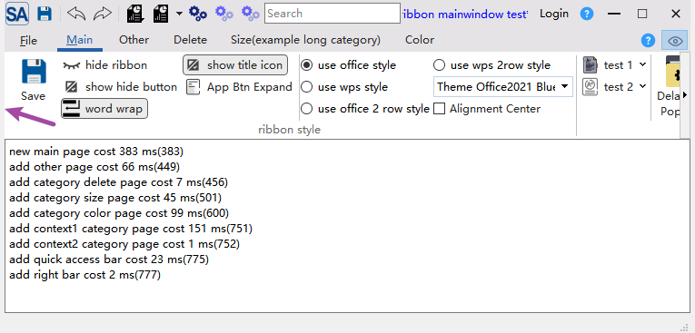
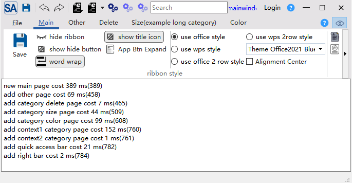

# SARibbon的内容边距设置

`SARibbon`通过`SARibbonMainWindow`和`SARibbonBar`的`setContentsMargins`方法组合设置内容边距

`SARibbonMainWindow`的`setContentsMargins`方法可以给MainWindow设置内容边距，如果想窗口显示出类似边框的效果，可以在构造函数中如下调用：

```cpp
MainWindow::MainWindow(QWidget* par) : SARibbonMainWindow(par)
{
    setContentsMargins(5, 0, 5, 0);
}
```

这时，你的窗口会有如下显示效果：



`SARibbonMainWindow`默认会给窗口的左右设置2px的边距，如果想取消这个默认设置，可以在构造函数中调用`setContentsMargins(0, 0, 0, 0)`设置

你也可以给`SARibbonBar`设置内容边距，让`SARibbonBar`的左右进一步缩减，例如：

```cpp
MainWindow::MainWindow(QWidget* par) : SARibbonMainWindow(par)
{
    setContentsMargins(2, 0, 2, 0);
    ribbon->setContentsMargins(5, 0, 5, 0);
}
```

上面的效果如下：



!!! tips "提示"
    SARibbonMainWindow默认会设置`2px`的左右边距