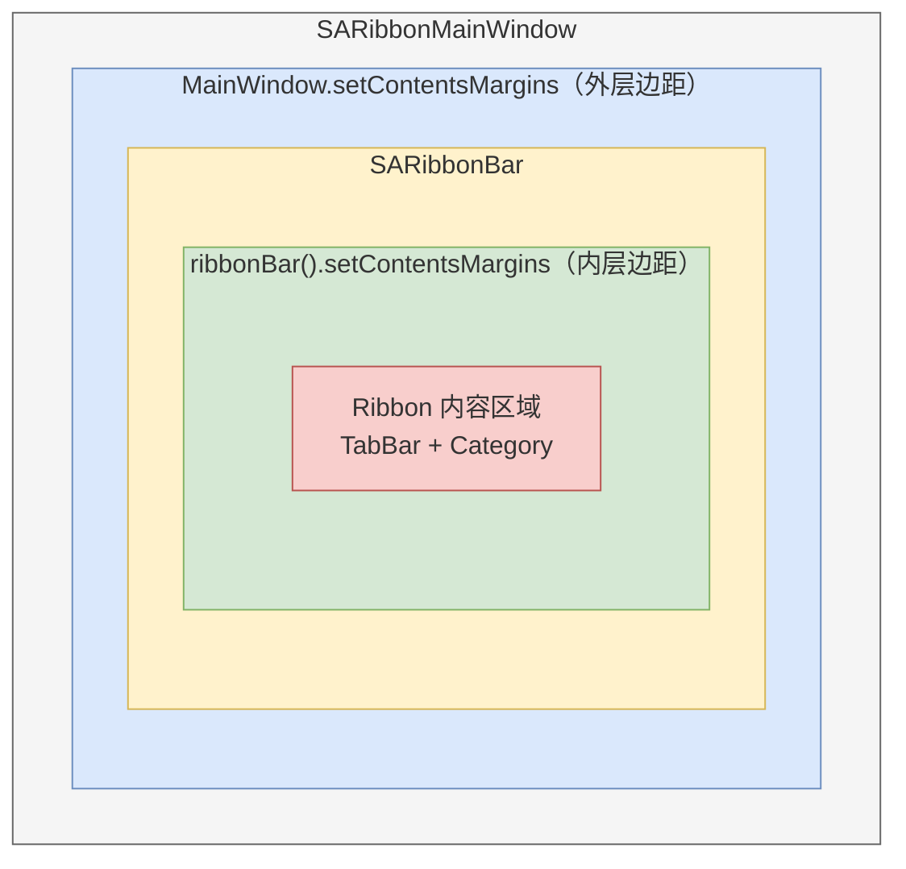

# SARibbon的内容边距设置

- ✅ **双层边距控制**：SARibbonMainWindow 和 SARibbonBar 可独立设置内容边距
- ✅ **组合效果灵活**：两种边距叠加使用，实现边框、缩进等多种视觉效果
- ✅ **原生边框适配**：原生边框模式下可仅通过 RibbonBar 边距调整内容位置
- ✅ **默认2px左右边距**：SARibbonMainWindow 默认提供细边框效果

---

SARibbon 通过 `SARibbonMainWindow` 和 `SARibbonBar` 的 `setContentsMargins` 方法组合设置内容边距，从而实现窗口边框效果或调整 Ribbon 控件的位置。

## SARibbonMainWindow 的边距

`SARibbonMainWindow` 的 `setContentsMargins` 方法为整个主窗口设置内容边距。如果您想让窗口显示出类似边框的效果，可以在构造函数中进行如下设置：

```cpp
MainWindow::MainWindow(QWidget* par) : SARibbonMainWindow(par)
{
    setContentsMargins(5, 0, 5, 0);
}
```

效果如下（左右各有5px的边距）：


!!! info "默认边距"
    `SARibbonMainWindow` 默认会给窗口的左右设置2px的边距。如果想取消这个默认设置，可以在构造函数中调用 `setContentsMargins(0, 0, 0, 0)`。

## SARibbonBar 的边距

您也可以给 `SARibbonBar` 设置内容边距，让 RibbonBar 内的内容进一步缩进：

```cpp
MainWindow::MainWindow(QWidget* par) : SARibbonMainWindow(par)
{
    setContentsMargins(2, 0, 2, 0);
    ribbonBar()->setContentsMargins(5, 0, 5, 0);
}
```

效果如下：


## 两层边距的层级关系

SARibbon 的边距由两层独立控制，外层由 `SARibbonMainWindow` 管理，内层由 `SARibbonBar` 管理：


```mermaid
flowchart TD
    subgraph window["SARibbonMainWindow"]
        subgraph outer["MainWindow.setContentsMargins（外层边距）"]
            subgraph ribbon["SARibbonBar"]
                subgraph inner["ribbonBar().setContentsMargins（内层边距）"]
                    content["Ribbon 内容区域<br/>TabBar + Category"]
                end
            end
        end
    end

    style window fill:#f5f5f5,stroke:#666666
    style outer fill:#dae8fc,stroke:#6c8ebf
    style ribbon fill:#fff2cc,stroke:#d6b656
    style inner fill:#d5e8d4,stroke:#82b366
    style content fill:#f8cecc,stroke:#b85450
```

外层边距控制窗口整体边框效果，内层边距控制 Ribbon 内容的额外缩进。两者叠加后的总缩进 = 外层边距 + 内层边距。

!!! tip "推荐默认值"
    - **常规场景**：MainWindow `(2, 0, 2, 0)` + RibbonBar `(0, 0, 0, 0)` — 默认细边框效果，无需额外设置
    - **原生边框模式**（`UseNativeFrame`）：MainWindow `(0, 0, 0, 0)` + RibbonBar `(5, 0, 5, 0)` — 让操作系统绘制边框，仅通过 RibbonBar 边距调整内容位置
    - **完全无边框**：MainWindow `(0, 0, 0, 0)` + RibbonBar `(0, 0, 0, 0)`

## 组合效果与推荐配置

两种边距可以组合使用，产生不同的视觉效果：

| 场景 | MainWindow 边距 | RibbonBar 边距 | 说明 |
|------|----------------|----------------|------|
| 默认 | `(2, 0, 2, 0)` | `(0, 0, 0, 0)` | 默认效果，左右有细边框 |
| 无边框 | `(0, 0, 0, 0)` | `(0, 0, 0, 0)` | 完全无边框效果 |
| 宽边框 | `(5, 0, 5, 0)` | `(0, 0, 0, 0)` | 左右较宽的边框 |
| 缩进式 | `(2, 0, 2, 0)` | `(5, 0, 5, 0)` | 窗口有边框，Ribbon 内容额外缩进 |
| 原生边框 | `(0, 0, 0, 0)` | `(5, 0, 5, 0)` | 使用原生边框时，仅 Ribbon 内容缩进 |

!!! tip "使用原生边框时的建议"
    当使用原生边框模式（`SARibbonMainWindowStyleFlag::UseNativeFrame`）时，操作系统会绘制窗口边框，此时可以将 `SARibbonMainWindow` 的边距设为 `(0, 0, 0, 0)`，仅通过 `SARibbonBar` 的边距来调整 Ribbon 内容的位置。

!!! tip "提示"
    SARibbonMainWindow默认会设置`2px`的左右边距
