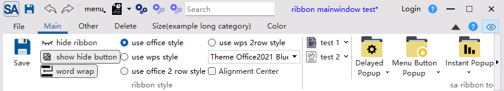
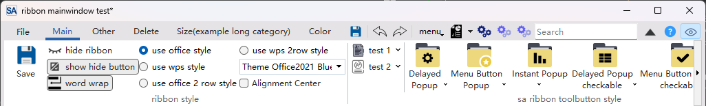

# 创建Ribbon风格的窗口

## 创建Ribbon风格的MainWindow

SARibbon 的核心是`SARibbonBar`这个类，它可以用于`MainWindow`也可以用于`Widget`

如果用于`MainWindow`，您的主窗口应继承自 `SARibbonMainWindow`，它会自动为您创建一个 `SARibbonBar`

创建Ribbon风格的`MainWindow`示例代码

```cpp
#include "mainwindow.h"
#include "SARibbon.h"

//
class MainWindow : public SARibbonMainWindow
{
    Q_OBJECT
public:
    MainWindow(QWidget* parent = nullptr) : SARibbonMainWindow(parent)
    {
        // 获取 RibbonBar 指针
        SARibbonBar* ribbon = ribbonBar();
        ...
    }
};
```

!!! warning "注意事项："
    如果你的 `MainWindow` 是通过 Qt Designer 创建的，**务必在 Designer 中删除默认的 `menuBar`**。因为 `SARibbonMainWindow` 会用自己的 `SARibbonBar` 替换掉原生的菜单栏，如果 `.ui` 文件中保留了原生菜单栏，会把ribbon菜单覆盖回原生的菜单。

`SARibbonMainWindow`的构造函数有三个参数，其定义如下：

```cpp
SARibbonMainWindow(QWidget* parent, SARibbonMainWindowStyles style, const Qt::WindowFlags flags)
```

最关键是第二个参数，第二个参数`SARibbonMainWindowStyles`决定了窗口的总体样式风格，常用的是下面两种搭配：

1. `SARibbonMainWindowStyleFlag::UseRibbonMenuBar|SARibbonMainWindowStyleFlag::UseRibbonFrame`

此风格为默认风格，使用ribbon风格菜单栏和ribbon风格边框，这时候窗口是一个自定义边框，不使用原生边框，界面效果如下：



2. `SARibbonMainWindowStyleFlag::UseRibbonMenuBar|SARibbonMainWindowStyleFlag::UseNativeFrame`

此风格为使用ribbon风格菜单栏和原生边框，这个界面的好处是支持操作系统的边框特效，例如win11的全局窗口快捷键，以及一些边框特效



在使用原生边框的时候，为了更适配原生边框，`SARibbonMainWindow`会把图标隐藏，同时把ribbonbar的样式设置为紧凑模式：

```cpp
// 在ribbon模式下使用本地边框，将隐藏icon，同时默认设置为紧凑模式
if (SARibbonBar* bar = ribbonBar()) {
    if (SARibbonTitleIconWidget* iconWidget = bar->titleIconWidget()) {
        // 隐藏icon
        iconWidget->hide();
    }
    // 设置为紧凑模式
    bar->setRibbonStyle(SARibbonBar::RibbonStyleCompactThreeRow);
}
```

## 创建Ribbon风格的Widget

除了主窗口，您也可以在普通的 `QWidget` 或 `QDialog` 上使用 Ribbon 界面，这在创建复杂对话框或子窗口时非常有用。为此，SARibbon 提供了 `SARibbonWidget` 类。

```cpp
#include "SARibbonWidget.h"
class MyRibbonWidget : public SARibbonWidget
{
    Q_OBJECT

public:
    explicit MyRibbonWidget(QWidget *parent = nullptr);
};
```

实现文件：

```cpp
// myribbonwidget.cpp
#include "myribbonwidget.h"
#include "SARibbonBar.h"

MyRibbonWidget::MyRibbonWidget(QWidget *parent)
    : SARibbonWidget(parent)
{
    // 1. 获取 RibbonBar
    SARibbonBar* ribbon = ribbonBar();

    // 2. 针对 Widget 模式进行优化
    ribbon->setTitleVisible(false); // 隐藏标题栏，因为 QWidget 通常没有独立标题
    ribbon->setRibbonStyle(SARibbonBar::RibbonStyleCompactThreeRow); // 使用紧凑模式节省空间
    ribbon->setApplicationButton(nullptr); // 移除 Application Button，Widget 通常不需要

    // 创建你的ribbon菜单
}
```

通过 `setWidget()` 方法，您可以将任意 `QWidget` 嵌入到 `SARibbonWidget` 中