# 创建Ribbon界面

## Category(分类页)

创建分类页有两种方式：

**方式一：通过ribbonbar添加**

```cpp
SARibbonBar* ribbon = ribbonBar();
// 直接添加一个名为“Main”的分类页
SARibbonCategory* homeCategory = ribbon->addCategoryPage("Main");
// 如果你需要进行ribbon界面自定义配置工具（SARibbonCustomizeDialog），你必须设置 objectName用于区分
homeCategory->setObjectName("MainCategory");
```

上面的代码将会添加一个名字为Main的标签页

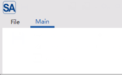

**方式二：先创建后添加**

```cpp
// 先创建一个分类页对象
SARibbonCategory* insertCategory = new SARibbonCategory(this);
insertCategory->setCategoryName("插入");
insertCategory->setObjectName("insertCategory");

// 再将其添加到 RibbonBar
ribbon->addCategoryPage(insertCategory);
```

## Panel(面板)

### 创建面板并添加动作

面板是category下面的一组功能。您可以通过 `Category` 的 `addPanel` 方法创建面板，并通过 `addAction` 系列方法添加功能按钮

每个category必须有一个panel

```cpp
// 在 "主页" 分类下创建一个 "文件" 面板
SARibbonPanel* filePanel = homeCategory->addPanel("文件");
filePanel->setObjectName("filePanel");

// 创建动作
QAction* newAction = new QAction(QIcon(":/new.svg"), "新建", this);
newAction->setObjectName("action_new");
newAction->setShortcut(QKeySequence::New);

// 将动作添加到面板
// addLargeAction: 大按钮，图标+文字
filePanel->addLargeAction(newAction);
// addSmallAction: 小按钮，通常只有图标
QAction* saveAction = new QAction(QIcon(":/save.svg"), "保存", this);
saveAction->setObjectName("action_save");
filePanel->addSmallAction(saveAction);

// 连接信号槽
connect(newAction, &QAction::triggered, [] {
    qDebug() << "New document created.";
});
```

### 创建菜单

在 Ribbon 界面中，菜单（Menu）是组织复杂功能的重要手段。SARibbon允许您将菜单以不同风格的按钮形式添加到面板中。主要区别在于按钮的弹出模式 (QToolButton::ToolButtonPopupMode)，它决定了用户如何与菜单进行交互

SARibbon 支持3种主要的弹出模式，您可以根据功能需求选择最合适的模式：

1. DelayedPopup (延迟弹出):

    用户点击按钮，会执行按钮的默认动作,用户长按按钮，菜单才会弹出（长按直至菜单弹出，按钮的默认动作不会执行）。适用场景主要是当按钮的主要功能是执行一个常用操作，菜单提供的是次要或高级选项时才选用此模式

2. MenuButtonPopup (菜单按钮弹出)：

    这是 Ribbon 界面最具特色的模式。按钮会被视觉上分割为上下两部分，点击按钮的上半部分（图标区域）会执行默认动作；点击下半部分（文本或下拉箭头区域）则会直接弹出菜单，不执行默认动作。鼠标悬停时，两部分会有不同的高亮效果。

    这是最推荐的模式，尤其适用于 Office 风格的应用。它清晰地区分了主要操作和次要操作，用户体验最佳。例如，一个“粘贴”按钮，点击图标区域执行标准粘贴，点击下拉箭头区域则弹出“选择性粘贴”、“粘贴为纯文本”等选项。

3. InstantPopup (即时弹出)：

    用户点击按钮的任何部分，都会立即弹出菜单，不会执行按钮的默认动作。这种模式适用于当按钮的功能完全由其下拉菜单定义，没有单一的“默认”操作时。例如，“页面布局”按钮，点击后直接弹出设置页边距、纸张方向等选项的菜单。

SARibbon添加菜单有两种方法，第一种是调用`addXXAction`函数：

```cpp
// 把action加入到panel，并以小图标显示
void addSmallAction(QAction* action, QToolButton::ToolButtonPopupMode popMode);
// 把action加入到panel，并以大图标显示
void addLargeAction(QAction* action, QToolButton::ToolButtonPopupMode popMode);
// 把action加入到panel，在三行模式下会以中图标显示
void addMediumAction(QAction* action, QToolButton::ToolButtonPopupMode popMode);
```

使用这种方法是action包含了menu，第二个参数明确指定了按钮的样式

下面是使用此方法的例子：

```cpp
SARibbonPanel* panelToolButtonStyle = page->addPanel(("sa ribbon toolbutton style"));

QMenu* menu = new QMenu;
//...构建菜单

// DelayedPopup模式
QAction* act = createAction(tr("Delayed\nPopup"), ":/icon/icon/folder-cog.svg");
act->setMenu(menu);
panelToolButtonStyle->addLargeAction(act, QToolButton::DelayedPopup);
connect(act, &QAction::triggered, this, &MainWindow::onDelayedPopupTriggered);

act = createAction(tr("Menu Button Popup"), ":/icon/icon/folder-star.svg");
act->setMenu(menu);
panelToolButtonStyle->addLargeAction(act, QToolButton::MenuButtonPopup);
connect(act, &QAction::triggered, this, &MainWindow::onMenuButtonPopupTriggered);

act = createAction(tr("Instant Popup"), ":/icon/icon/folder-stats.svg");
act->setMenu(menu);
panelToolButtonStyle->addLargeAction(act, QToolButton::InstantPopup);
connect(act, &QAction::triggered, this, &MainWindow::onInstantPopupTriggered);
```

上面的代码将会创建如下三个菜单按钮

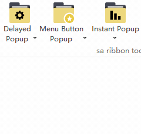

这三个按钮共享一个菜单

SARibbon还提供了另外一个接口来快速添加菜单(方法位于`SARibbonPanel`类)：

```cpp
// 添加menu
void addMenu(QMenu* menu,
                SARibbonPanelItem::RowProportion rowProportion,
                QToolButton::ToolButtonPopupMode popMode = QToolButton::InstantPopup);
// 添加普通大菜单
void addLargeMenu(QMenu* menu, QToolButton::ToolButtonPopupMode popMode = QToolButton::InstantPopup);
// 添加普通小按钮菜单
void addMediumMenu(QMenu* menu, QToolButton::ToolButtonPopupMode popMode = QToolButton::InstantPopup);
// 添加普通小按钮菜单
void addSmallMenu(QMenu* menu, QToolButton::ToolButtonPopupMode popMode = QToolButton::InstantPopup);
```

这几个函数实际利用率menu自身的action进行管理，无需再单独创建一个action
    
!!! warning "注意"
    这几个方法会修改 `menu->menuAction()` 的部分属性（icon/text/objectName），如需保留自定义值，请提前设置。

### 面板的布局占位说明

SARibbon 面板的布局目前有3种占位标志。当您调用 `addLargeAction`、`addMediumAction` 或 `addSmallAction` 时，您不仅是在添加一个按钮，还在指定它在网格布局中的“占位大小”。

- **Large Action**: 高度上占据2行或3行（取决于当前是两行还是三行模式），显示大图标和文字。
- **Medium Action**: 高度上占据1行或1.5行的网格（取决于当前是两行还是三行模式），通常显示图标和文字。
- **Small Action**: 高度上占据1行

这些行占比在不同的布局方案会有不同的呈现效果

SARibbonPanel支持两种布局方案，分别是2行模式和3行模式，通过`SARibbonBar::setRibbonStyle`函数你可以设置不同的布局风格

对于3行模式，上诉三种行占位的效果如下图所示

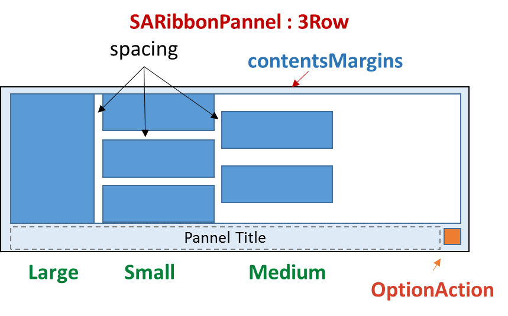

对于2行模式，上诉三种行占位的效果如下图所示

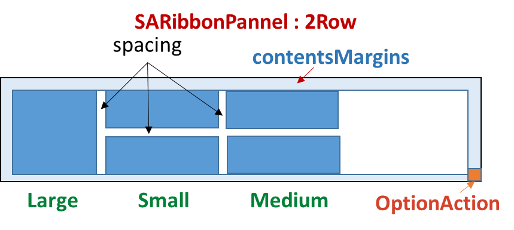

2行模式下medium和small占位(`SARibbonPannelItem::RowProportion`)是一样的，不做区分。

关于面板按钮的布局，详细可见：[Ribbon栏按钮布局说明](./layout-of-ribbonbutton.md)，以及：[SARibbon布局方式](./layout-of-SARibbon.md)

面板犹如一个`Toolbar`,添加的action最终会以按钮的方式进行渲染，`SARibbonBar`的提供了许多函数可以统一设置面板的属性：

- 设置panel按钮图标尺寸：

    ```cpp
    // 大按钮图标尺寸
    void setPanelLargeIconSize(const QSize& largeSize);
    // 小按钮图标尺寸
    void setPanelSmallIconSize(const QSize& smallSize);
    ```

- 设置panel的一些渲染属性：

    ```cpp
    // 设置按钮是否允许换行
    void setEnableWordWrap(bool on);
    // 设置panel是否显示标题栏
    void setEnableShowPanelTitle(bool on);
    ```

- 设置panel的一些位置尺寸：

    ```cpp
    // 设置panel与panel之间的间距
    void setPanelSpacing(int n);
    // 设置panel的标题栏高度
    void setPanelTitleHeight(int h);
    // 按钮的最大宽高比，这个系数决定按钮的最大宽度，系数越大，按钮能显示的越宽
    void setButtonMaximumAspectRatio(qreal fac = 1.4);
    ```

上面的方法会作用到每一个已经设置的panel和对应的按钮

### 在面板中添加复杂控件 (Widget)

除了 `QAction`，您还可以直接在面板中添加任何 `QWidget`，例如组合框、微调框或自定义控件。

```cpp
SARibbonCategory* page = ribbonBar()->addCategoryPage(tr("Main"));
SARibbonPanel* panelWidgetTest = page->addPanel(tr("widget test"));

QComboBox* com1 = new QComboBox(this);
com1->setWindowTitle(tr("QComboBox test"));
for (int i = 0; i < 40; ++i) {
    com1->addItem(QString("QComboBox test%1").arg(i + 1));
}
com1->setEditable(true);
panelWidgetTest->addSmallWidget(com1);

QComboBox* com2 = new QComboBox(this);
com2->setWindowTitle("ComboBox Editable");
for (int i = 0; i < 40; ++i) {
    com2->addItem(QString("item %1").arg(i + 1));
}
panelWidgetTest->addSmallWidget(com2);


QLineEdit* lineEdit = new QLineEdit(this);
lineEdit->setText("LineEdit");
panelWidgetTest->addSmallWidget(lineEdit);

panelWidgetTest->addSeparator();

QCalendarWidget* calendarWidget = new QCalendarWidget(this);
panelWidgetTest->addLargeWidget(calendarWidget);
```

上面代码的效果如下：

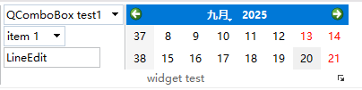

## 使用按钮组 (Button Group)

按钮组`SARibbonButtonGroupWidget` 可以将多个小按钮紧密排列在一起，和`QToolBar`类似，常用于一组相近功能的操作，如文本对齐

`SARibbonButtonGroupWidget`继承`QToolBar`，在一个按钮组里的`action`,你不需要再组个aciton绑定信号，使用`QToolBar::actionTriggered`信号即可

下面这段代码演示如何创建按钮组，以及如何绑定信号

```cpp
// 按钮组2
SARibbonButtonGroupWidget* btnGroup2 = new SARibbonButtonGroupWidget(panel1);
btnGroup2->setObjectName("SARibbonButtonGroupWidget2");

QAction* titleAlgnmentRight = createAction(tr("Align Right"), ":/icon/icon/Align-Right.svg");
titleAlgnmentRight->setProperty("align", (int)Qt::AlignRight | Qt::AlignVCenter);
btnGroup2->addAction(titleAlgnmentRight);
QAction* titleAlgnmentLeft = createAction(tr("Align Left"), ":/icon/icon/Align-Left.svg");
titleAlgnmentLeft->setProperty("align", (int)Qt::AlignLeft | Qt::AlignVCenter);
btnGroup2->addAction(titleAlgnmentLeft);
QAction* titleAlgnmentCenter = createAction(tr("Align Center"), ":/icon/icon/Align-Center.svg");
titleAlgnmentCenter->setProperty("align", (int)Qt::AlignCenter);
btnGroup2->addAction(titleAlgnmentCenter);
panel1->addWidget(btnGroup2, SARibbonPanelItem::Medium);
connect(btnGroup2, &SARibbonButtonGroupWidget::actionTriggered, this, &MainWindow::onButtonGroupActionTriggered);
```

上面的代码生成了如下界面（具体例子可见example/MainWindowExample/mainWindow.cpp,createCategoryOther函数）

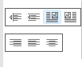

## 使用Gallery(画廊)

Gallery (画廊)是一个Ribbon特有的控件，用于以网格形式展示带图标的选项，常用于在有限空间显示大量图标动作，例如word的样式选择

SARibbon的Gallery (画廊)对应窗口为`SARibbonGallery`，通过`SARibbonPanel::addGallery`即可创建一个Gallery (画廊)，此函数返回创建的`SARibbonGallery`指针

`SARibbonGallery`可以管理多个动作组，一个动作组对应的类名为`SARibbonGalleryGroup`,你可以使用`SARibbonGallery::addCategoryActions`方法快速添加动作组，其参数是动作组标题和动作组的action列表

```cpp
SARibbonGalleryGroup* addCategoryActions(const QString& title, QList< QAction* > actions);
```

下面这段代码演示了如何创建一个Gallery (画廊)，并添加2个动作组

```cpp
QAction MyRibbonMainWindow::createAction(const QString& text, const QString& iconurl){
    QAction* act = new QAction(this);
    act->setText(text);
    act->setIcon(QIcon(iconurl));
    return act;
}

void MyRibbonMainWindow::buildGalleryExample(){
    SARibbonPanel* panelWithGallery = ...;
    ...
    // 创建一个Gallery (画廊)
    SARibbonGallery* gallery = panelWithGallery->addGallery();
    // 添加动作组1
    QList< QAction* > galleryActions1;
    galleryActions1.append(createAction("Document File", ":/gallery-icon/icon/gallery/Document-File.svg"));
    galleryActions1.append(createAction("Download File", ":/gallery-icon/icon/gallery/Download-File.svg"));
    ......
    galleryActions1.append(createAction("File Settings", ":/gallery-icon/icon/gallery/File-Settings.svg"));
    galleryActions1.append(createAction("Presentation File", ":/gallery-icon/icon/gallery/Presentation-File.svg"));
    SARibbonGalleryGroup* group1 = gallery->addCategoryActions(tr("Files"), galleryActions1);
    group1->setGalleryGroupStyle(SARibbonGalleryGroup::IconWithWordWrapText);
    group1->setGridMinimumWidth(80);

    // 添加动作组2
    QList< QAction* > galleryActions2;
    galleryActions2.append(createAction("Photoshop", ":/gallery-icon/icon/gallery/Photoshop.svg"));
    galleryActions2.append(createAction("Internet-Explorer", ":/gallery-icon/icon/gallery/Internet-Explorer.svg"));
    galleryActions2.append(createAction("Illustrator", ":/gallery-icon/icon/gallery/Illustrator.svg"));
    galleryActions2.append(createAction("Google-Maps", ":/gallery-icon/icon/gallery/Google-Maps.svg"));
    galleryActions2.append(createAction("Adobe", ":/gallery-icon/icon/gallery/Adobe.svg"));
    galleryActions2.append(createAction("Word", ":/gallery-icon/icon/gallery/Word.svg"));
    SARibbonGalleryGroup* group2 = gallery->addCategoryActions(tr("Apps"), galleryActions2);
    group2->setGridMinimumWidth(80);
    // 设置当前显示的组
    gallery->setCurrentViewGroup(group1);
}

```

通过上面代码，创建的gallery效果如下:

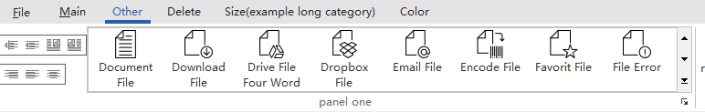

此gallery展开后效果如下：

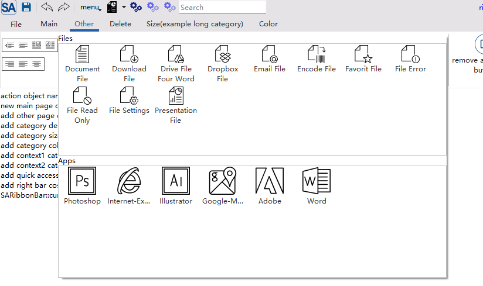

## Context Category(上下文标签页)

Context Category 是一种特殊标签页，通常在特定条件下（如选中某个对象）才显示，最常见的就是word中的“图片工具”和“表格工具”，是在选中图片或表格时才出现，这种有条件显示的标签称之为上下文标签

SARibbon的Context Category(上下文标签页)对应窗口为`SARibbonContextCategory`，通过`SARibbonBar::addContextCategory`即可创建一个Context Category(上下文标签页)，此函数返回创建的`SARibbonContextCategory`指针

`SARibbonContextCategory`并不是一个窗口(它的基类是`QObject`)，只是一个标签页管理器，需要再`SARibbonContextCategory`上添加标签页，通过`SARibbonContextCategory::addCategoryPage`方法即可在对应的Context Category(上下文标签页)上添加标签页

Context Category(上下文标签页)默认情况下不会显示，需要调用`SARibbonBar::showContextCategory`方法显示，隐藏上下文标签页则可通过`SARibbonBar::hideContextCategory`实现，`SARibbonContextCategory`也带有`show`/`hide`槽函数来实现上下文标签页的显示和隐藏

下面这段代码演示了如何创建一个Context Category(上下文标签页)，并添加两个标签页

```cpp
//m_contextCategory为MainWindow的成员变量：SARibbonContextCategory* m_contextCategory;

void MainWindow::createContextCategory(){
    SARibbonBar* ribbon = ribbonBar();
    m_contextCategory    = ribbon->addContextCategory(tr("context"), QColor(), 1);

    SARibbonCategory* contextCategoryPage1 = m_contextCategory->addCategoryPage(tr("Page1"));
    //创建contextCategoryPage1对应的内容
    createContextCategoryPage1(contextCategoryPage1);

    SARibbonCategory* contextCategoryPage2 = m_contextCategory->addCategoryPage(tr("Page2"));
    //创建contextCategoryPage2对应的内容
    createContextCategoryPage2(contextCategoryPage2);
}
```

上面的代码创建完Context Category(上下文标签页)后并不会显示，如果需要显示，你还需在特定条件下触发

```cpp
void MainWindow::onShowContextCategory(bool on)
{
    if (m_contextCategory == nullptr) {
        createContextCategory();
    }
    if (on) {
        m_contextCategory->show();
    } else {
        m_contextCategory->hide();
    }
}
```

上面的代码效果如下：

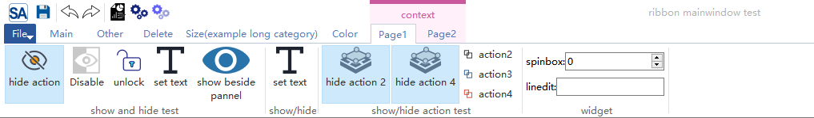

为了区分上下文标签页和普通的标签页，上下文标签页会有特殊的颜色进行标识，如上图所示。这个标识的颜色可以通过`SARibbonBar::setContextCategoryColor`设置

## Application Button

`Application Button` 是 Ribbon 界面左上角的主菜单按钮，通常用于“文件”操作

`SARibbon` 在创建 `SARibbonBar` 时，会默认创建一个`SARibbonApplicationButton`实例作为Application Button。您可以通过 `SARibbonBar::applicationButton`方法获取该按钮的指针，并对其进行操作，例如设置文本、设置图标、设置快捷键、设置菜单，等等

如：

```cpp
void MainWindow::createRibbonApplicationButton()
{
    SARibbonBar* ribbon = ribbonBar();
    QAbstractButton* btn = ribbon->applicationButton();
    btn->setText(("&File"));

    SARibbonApplicationButton* appBtn = qobject_cast< SARibbonApplicationButton* >(btn);
    if (appBtn) {
        QMenu* menu = new QMenu(this);
        ...
        appBtn->setMenu(menu);
    }
}
```

如果你有自定义的按钮，你可以通过 `SARibbonBar::setApplicationButton` 方法设置 `Application Button`。如果你不想要`Application Button`，你可以传入`nullptr`

```cpp
ribbonBar()->setApplicationButton(nullptr); // 移除按钮
```

application button可以通过qss设置比较丰富的样式，下面是模仿win7风格的ribbon样式设置的qss演示：

```css
SARibbonApplicationButton{
  color:white;
  border: 1px solid #416ABD;
  border-top-left-radius: 4px;
  border-top-right-radius: 4px;
  background-color: qlineargradient(spread:pad, x1:0, y1:0, x2:0, y2:1,stop:0 #467FBD, stop:0.5 #2A5FAC,stop:0.51 #1A4088,
stop:1 #419ACF);
}

SARibbonApplicationButton:hover{
  background-color: qlineargradient(spread:pad, x1:0, y1:0, x2:0, y2:1,stop:0 #7BB2EB, stop:0.5 #477ECD,stop:0.51 #114ECF,
stop:1 #80E1FF);
}

SARibbonApplicationButton:pressed{
  background-color: qlineargradient(spread:pad, x1:0, y1:0, x2:0, y2:1,stop:0 #467BBB, stop:0.5 #2F63AE,stop:0.51 #1C438A,
stop:1 #358BC9);
}

SARibbonApplicationButton:focus{
  outline: none;
}

SARibbonApplicationButton::menu-indicator {
  /*subcontrol-position: right;*/
  width:0px;
}
```

上面的效果如下：

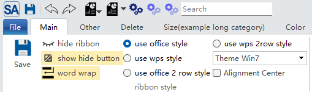

在宽松模式下，`Application Button`可以设置为垂直扩展，这时候，`Application Button`将占用标题栏和tab栏的空间

示例：

```cpp
ribbonBar()->setApplicationButtonVerticalExpansion(true);
```

上面的代码效果如图所示：

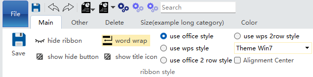

!!! warning "注意"
    `SARibbonBar::setApplicationButtonVerticalExpansion`函数会对`titleIconWidget`的可见性进行调整，如果设置`applicationButtonVerticalExpansion=true`，那么`titleIconWidget`会被隐藏，反之，`titleIconWidget`会被显示
    但`SARibbonBar::setTitleIconVisible`函数不会对`applicationButtonVerticalExpansion`的状态有影响
    因此，如果你动态调整`applicationButtonVerticalExpansion`的状态，如果你需要显示窗口图标，在设置`setApplicationButtonVerticalExpansion(false)`后，需要调用`setTitleIconVisible(true)`让窗口图标显示

!!! warning "注意"
    `ApplicationButtonVerticalExpansion`仅在宽松模式(`SARibbonBar::RibbonStyleLoose`)下有效

## Application Widget

在许多现代化应用（如 Microsoft Office）中，点击 `Application Button` 并不会弹出一个简单的下拉菜单，而是会弹出一个全屏或半屏的复杂页面，该页面可以包含最近文件列表、模板选择、账户设置、应用选项等丰富内容

SARibbon提供了`SARibbonApplicationWidget`，它能自动帮你覆盖主窗口，你的弹出式窗口可以继承`SARibbonApplicationWidget`来实现

`SARibbonApplicationWidget`提供了`resizeToParent`函数来决定如何相对父窗口进行缩放，默认是完全覆盖父窗口，如果你想覆盖一半或者其他尺寸，你可以重写此函数

使用`Application Widget`的例子如下：

继承`SARibbonApplicationWidget`实现自己的窗口

```cpp
class ApplicationWidget : public SARibbonApplicationWidget
{
    Q_OBJECT
public:
    explicit ApplicationWidget(SARibbonMainWindow* parent = nullptr);
    ~ApplicationWidget();
};
```

在MainWindow中创建`Application Widget`的成员变量指针`m_appWidget`，初始化时绑定`applicationButton`的响应：

```cpp
void MainWindow::createRibbonApplicationButton()
{
    SARibbonBar* ribbon = ribbonBar();
    if (!ribbon) {
        return;
    }
    QAbstractButton* btn = ribbon->applicationButton();
    btn->setText(("&File"));
    // 这里演示用SARibbonApplicationWidget实现一个类似office的弹出式窗口
    m_appWidget = new ApplicationWidget(this);
    m_appWidget->hide();
    connect(btn, &QAbstractButton::clicked, this, [ this ](bool c) {
        Q_UNUSED(c);
        this->m_appWidget->show();
    });
}
```

上面的代码效果如下：

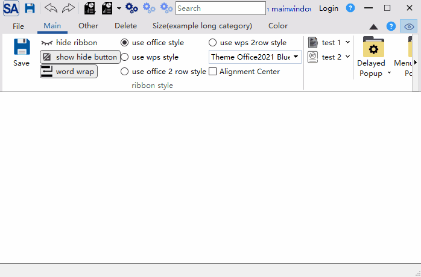

## Quick Access Bar（快速访问工具栏）

快速访问工具栏位于窗口最顶部，用于放置最常用的操作，如保存、撤销、重做。快速访问工具栏对应的类为`SARibbonQuickAccessBar`,它继承自`QToolBar`，你可以和操作工具栏一样使用它

SARibbon默认会创建一个快速访问工具栏，你可以调用`SARibbonBar::quickAccessBar`函数获取快速访问工具栏的指针，然后对快速访问工具栏进行操作

下面是快速访问工具栏的用法：

```cpp
void MainWindow::createQuickAccessBar()
{
    SARibbonQuickAccessBar* quickAccessBar = ribbonBar()->quickAccessBar();

    QAction* actionSave = new QAction(QIcon(":/icon/icon/save.svg"),"save",this);
    quickAccessBar->addAction(actionSave);
    quickAccessBar->addSeparator();

    QAction* actionUndo = new QAction(QIcon(":/icon/icon/undo.svg"),"undo",this);
    quickAccessBar->addAction(actionUndo);

    QAction* actionRedo = new QAction(QIcon(":/icon/icon/redo.svg"),"redo",this);
    quickAccessBar->addAction(actionRedo);

    quickAccessBar->addSeparator();

    QMenu* menu1 = new QMenu("Presentation File 1", this);
    menu1->setIcon(QIcon(":/icon/icon/presentationFile.svg"));
    // 创建菜单
    ...
    // 创建 QAction
    quickAccessBar->addMenuAction(menu1->menuAction());//效果等同quickAccessBar->addMenuAction(menu1);

    QMenu* menu2 = new QMenu("Presentation File 2", this);
    menu2->setIcon(QIcon(":/icon/icon/presentationFile.svg"));
    // 创建菜单
    ...
    quickAccessBar->addMenuAction(menu2, QToolButton::MenuButtonPopup);
    ...
    mSearchEditor = new QLineEdit(this);
    mSearchEditor->setMinimumWidth(150);
    mSearchEditor->setPlaceholderText("Search");
    quickAccessBar->addWidget(mSearchEditor);
}
```

上面的代码创建了一个快速访问工具栏，效果如下：

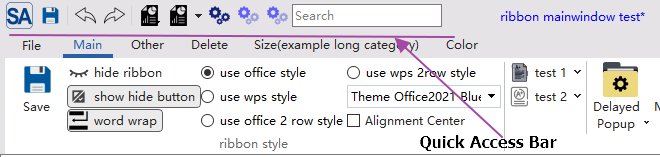

## Right Button Group（右侧按钮组）

`Right Button Group`（右侧按钮组）是 Ribbon 界面右上角按钮组，通常用于“帮助”、“设置”、“关于”等操作。`Right Button Group`（右侧按钮组）对应的类为`SARibbonButtonGroupWidget`,它继承自`QToolBar`，你可以和操作工具栏一样使用它

SARibbon默认会创建一个`Right Button Group`（右侧按钮组），你可以调用`SARibbonBar::rightButtonGroup`函数获取`Right Button Group`的指针，然后对它进行操作

下面是`Right Button Group`的用法：

```cpp
void MainWindow::createRightButtonGroup()
{
    SARibbonBar* ribbon = ribbonBar();
    SARibbonButtonGroupWidget* rightBar = ribbon->rightButtonGroup();
    QAction* actionHelp                 = new QAction(QIcon(":/icon/icon/help.svg"),"help",this);
    QAction* actionVisible                   = new QAction(QIcon(":/icon/icon/visible-true.svg"),"Visible",this);
    rightBar->addAction(actionHelp);
    rightBar->addAction(actionVisible);
}
```

`Right Button Group`（右侧按钮组）效果如下：

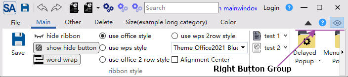

## Window Button Bar（系统标题栏按钮旁的工具栏）

`Window Button Bar`（系统标题栏按钮旁的工具栏）是 Ribbon 界面系统最大最小化合关闭按钮组，`Window Button Bar`对应的类名为`SARibbonSystemButtonBar`，它默认会创建好窗口需要的最大最小化及关闭按钮，它会自动处理窗口的状态调整系统按钮的显示，`SARibbonSystemButtonBar`内部有一个`SARibbonButtonGroupWidget`，提供了`addAction`、`addSeparator`、`addWidget`等函数，用于在最大最小化旁边添加按钮

你可以通过`SARibbonMainWindow`的`windowButtonBar`函数获取`SARibbonSystemButtonBar`指针

!!! warning "注意"
    `SARibbonSystemButtonBar`不是`SARibbonBar`的子窗口，是`SARibbonMainWindow`的子窗口

`SARibbonSystemButtonBar`的使用示例如下：

```cpp
void MainWindow::createWindowButtonGroupBar()
{
    SARibbonSystemButtonBar* wbar = windowButtonBar();
    if (!wbar) {
        return;
    }
    QAction* actionLogin = new QAction(QIcon(), "Login",this);
    QAction* actionHelp = new QAction(QIcon(":/icon/icon/help.svg"),"help",this);
    ...
    wbar->addAction(a);
    wbar->addAction(actionHelp);
}
```

上面代码的效果如下：

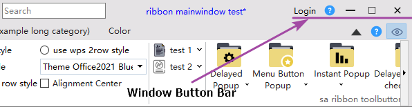
