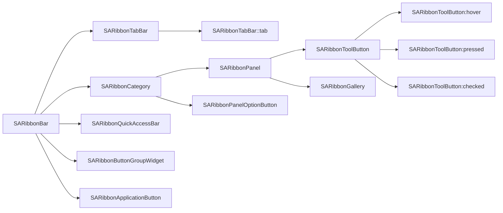

# 自定义样式

- ✅ **QSS完全自定义**：通过 Qt StyleSheet 深度定制界面颜色、边框、字体等所有视觉元素
- ✅ **原生边框模式**：UseNativeFrame 标志启用系统边框，适合无自定义标题栏的场景
- ✅ **样式合并机制**：内置主题 QSS 与自定义 QSS 可合并叠加，不互相覆盖
- ✅ **15种QSS选择器**：覆盖 SARibbonBar/Category/Panel/ToolButton/TabBar 等所有核心组件
- ✅ **内置主题参考**：`src/SARibbonBar/resource` 目录提供6套完整 QSS 文件作为修改基础

## QSS选择器与组件对应关系

自定义 QSS 时，需要了解各选择器对应的界面组件层级关系：


```mermaid
flowchart LR
    A[SARibbonBar] --> B[SARibbonTabBar]
    A --> C[SARibbonCategory]
    A --> D[SARibbonQuickAccessBar]
    A --> E[SARibbonButtonGroupWidget]
    A --> F[SARibbonApplicationButton]
    B --> G["SARibbonTabBar::tab"]
    C --> H[SARibbonPanel]
    C --> I[SARibbonPanelOptionButton]
    H --> J[SARibbonToolButton]
    H --> K[SARibbonGallery]
    J --> L["SARibbonToolButton:hover"]
    J --> M["SARibbonToolButton:pressed"]
    J --> N["SARibbonToolButton:checked"]
```

---

`SARibbon` 支持通过 QSS（Qt StyleSheet）自定义样式，从而实现不同风格的 Ribbon 界面。本文将以 **Matlab 2024** 的 Ribbon 风格为例，介绍如何通过 QSS 样式定制实现类似的界面效果。

!!! example "教程源码"
    本教程源码位于`example/MatlabUI`

## Matlab 2024 Ribbon 界面特点

`Matlab 2024` 的 Ribbon 界面具有以下设计特征：

- 使用原生系统窗口边框；
- 无自定义标题栏；
- 不包含 Office 风格 Ribbon 中的 `Application Button`。

我们将基于这些特征，使用 `SARibbon` 实现一个风格一致的界面。


## 实现步骤

### 1. 启用原生窗口边框

`SARibbonMainWindow` 提供了 `SARibbonMainWindowStyleFlag::UseNativeFrame` 标志，用于启用原生系统边框。启用后，`SARibbon` 将不再绘制标题栏。

!!! warning "注意"
    该标志必须在构造函数中设置，不支持运行时动态设置

```c++ hl_lines="3 4"
MainWindow::MainWindow(QWidget* par)
    : SARibbonMainWindow(par,
                         SARibbonMainWindowStyleFlag::UseNativeFrame
                             | SARibbonMainWindowStyleFlag::UseRibbonMenuBar)  // 使用原生边框，使用ribbon
{

}
```

!!! tip "注意"
    不要忘记了SARibbonMainWindowStyleFlag::UseRibbonMenuBar标志位

### 2. 设置为紧凑布局

默认的 `SARibbon` 布局包含标题栏，适用于非原生边框窗口。在原生边框模式下，标题栏是多余的，应使用紧凑布局。

通过设置 `SARibbonBar::RibbonStyleCompactThreeRow`，可移除标题栏并采用三行布局：

```c++ hl_lines="8"
MainWindow::MainWindow(QWidget* par)
    : SARibbonMainWindow(par,
                         SARibbonMainWindowStyleFlag::UseNativeFrame
                             | SARibbonMainWindowStyleFlag::UseRibbonMenuBar)  // 使用原生边框，使用ribbon
{
    SARibbonBar* ribbon = ribbonBar();
    //! matlab ui 由于使用系统边框，应该设置为紧凑模式，避免上面的留白
    ribbon->setRibbonStyle(SARibbonBar::RibbonStyleCompactThreeRow);
}
```

### 3. 移除 Application Button

`Matlab2024`的界面没有`Application Button`，`SARibbon`默认会创建一个`Application Button`，可以通过`SARibbonBar::setApplicationButton`传入一个空指针取消此按钮

```c++ hl_lines="10"
MainWindow::MainWindow(QWidget* par)
    : SARibbonMainWindow(par,
                         SARibbonMainWindowStyleFlag::UseNativeFrame
                             | SARibbonMainWindowStyleFlag::UseRibbonMenuBar)  // 使用原生边框，使用ribbon
{
    SARibbonBar* ribbon = ribbonBar();
    //! matlab ui 由于使用系统边框，应该设置为紧凑模式，避免上面的留白
    ribbon->setRibbonStyle(SARibbonBar::RibbonStyleCompactThreeRow);
    //! matlab ui 没有Application button，传入nullptr取消Application button
    ribbon->setApplicationButton(nullptr);
}
```

至此，通过上面的设置，你能得到一个如下样式的窗口（为了更好看效果，这里添加了一些按钮）


### 4. 调整左右边距

`SARibbonBar` 默认带有 2px 的左右内边距，而 `Matlab` 界面是没有左右的边距的

你可以设置`SARibbonBar`的`contentsMargins`来调整边界值，通过`SARibbonBar::setContentsMargins`即可设置：

```c++ hl_lines="8"
MainWindow::MainWindow(QWidget* par)
    : SARibbonMainWindow(par,
                         SARibbonMainWindowStyleFlag::UseNativeFrame
                             | SARibbonMainWindowStyleFlag::UseRibbonMenuBar)  // 使用原生边框，使用ribbon
{
    SARibbonBar* ribbon = ribbonBar();
    ...
    ribbon->setContentsMargins(0, 0, 0, 0);
    ...
}
```

### 5. 加载自定义 QSS 样式

你可以在你的程序中添加一个`theme-matlab.qss`文件来保存你的自定义样式，并把它添加到qrc资源文件中

然后在`MainWindow`构造函数中加载并应用：

```c++ hl_lines="13"
MainWindow::MainWindow(QWidget* par)
    : SARibbonMainWindow(par,
                         SARibbonMainWindowStyleFlag::UseNativeFrame
                             | SARibbonMainWindowStyleFlag::UseRibbonMenuBar)  // 使用原生边框，使用ribbon
{
    SARibbonBar* ribbon = ribbonBar();
    ...
    //! 从资源文件里加载主题
    QFile file(":/ribbon-theme/theme-matlab.qss");
    if (file.open(QIODevice::ReadOnly | QIODevice::Text)) {
        QString qss = QString::fromUtf8(file.readAll());
        // 设置qss
        QTimer::singleShot(0, [ this, qss ]() { this->setStyleSheet(qss); });
    }
}
```

!!! warning "注意"
    注意这里的第13行，这里使用了`QTimer::singleShot`把`setStyleSheet`投递到队列中，让构造函数完成后执行样式设置，可以延迟设置样式，确保界面初始化完成后再应用样式

这样你的程序启动后就会加载你的qss样式

下面将介绍如何使用qss进行样式定制

## SARibbon的QSS样式定制

自定义`SARibbon`主题样式可以参考`SARibbon`的内置主题，`SARibbon`的内置主题位于`src/SARibbonBar/resource`目录

### 1. 基本颜色定义

在定制 QSS 前，先明确主体颜色，参考具体的`Matlab 2024`的界面颜色


可得到本次主题的主要颜色定义如下：

| 元素             | 颜色值     |
|------------------|------------|
| Tab 栏背景色     | `#004076`  |
| Category 背景色  | `#f5f5f5`  |
| 文字颜色         | `black`    |
| 按钮默认背景     | `#f5f5f5`  |
| 按钮悬停/选中色  | `#d9d9d9`  |

### 2. QSS设置 SARibbonBar 背景

`Matlab`的背景颜色为`#004076`,需要把`SARibbonBar`的背景色设置为`#004076`

```css
SARibbonBar {
  background-color: #004076;
  border: none;
  color: black;
}
```

### 3. QSS设置 Category 背景

接着是要设置`SARibbonCategory`的背景色为`#f5f5f5`

```css
/*SARibbonCategory*/
SARibbonCategory {
  background-color: #f5f5f5;
}
```

通过上面的样式，你的界面的效果如下：


### 4. QSS设置 SARibbonToolButton 样式

`Matlab`的按钮选中颜色和hover颜色为`#d9d9d9`，没选中状态为透明色，但是这里有一点需要注意：在`QToolButton::MenuButtonPopup`模式下，大的`SARibbonToolButton`会分为两部分，如果设置为透明，在`QToolButton::MenuButtonPopup`模式下，鼠标位于上下两部分是无法区分的，主要原因是：假如鼠标位于下半部分按钮，此时上半部分的按钮属于未选中状态，但未选中状态颜色为透明，而此时整个按钮是被渲染为选中状态，这时候上半部分的未选中状态是看不出来的

!!! warning "SARibbonToolButton的QSS设置注意事项"
    `SARibbonToolButton` 的默认背景色应设置为与 Category 背景一致（如 `#f5f5f5`），而非透明，以避免在 `MenuButtonPopup` 模式下出现视觉异常。

上述例子中category背景颜色为`#f5f5f5`,那么`SARibbonToolButton`的QSS应该如下：

```css
/*SARibbonToolButton*/
SARibbonToolButton {
  border: none;
  color: black;
  background-color: #f5f5f5; /*这里不能设置为transparent*/
}

SARibbonToolButton:pressed {
  background-color: #d9d9d9;
}

SARibbonToolButton:checked {
  background-color: #d9d9d9;
}

SARibbonToolButton:hover {
  background-color: #d9d9d9;
}
```

运行效果如下：


这时能看到`SARibbonToolButton`在`QToolButton::MenuButtonPopup`模式，上下两部分能明显区分出来

### 5. QSS设置 Tab 栏样式

Tab栏对应的类是`SARibbonTabBar`,`SARibbonTabBar` 的 Tab 标签可通过 `::tab` 子控件进行样式设置

Matlab 风格的 Tab 具有以下特点：

- 左侧有 5px 偏移；
- 固定宽度（如 100px）；
- 选中时背景为 `#f5f5f5`，文字为黑色；

具体的QSS如下：

```css
/*SARibbonTabBar*/
SARibbonTabBar {
  background-color: transparent;
}

SARibbonTabBar::tab {
  color: white;
  border: 1px solid transparent;
  background: transparent;
  margin-top: 0px;
  margin-right: 0px;
  margin-left: 5px;
  margin-bottom: 0px;
  min-width: 100px;
}

SARibbonTabBar::tab:selected {
  color: black;
  background: #f5f5f5;
}

SARibbonTabBar::tab:hover:!selected {
    color: white;
    background: transparent;
    border-top:1px solid #f5f5f5;
    border-right:1px solid #f5f5f5;
    border-left:1px solid #f5f5f5;
    border-bottom:1px solid transparent;
}
```

> `SARibbonTabBar::tab:hover:!selected`是设置未选中的tab，但鼠标移动过去的效果，这里可以设置为把边框高亮，让鼠标移动过去后能明显显示

## 最终效果

完成上述设置后，你将得到一个风格接近 Matlab 2024 的 Ribbon 界面，具备原生边框、紧凑布局、无 Application Button、颜色风格统一等特点。

效果如下：


## QSS 作用域说明（重要）

### setStyleSheet 的替换语义

在 Qt 中，`setStyleSheet()` 方法会**替换**（而不是合并）目标控件及其子控件的当前样式表。内置主题的 QSS 也是通过 `setStyleSheet()` 设置的，这意味着：

- **自定义 QSS 会覆盖内置主题的 QSS**：如果在 `setRibbonTheme()` 之后调用 `setStyleSheet(customQSS)`，自定义 QSS 将完全取代内置主题的样式定义
- **子控件继承**：通过父控件的 `setStyleSheet()` 设置的 QSS 会自动级联到子控件，子控件可以覆盖特定属性

```cpp
// 错误用法 —— setRibbonTheme 会清除之前的 setStyleSheet
this->setStyleSheet(customQSS);      // 先加载自定义 QSS
ribbonBar()->setRibbonTheme(...);    // 这会调用 setStyleSheet，覆盖自定义 QSS

// 正确用法 —— 先设置主题，再叠加自定义 QSS
ribbonBar()->setRibbonTheme(...);    // 先加载内置主题
this->setStyleSheet(customQSS);      // 再用自定义 QSS 覆盖
```

!!! warning "重要警告"
    调用 `setRibbonTheme()` 会在内部调用 `setStyleSheet()`，**这会清除此前通过 `setStyleSheet()` 设置的所有自定义 QSS**。因此，如果在应用中同时使用内置主题和自定义 QSS，务必**先设置内置主题，再叠加自定义 QSS**。

### 全局作用域风险

以下选择器使用了标准 Qt 控件类名（非 SARibbon 前缀），如果不加父控件限定，可能会影响应用中**所有**同类型控件：

| 选择器 | 影响范围 |
|--------|---------|
| `QComboBox` | 所有下拉框 |
| `QLineEdit` | 所有文本框 |
| `QCheckBox` | 所有复选框 |
| `QRadioButton` | 所有单选按钮 |
| `QToolButton` | 所有工具栏按钮 |

SARibbon 的内置主题通过子控件限定符（如 `SARibbonPanel > QComboBox`）将样式限制在 Ribbon 面板内部，避免全局污染。自定义 QSS 时应遵循相同的做法：

```css
/* 正确：限定在 SARibbonPanel 内部 */
SARibbonPanel > QComboBox {
    border: 1px solid #ccc;
}
SARibbonPanel > QLineEdit {
    background: white;
}
SARibbonPanel > QCheckBox {
    color: black;
}

/* 错误：无限定符会污染全局 */
QComboBox {
    border: 1px solid #ccc;
}
```

!!! tip "提示"
    如果应用中包含多个独立窗口或非 Ribbon 的面板，上述带 `SARibbonPanel` 的限定符仍可能不够。此时应考虑使用 `SARibbonBar SARibbonPanel > QComboBox` 等更具体的路径限定来确保隔离。

## QSS 自定义主题的后处理调整

纯 QSS 无法覆盖所有视觉方面的定制，某些 Ribbon 特有的布局参数和颜色属性需要在 C++ 端进行额外设置。内置主题在 `SARibbonMainWindow::setRibbonTheme()` 中通过三步后处理修正（`SARibbonMainWindow.cpp:575-588`）：

1. **Tab 边距**：`SARibbonTabBar::setTabMargin(QMargins)` — 补偿 QSS 中无法精确表达的 Tab 间距
2. **上下文 Category 颜色**：`SARibbonBar::setContextCategoryColorList()` + `setContextCategoryColorHighLight()` — 设置运行时颜色方案
3. **Tab 栏基线颜色**：`SARibbonBar::setTabBarBaseLineColor(QColor)` — 设置 Tab 栏底部的线条颜色

自定义主题时，如果有类似需求，可以在加载 QSS 后添加相应的 C++ 调整代码：

```cpp
// 加载自定义 QSS
QFile file(":/ribbon-theme/theme-custom.qss");
if (file.open(QIODevice::ReadOnly | QIODevice::Text)) {
    QString qss = QString::fromUtf8(file.readAll());
    setStyleSheet(qss);
}

// 后处理调整
SARibbonBar* bar = ribbonBar();
if (SARibbonTabBar* tab = bar->ribbonTabBar()) {
    tab->setTabMargin(QMargins(5, 0, 0, 0));  // 调整 Tab 边距
}
bar->setContextCategoryColorList({ QColor(18, 64, 120) });  // 设置上下文颜色
bar->setTabBarBaseLineColor(QColor(186, 201, 219));          // 设置基线颜色
```

!!! tip "参考"
    内置主题的后处理逻辑定义在 `src/SARibbonBar/SARibbonMainWindow.cpp` 中 `PrivateData::updateTabBarMargins()`、`updateContextColors()` 和 `updateTabBarBaseLineColor()` 三个静态方法中（第 39-41 行声明，第 102-154 行实现）。`SARibbonWidget` 有类似的内联逻辑。

## 添加新内置主题（开发者指南）

如果需要为项目添加一个永久性的内置主题（而非临时的 QSS 覆盖），可以按照以下 5 个步骤操作。所有涉及的文件均位于 `src/SARibbonBar/` 目录下。

### 步骤 1：创建 .qss 文件

在 `src/SARibbonBar/resource/` 目录下创建主题 QSS 文件，建议以 `theme-{名称}.qss` 命名，并参考现有 6 套内置主题中风格最接近的一份作为基础进行修改：

```
src/SARibbonBar/resource/theme-mytheme.qss
```

### 步骤 2：注册到 QRC 资源文件

编辑 `src/SARibbonBar/SARibbonResource.qrc`，在 `/SARibbonTheme` 前缀下添加新文件：

```xml
<qresource prefix="/SARibbonTheme">
    <file>resource/theme-win7.qss</file>
    <file>resource/theme-office2013.qss</file>
    <file>resource/theme-dark.qss</file>
    <file>resource/theme-office2016-blue.qss</file>
    <file>resource/theme-office2021-blue.qss</file>
    <file>resource/theme-dark2.qss</file>
    <file>resource/theme-mytheme.qss</file>  <!-- 新增 -->
</qresource>
```

### 步骤 3：添加枚举值

在 `src/SARibbonBar/SARibbonGlobal.h` 的 `SARibbonTheme` 枚举（第 219 行）中添加新值：

```cpp
enum class SARibbonTheme
{
    RibbonThemeOffice2013,      ///< Office 2013 theme
    RibbonThemeOffice2016Blue,  ///< Office 2016 - Blue theme
    RibbonThemeOffice2021Blue,  ///< Office 2021 - Blue theme
    RibbonThemeWindows7,        ///< Windows 7 theme
    RibbonThemeDark,            ///< Dark theme
    RibbonThemeDark2,           ///< Dark theme 2
    RibbonThemeMyTheme          ///< My custom theme            // 新增
};
```

### 步骤 4：添加内置 QSS 加载逻辑

在 `src/SARibbonBar/SARibbonUtil.cpp` 的 `getBuiltInRibbonThemeQss()` 函数（第 142 行）中添加新的 `case` 分支：

```cpp
QString getBuiltInRibbonThemeQss(SARibbonTheme theme)
{
    QFile file;
    switch (theme) {
    // ... 现有 case 分支 ...
    case SARibbonTheme::RibbonThemeMyTheme:
        file.setFileName(":/SARibbonTheme/resource/theme-mytheme.qss");
        break;
    default:
        file.setFileName(":/SARibbonTheme/resource/theme-office2013.qss");
        break;
    }
    // ...
}
```

### 步骤 5：添加后处理调整规则

在 `src/SARibbonBar/SARibbonMainWindow.cpp` 的三个后处理方法中添加新主题的调整规则：

```cpp
// updateTabBarMargins() — 第 102 行
static const std::map< SARibbonTheme, QMargins > themeMargins = {
    // ... 现有条目 ...
    { SARibbonTheme::RibbonThemeMyTheme, { 5, 0, 0, 0 } },  // 新增
};

// updateContextColors() — 第 118 行，在 switch 中添加 case
case SARibbonTheme::RibbonThemeMyTheme:
    bar->setContextCategoryColorList({ QColor(200, 200, 200) });
    bar->setContextCategoryColorHighLight(cs_vibrantHighlight);
    break;

// updateTabBarBaseLineColor() — 第 147 行，在条件中增加
if (theme == SARibbonTheme::RibbonThemeOffice2013
    || theme == SARibbonTheme::RibbonThemeMyTheme) {  // 新增
    bar->setTabBarBaseLineColor(QColor(186, 201, 219));
} else {
    bar->setTabBarBaseLineColor(QColor());
}
```

!!! tip "提示"
    如果自定义主题不需要后处理调整（例如主题基于现有主题的配色方案），可以省略步骤 5，不修改 `SARibbonMainWindow.cpp` 中的后处理函数。

---

本教程源码位于`example/MatlabUI`

## 附录：SARibbon QSS 选择器参考（完整版）

以下列出了 SARibbon 中所有 83 个 QSS 选择器，按组件族分组。表格中主题列为各内置主题的可用性（✔ = 存在，— = 不存在）。主题缩写：**2021** = office2021-blue，**2016** = office2016-blue，**2013** = office2013，**dark** = dark，**dark2** = dark2，**win7** = win7。

!!! note "已知命名不一致"
    - `SARibbonApplicationButton::pressed`：2016 主题使用 `::pressed`（子控件语法）而非 `:pressed`（伪状态），其他 5 个主题均使用 `:pressed`
    - `RibbonGalleryViewport`：win7 主题缺少 `SA` 前缀（应为 `SARibbonGalleryViewport`），其他 5 个主题均使用完整类名

### Core 核心组件

| # | QSS 选择器 | 说明 | 2021 | 2016 | 2013 | dark | dark2 | win7 |
|---|-----------|------|------|------|------|------|------|------|
| 1 | `SARibbonApplicationWidget` | Application widget 背景/颜色 | ✔ | — | — | — | — | — |
| 2 | `SARibbonBar` | Ribbon 主栏背景/边框/文字颜色 | ✔ | ✔ | ✔ | ✔ | ✔ | ✔ |
| 3 | `SARibbonApplicationButton` | Application 按钮基础样式 | ✔ | ✔ | ✔ | ✔ | ✔ | ✔ |
| 4 | `SARibbonApplicationButton:hover` | 悬停状态 | ✔ | ✔ | ✔ | ✔ | ✔ | ✔ |
| 5 | `SARibbonApplicationButton:pressed` | 按下伪状态 | ✔ | —* | ✔ | ✔ | ✔ | ✔ |
| 6 | `SARibbonApplicationButton::pressed` | **拼写差异**：子控件语法（应为 `:pressed`） | — | ✔* | — | — | — | — |
| 7 | `SARibbonApplicationButton:focus` | 焦点轮廓（outline:none） | ✔ | ✔ | ✔ | ✔ | ✔ | ✔ |
| 8 | `SARibbonApplicationButton::menu-indicator` | 隐藏菜单指示器（width:0） | ✔ | ✔ | ✔ | ✔ | ✔ | ✔ |

\* 第 5、6 项语义相同；2016 主题使用 `::pressed` 替代 `:pressed`。

### Category 分类页

| # | QSS 选择器 | 说明 | 2021 | 2016 | 2013 | dark | dark2 | win7 |
|---|-----------|------|------|------|------|------|------|------|
| 9 | `SARibbonCategory` | Category 背景 | ✔ | ✔ | ✔ | ✔ | ✔ | ✔ |
| 10 | `SARibbonCategory:focus` | 焦点轮廓（outline:none） | ✔ | ✔ | ✔ | ✔ | ✔ | ✔ |
| 11 | `SARibbonCategory > SARibbonSeparatorWidget` | Category 范围内的分隔线（颜色/边距） | ✔ | ✔ | ✔ | — | ✔ | ✔ |
| 12 | `SARibbonCategoryScrollButton` | 滚动按钮基础样式 | ✔ | ✔ | ✔ | ✔ | ✔ | ✔ |
| 13 | `SARibbonCategoryScrollButton[arrowType="3"]` | 右箭头（border-right） | ✔ | ✔ | ✔ | ✔ | ✔ | ✔ |
| 14 | `SARibbonCategoryScrollButton[arrowType="4"]` | 左箭头（border-left） | ✔ | ✔ | ✔ | ✔ | ✔ | ✔ |
| 15 | `SARibbonCategoryScrollButton:hover` | 悬停状态 | ✔ | ✔ | ✔ | — | — | — |
| 16 | `SARibbonStackedWidget` | Stacked widget 边框 | ✔ | ✔ | ✔ | ✔ | — | — |
| 17 | `SARibbonStackedWidget:focus` | 焦点轮廓（outline:none） | ✔ | ✔ | ✔ | ✔ | — | ✔ |

### Panel 面板

| # | QSS 选择器 | 说明 | 2021 | 2016 | 2013 | dark | dark2 | win7 |
|---|-----------|------|------|------|------|------|------|------|
| 18 | `SARibbonPanel` | 面板背景/边框/颜色 | ✔ | ✔ | ✔ | ✔ | ✔ | ✔ |
| 19 | `SARibbonPanel > SARibbonButtonGroupWidget` | Panel 范围内的按钮组边框 | ✔ | ✔ | — | — | — | — |
| 20 | `SARibbonPanel > SARibbonSeparatorWidget` | Panel 范围内的分隔线 | — | — | — | — | ✔ | — |
| 21 | `SARibbonPanelLabel` | 面板标题标签 | ✔ | ✔ | ✔ | ✔ | ✔ | ✔ |
| 22 | `SARibbonPanelOptionButton` | 选项按钮基础样式 | ✔ | ✔ | ✔ | ✔ | ✔ | ✔ |
| 23 | `SARibbonPanelOptionButton:hover` | 选项按钮悬停 | ✔ | ✔ | ✔ | ✔ | ✔ | ✔ |
| 24 | `SARibbonPanel > QLineEdit` | Panel 范围内的文本框 | ✔ | ✔ | ✔ | ✔ | ✔ | ✔ |
| 25 | `SARibbonPanel > QLineEdit:hover` | 文本框悬停 | ✔ | ✔ | ✔ | ✔ | ✔ | ✔ |
| 26 | `SARibbonPanel > QCheckBox` | Panel 范围内的复选框 | ✔ | ✔ | ✔ | ✔ | ✔ | ✔ |
| 27 | `SARibbonPanel > QRadioButton` | Panel 范围内的单选按钮 | — | — | — | — | ✔ | — |
| 28 | `SARibbonPanel > QComboBox` | Panel 范围内的下拉框 | ✔ | ✔ | ✔ | ✔ | ✔ | ✔ |
| 29 | `SARibbonPanel > QComboBox:hover` | 下拉框悬停边框 | ✔ | ✔ | ✔ | ✔ | ✔ | ✔ |
| 30 | `SARibbonPanel > QComboBox:editable` | 可编辑下拉框样式 | ✔ | ✔ | ✔ | ✔ | ✔ | ✔ |
| 31 | `SARibbonPanel > QComboBox::drop-down` | 下拉按钮子控件定位 | ✔ | ✔ | ✔ | ✔ | ✔ | ✔ |
| 32 | `SARibbonPanel > QComboBox::drop-down:hover` | 下拉按钮悬停 | ✔ | ✔ | ✔ | ✔ | ✔ | ✔ |
| 33 | `SARibbonPanel > QComboBox::down-arrow` | 下拉箭头图标 | ✔ | ✔ | ✔ | ✔ | ✔ | ✔ |

### Controls 控件

| # | QSS 选择器 | 说明 | 2021 | 2016 | 2013 | dark | dark2 | win7 |
|---|-----------|------|------|------|------|------|------|------|
| 34 | `SARibbonToolButton` | 工具按钮基础样式 | ✔ | ✔ | ✔ | ✔ | ✔ | ✔ |
| 35 | `SARibbonToolButton:focus` | 焦点边框/背景 | — | — | ✔ | ✔ | ✔ | ✔ |
| 36 | `SARibbonToolButton:pressed` | 按下状态 | ✔ | ✔ | ✔ | ✔ | ✔ | ✔ |
| 37 | `SARibbonToolButton:hover` | 悬停状态 | ✔ | ✔ | ✔ | ✔ | ✔ | ✔ |
| 38 | `SARibbonToolButton:checked` | 选中状态 | ✔ | ✔ | ✔ | ✔ | ✔ | ✔ |
| 39 | `SARibbonToolButton:checked:hover` | 选中+悬停组合 | ✔ | — | — | — | — | — |
| 40 | `SARibbonButtonGroupWidget` | 按钮组（透明背景） | ✔ | ✔ | ✔ | ✔ | ✔ | ✔ |
| 41 | `SARibbonButtonGroupWidget > QToolButton` | 组内的工具按钮 | — | ✔ | — | ✔ | ✔ | ✔ |
| 42 | `SARibbonButtonGroupWidget > QToolButton:hover` | 组内按钮悬停 | — | ✔ | — | ✔ | ✔ | ✔ |
| 43 | `SARibbonButtonGroupWidget > QToolButton:pressed` | 组内按钮按下 | — | ✔ | — | ✔ | ✔ | ✔ |
| 44 | `SARibbonButtonGroupWidget > QToolButton:checked` | 组内按钮选中 | — | ✔ | — | ✔ | ✔ | ✔ |
| 45 | `SARibbonButtonGroupWidget > QToolButton[popupMode="1"]` | MenuButtonPopup 模式（padding-right） | — | ✔ | — | ✔ | ✔ | ✔ |
| 46 | `... > QToolButton[popupMode="1"]::menu-button:hover` | 菜单按钮悬停 | — | ✔ | — | ✔ | ✔ | ✔ |
| 47 | `... > QToolButton[popupMode="1"]::menu-button:pressed` | 菜单按钮按下 | — | ✔ | — | ✔ | ✔ | ✔ |
| 48 | `... > QToolButton[popupMode="2"]` | InstantPopup 模式（padding-right） | — | ✔ | — | ✔ | ✔ | ✔ |
| 49 | `... > QToolButton[popupMode="0"]` | 无弹出模式（小 padding） | — | ✔ | — | ✔ | ✔ | ✔ |
| 50 | `SARibbonCtrlContainer` | 控件容器（透明背景） | ✔ | ✔ | ✔ | ✔ | ✔ | ✔ |
| 51 | `SARibbonQuickAccessBar` | 快速访问工具栏 | — | ✔ | — | — | — | — |

### TabBar 标签栏

| # | QSS 选择器 | 说明 | 2021 | 2016 | 2013 | dark | dark2 | win7 |
|---|-----------|------|------|------|------|------|------|------|
| 52 | `SARibbonTabBar` | Tab 标签栏背景 | ✔ | ✔ | ✔ | ✔ | ✔ | ✔ |
| 53 | `SARibbonTabBar::tab` | 单个 Tab 基础样式 | ✔ | ✔ | ✔ | ✔ | ✔ | ✔ |
| 54 | `SARibbonTabBar::tab:selected` | 选中的 Tab | ✔ | ✔ | ✔ | ✔ | ✔ | ✔ |
| 55 | `SARibbonTabBar::tab:hover:!selected` | 悬停于未选中的 Tab | ✔ | ✔ | ✔ | ✔ | ✔ | ✔ |
| 56 | `SARibbonTabBar::tab:!selected` | 显式的未选中 Tab 样式 | — | — | — | ✔ | ✔ | — |
| 57 | `SARibbonTabBar::tab:selected, SARibbonTabBar::tab:hover` | 组合选择器（圆角 Tab） | — | — | — | — | — | ✔ |

### Separator 分隔线

| # | QSS 选择器 | 说明 | 2021 | 2016 | 2013 | dark | dark2 | win7 |
|---|-----------|------|------|------|------|------|------|------|
| 58 | `SARibbonSeparatorWidget` | 分隔线基础（`color` 定义线颜色，部分主题另设 `background-color`） | ✔ | ✔ | ✔ | ✔ | ✔ | ✔ |

### Gallery 画廊

| # | QSS 选择器 | 说明 | 2021 | 2016 | 2013 | dark | dark2 | win7 |
|---|-----------|------|------|------|------|------|------|------|
| 59 | `SARibbonGallery` | Gallery 边框/背景/颜色 | ✔ | ✔ | ✔ | ✔ | ✔ | ✔ |
| 60 | `SARibbonGalleryButton` | Gallery 滚动按钮基础 | ✔ | ✔ | ✔ | ✔ | ✔ | ✔ |
| 61 | `SARibbonGalleryButton:hover` | Gallery 按钮悬停 | ✔ | ✔ | — | — | — | — |
| 62 | `SARibbonGalleryGroup` | Gallery 组（show-decoration-selected，边框） | ✔ | ✔ | ✔ | ✔ | ✔ | ✔ |
| 63 | `SARibbonGalleryGroup::item` | 条目基础样式 | — | — | — | ✔ | ✔ | — |
| 64 | `SARibbonGalleryGroup::item:selected` | 选中的条目 | ✔ | ✔ | ✔ | ✔ | ✔ | ✔ |
| 65 | `SARibbonGalleryGroup::item:hover` | 悬停的条目 | ✔ | ✔ | ✔ | ✔ | ✔ | ✔ |
| 66 | `SARibbonGalleryViewport` | Gallery 视口背景 | ✔ | ✔ | ✔ | ✔ | ✔ | —* |
| 67 | `RibbonGalleryViewport` | **拼写差异**：缺少 `SA` 前缀 | — | — | — | — | — | ✔* |

\* 第 66、67 项语义相同；win7 主题缺少 `SA` 前缀。

### Menu 菜单

| # | QSS 选择器 | 说明 | 2021 | 2016 | 2013 | dark | dark2 | win7 |
|---|-----------|------|------|------|------|------|------|------|
| 68 | `SARibbonMenu` | 菜单背景/颜色/边框 | ✔ | ✔ | ✔ | ✔ | ✔ | ✔ |
| 69 | `SARibbonMenu::item` | 菜单项内边距/背景 | ✔ | ✔ | ✔ | ✔ | ✔ | ✔ |
| 70 | `SARibbonMenu::item:selected` | 选中的菜单项 | ✔ | ✔ | ✔ | ✔ | ✔ | ✔ |
| 71 | `SARibbonMenu::item:hover` | 悬停的菜单项 | ✔ | ✔ | ✔ | ✔ | ✔ | ✔ |
| 72 | `SARibbonMenu::icon` | 菜单图标边距 | ✔ | ✔ | ✔ | ✔ | ✔ | ✔ |

### System 系统按钮

| # | QSS 选择器 | 说明 | 2021 | 2016 | 2013 | dark | dark2 | win7 |
|---|-----------|------|------|------|------|------|------|------|
| 73 | `SARibbonSystemToolButton` | 系统按钮基础（透明背景，无边框） | ✔ | ✔ | ✔ | ✔ | ✔ | ✔ |
| 74 | `SARibbonSystemToolButton:focus` | 焦点轮廓（outline:none） | ✔ | ✔ | ✔ | ✔ | ✔ | ✔ |
| 75 | `SARibbonSystemToolButton#SAMinimizeWindowButton` | 最小化按钮图标/内边距 | ✔ | ✔ | ✔ | ✔ | ✔ | ✔ |
| 76 | `#SAMinimizeWindowButton:hover` | 最小化悬停背景 | ✔ | ✔ | ✔ | ✔ | ✔ | ✔ |
| 77 | `#SAMinimizeWindowButton:pressed` | 最小化按下背景 | ✔ | ✔ | ✔ | ✔ | ✔ | ✔ |
| 78 | `SARibbonSystemToolButton#SAMaximizeWindowButton` | 最大化按钮图标/内边距 | ✔ | ✔ | ✔ | ✔ | ✔ | ✔ |
| 79 | `#SAMaximizeWindowButton:hover` | 最大化悬停背景 | ✔ | ✔ | ✔ | ✔ | ✔ | ✔ |
| 80 | `#SAMaximizeWindowButton:checked` | 最大化选中（显示 Normal.svg 图标） | ✔ | ✔ | ✔ | ✔ | ✔ | ✔ |
| 81 | `SARibbonSystemToolButton#SACloseWindowButton` | 关闭按钮图标/内边距 | ✔ | ✔ | ✔ | ✔ | ✔ | ✔ |
| 82 | `#SACloseWindowButton:hover` | 关闭悬停（红色背景 #e81123） | ✔ | ✔ | ✔ | ✔ | ✔ | ✔ |
| 83 | `#SACloseWindowButton:pressed` | 关闭按下（浅红色 #f1707a） | ✔ | ✔ | ✔ | ✔ | ✔ | ✔ |

---

**每个主题的选择器数量统计**：office2021-blue 66 个，office2016-blue 74 个，office2013 63 个，dark 71 个，dark2 72 个，win7 70 个。

!!! tip "提示"
    内置主题 QSS 文件位于 `src/SARibbonBar/resource` 目录，建议以内置主题为基础进行修改，可避免遗漏关键选择器。内置 QSS 文件中包含中文注释，英文开发者仍可通过选择器名称和属性值理解样式结构。
