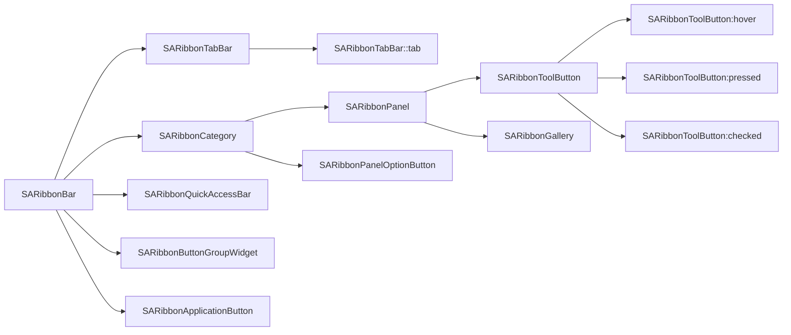

# 自定义样式

- ✅ **QSS完全自定义**：通过 Qt StyleSheet 深度定制界面颜色、边框、字体等所有视觉元素
- ✅ **原生边框模式**：UseNativeFrame 标志启用系统边框，适合无自定义标题栏的场景
- ✅ **样式合并机制**：内置主题 QSS 与自定义 QSS 可合并叠加，不互相覆盖
- ✅ **83种QSS选择器**：覆盖 SARibbonBar/Category/Panel/ToolButton/TabBar 等所有核心组件，10种内置主题（6模板+10调色板）可用性对照
- ✅ **内置主题参考**：`src/SARibbonBar/resource/templates/` 目录提供6套 QSS 模板，`src/SARibbonBar/resource/palettes/` 目录提供10套调色板 JSON 文件
- ✅ **JSON调色板自定义**：无需编辑QSS即可更改颜色，详见 [JSON主题配置指南](./json-theme-config.md) 了解完整调色板规范和示例

## QSS选择器与组件对应关系

自定义 QSS 时，需要了解各选择器对应的界面组件层级关系：


```mermaid
flowchart LR
    A[SARibbonBar] --> B[SARibbonTabBar]
    A --> C[SARibbonCategory]
    A --> D[SARibbonQuickAccessBar]
    A --> E[SARibbonButtonGroupWidget]
    A --> F[SARibbonApplicationButton]
    B --> G["SARibbonTabBar::tab"]
    C --> H[SARibbonPanel]
    C --> I[SARibbonPanelOptionButton]
    H --> J[SARibbonToolButton]
    H --> K[SARibbonGallery]
    J --> L["SARibbonToolButton:hover"]
    J --> M["SARibbonToolButton:pressed"]
    J --> N["SARibbonToolButton:checked"]
```

---

`SARibbon` 支持通过 QSS（Qt StyleSheet）自定义样式，从而实现不同风格的 Ribbon 界面。本文将以 **Matlab 2024** 的 Ribbon 风格为例，介绍如何通过 QSS 样式定制实现类似的界面效果。

!!! example "教程源码"
    本教程源码位于`example/MatlabUI`

## Matlab 2024 Ribbon 界面特点

`Matlab 2024` 的 Ribbon 界面具有以下设计特征：

- 使用原生系统窗口边框；
- 无自定义标题栏；
- 不包含 Office 风格 Ribbon 中的 `Application Button`。

我们将基于这些特征，使用 `SARibbon` 实现一个风格一致的界面。


## 实现步骤

### 1. 启用原生窗口边框

`SARibbonMainWindow` 提供了 `SARibbonMainWindowStyleFlag::UseNativeFrame` 标志，用于启用原生系统边框。启用后，`SARibbon` 将不再绘制标题栏。

!!! warning "注意"
    该标志必须在构造函数中设置，不支持运行时动态设置

```c++ hl_lines="3 4"
MainWindow::MainWindow(QWidget* par)
    : SARibbonMainWindow(par,
                         SARibbonMainWindowStyleFlag::UseNativeFrame
                             | SARibbonMainWindowStyleFlag::UseRibbonMenuBar)  // 使用原生边框，使用ribbon
{

}
```

!!! tip "注意"
    不要忘记了SARibbonMainWindowStyleFlag::UseRibbonMenuBar标志位

### 2. 设置为紧凑布局

默认的 `SARibbon` 布局包含标题栏，适用于非原生边框窗口。在原生边框模式下，标题栏是多余的，应使用紧凑布局。

通过设置 `SARibbonBar::RibbonStyleCompactThreeRow`，可移除标题栏并采用三行布局：

```c++ hl_lines="8"
MainWindow::MainWindow(QWidget* par)
    : SARibbonMainWindow(par,
                         SARibbonMainWindowStyleFlag::UseNativeFrame
                             | SARibbonMainWindowStyleFlag::UseRibbonMenuBar)  // 使用原生边框，使用ribbon
{
    SARibbonBar* ribbon = ribbonBar();
    //! matlab ui 由于使用系统边框，应该设置为紧凑模式，避免上面的留白
    ribbon->setRibbonStyle(SARibbonBar::RibbonStyleCompactThreeRow);
}
```

### 3. 移除 Application Button

`Matlab2024`的界面没有`Application Button`，`SARibbon`默认会创建一个`Application Button`，可以通过`SARibbonBar::setApplicationButton`传入一个空指针取消此按钮

```c++ hl_lines="10"
MainWindow::MainWindow(QWidget* par)
    : SARibbonMainWindow(par,
                         SARibbonMainWindowStyleFlag::UseNativeFrame
                             | SARibbonMainWindowStyleFlag::UseRibbonMenuBar)  // 使用原生边框，使用ribbon
{
    SARibbonBar* ribbon = ribbonBar();
    //! matlab ui 由于使用系统边框，应该设置为紧凑模式，避免上面的留白
    ribbon->setRibbonStyle(SARibbonBar::RibbonStyleCompactThreeRow);
    //! matlab ui 没有Application button，传入nullptr取消Application button
    ribbon->setApplicationButton(nullptr);
}
```

至此，通过上面的设置，你能得到一个如下样式的窗口（为了更好看效果，这里添加了一些按钮）


### 4. 调整左右边距

`SARibbonBar` 默认带有 2px 的左右内边距，而 `Matlab` 界面是没有左右的边距的

你可以设置`SARibbonBar`的`contentsMargins`来调整边界值，通过`SARibbonBar::setContentsMargins`即可设置：

```c++ hl_lines="8"
MainWindow::MainWindow(QWidget* par)
    : SARibbonMainWindow(par,
                         SARibbonMainWindowStyleFlag::UseNativeFrame
                             | SARibbonMainWindowStyleFlag::UseRibbonMenuBar)  // 使用原生边框，使用ribbon
{
    SARibbonBar* ribbon = ribbonBar();
    ...
    ribbon->setContentsMargins(0, 0, 0, 0);
    ...
}
```

### 5. 加载自定义 QSS 样式

你可以在你的程序中添加一个`theme-matlab.qss`文件来保存你的自定义样式，并把它添加到qrc资源文件中

然后在`MainWindow`构造函数中加载并应用：

```c++ hl_lines="13"
MainWindow::MainWindow(QWidget* par)
    : SARibbonMainWindow(par,
                         SARibbonMainWindowStyleFlag::UseNativeFrame
                             | SARibbonMainWindowStyleFlag::UseRibbonMenuBar)  // 使用原生边框，使用ribbon
{
    SARibbonBar* ribbon = ribbonBar();
    ...
    //! 从资源文件里加载主题
    QFile file(":/ribbon-theme/theme-matlab.qss");
    if (file.open(QIODevice::ReadOnly | QIODevice::Text)) {
        QString qss = QString::fromUtf8(file.readAll());
        // 设置qss
        QTimer::singleShot(0, [ this, qss ]() { this->setStyleSheet(qss); });
    }
}
```

!!! warning "注意"
    注意这里的第13行，这里使用了`QTimer::singleShot`把`setStyleSheet`投递到队列中，让构造函数完成后执行样式设置，可以延迟设置样式，确保界面初始化完成后再应用样式

这样你的程序启动后就会加载你的qss样式

下面将介绍如何使用qss进行样式定制

## SARibbon的QSS样式定制

自定义`SARibbon`主题样式可以参考`SARibbon`的内置主题模板，模板位于`src/SARibbonBar/resource/templates/`，调色板位于`src/SARibbonBar/resource/palettes/`

### 1. 基本颜色定义

在定制 QSS 前，先明确主体颜色，参考具体的`Matlab 2024`的界面颜色


可得到本次主题的主要颜色定义如下：

| 元素             | 颜色值     |
|------------------|------------|
| Tab 栏背景色     | `#004076`  |
| Category 背景色  | `#f5f5f5`  |
| 文字颜色         | `black`    |
| 按钮默认背景     | `#f5f5f5`  |
| 按钮悬停/选中色  | `#d9d9d9`  |

### 2. QSS设置 SARibbonBar 背景

`Matlab`的背景颜色为`#004076`,需要把`SARibbonBar`的背景色设置为`#004076`

```css
SARibbonBar {
  background-color: #004076;
  border: none;
  color: black;
}
```

### 3. QSS设置 Category 背景

接着是要设置`SARibbonCategory`的背景色为`#f5f5f5`

```css
/*SARibbonCategory*/
SARibbonCategory {
  background-color: #f5f5f5;
}
```

通过上面的样式，你的界面的效果如下：


### 4. QSS设置 SARibbonToolButton 样式

`Matlab`的按钮选中颜色和hover颜色为`#d9d9d9`，没选中状态为透明色，但是这里有一点需要注意：在`QToolButton::MenuButtonPopup`模式下，大的`SARibbonToolButton`会分为两部分，如果设置为透明，在`QToolButton::MenuButtonPopup`模式下，鼠标位于上下两部分是无法区分的，主要原因是：假如鼠标位于下半部分按钮，此时上半部分的按钮属于未选中状态，但未选中状态颜色为透明，而此时整个按钮是被渲染为选中状态，这时候上半部分的未选中状态是看不出来的

!!! warning "SARibbonToolButton的QSS设置注意事项"
    `SARibbonToolButton` 的默认背景色应设置为与 Category 背景一致（如 `#f5f5f5`），而非透明，以避免在 `MenuButtonPopup` 模式下出现视觉异常。

上述例子中category背景颜色为`#f5f5f5`,那么`SARibbonToolButton`的QSS应该如下：

```css
/*SARibbonToolButton*/
SARibbonToolButton {
  border: none;
  color: black;
  background-color: #f5f5f5; /*这里不能设置为transparent*/
}

SARibbonToolButton:pressed {
  background-color: #d9d9d9;
}

SARibbonToolButton:checked {
  background-color: #d9d9d9;
}

SARibbonToolButton:hover {
  background-color: #d9d9d9;
}
```

运行效果如下：


这时能看到`SARibbonToolButton`在`QToolButton::MenuButtonPopup`模式，上下两部分能明显区分出来

### 5. QSS设置 Tab 栏样式

Tab栏对应的类是`SARibbonTabBar`,`SARibbonTabBar` 的 Tab 标签可通过 `::tab` 子控件进行样式设置

Matlab 风格的 Tab 具有以下特点：

- 左侧有 5px 偏移；
- 固定宽度（如 100px）；
- 选中时背景为 `#f5f5f5`，文字为黑色；

具体的QSS如下：

```css
/*SARibbonTabBar*/
SARibbonTabBar {
  background-color: transparent;
}

SARibbonTabBar::tab {
  color: white;
  border: 1px solid transparent;
  background: transparent;
  margin-top: 0px;
  margin-right: 0px;
  margin-left: 5px;
  margin-bottom: 0px;
  min-width: 100px;
}

SARibbonTabBar::tab:selected {
  color: black;
  background: #f5f5f5;
}

SARibbonTabBar::tab:hover:!selected {
    color: white;
    background: transparent;
    border-top:1px solid #f5f5f5;
    border-right:1px solid #f5f5f5;
    border-left:1px solid #f5f5f5;
    border-bottom:1px solid transparent;
}
```

> `SARibbonTabBar::tab:hover:!selected`是设置未选中的tab，但鼠标移动过去的效果，这里可以设置为把边框高亮，让鼠标移动过去后能明显显示

## 最终效果

完成上述设置后，你将得到一个风格接近 Matlab 2024 的 Ribbon 界面，具备原生边框、紧凑布局、无 Application Button、颜色风格统一等特点。

效果如下：


## QSS 作用域说明（重要）

### setStyleSheet 的替换语义

在 Qt 中，`setStyleSheet()` 方法会**替换**（而不是合并）目标控件及其子控件的当前样式表。内置主题的 QSS 也是通过 `setStyleSheet()` 设置的，这意味着：

- **自定义 QSS 会覆盖内置主题的 QSS**：如果在 `setRibbonTheme()` 之后调用 `setStyleSheet(customQSS)`，自定义 QSS 将完全取代内置主题的样式定义
- **子控件继承**：通过父控件的 `setStyleSheet()` 设置的 QSS 会自动级联到子控件，子控件可以覆盖特定属性

```cpp
// 错误用法 —— setRibbonTheme 会清除之前的 setStyleSheet
this->setStyleSheet(customQSS);      // 先加载自定义 QSS
ribbonBar()->setRibbonTheme(...);    // 这会调用 setStyleSheet，覆盖自定义 QSS

// 正确用法 —— 先设置主题，再叠加自定义 QSS
ribbonBar()->setRibbonTheme(...);    // 先加载内置主题
this->setStyleSheet(customQSS);      // 再用自定义 QSS 覆盖
```

!!! warning "重要警告"
    调用 `setRibbonTheme()` 会在内部调用 `setStyleSheet()`，**这会清除此前通过 `setStyleSheet()` 设置的所有自定义 QSS**。因此，如果在应用中同时使用内置主题和自定义 QSS，务必**先设置内置主题，再叠加自定义 QSS**。

### 全局作用域风险

以下选择器使用了标准 Qt 控件类名（非 SARibbon 前缀），如果不加父控件限定，可能会影响应用中**所有**同类型控件：

| 选择器 | 影响范围 |
|--------|---------|
| `QComboBox` | 所有下拉框 |
| `QLineEdit` | 所有文本框 |
| `QCheckBox` | 所有复选框 |
| `QRadioButton` | 所有单选按钮 |
| `QToolButton` | 所有工具栏按钮 |

SARibbon 的内置主题通过子控件限定符（如 `SARibbonPanel > QComboBox`）将样式限制在 Ribbon 面板内部，避免全局污染。自定义 QSS 时应遵循相同的做法：

```css
/* 正确：限定在 SARibbonPanel 内部 */
SARibbonPanel > QComboBox {
    border: 1px solid #ccc;
}
SARibbonPanel > QLineEdit {
    background: white;
}
SARibbonPanel > QCheckBox {
    color: black;
}

/* 错误：无限定符会污染全局 */
QComboBox {
    border: 1px solid #ccc;
}
```

!!! tip "提示"
    如果应用中包含多个独立窗口或非 Ribbon 的面板，上述带 `SARibbonPanel` 的限定符仍可能不够。此时应考虑使用 `SARibbonBar SARibbonPanel > QComboBox` 等更具体的路径限定来确保隔离。

## QSS 自定义主题的后处理调整

纯 QSS 无法覆盖所有视觉方面的定制，某些 Ribbon 特有的布局参数和颜色属性需要在 C++ 端进行额外设置。内置主题的后处理调整集中在 `SARibbonThemeManager.cpp` 的四个静态映射中：

1. **Tab 边距**：`SARibbonTabBar::setTabMargin(QMargins)` — 补偿 QSS 中无法精确表达的 Tab 间距
2. **上下文 Category 颜色**：`SARibbonBar::setContextCategoryColorList()` + `setContextCategoryColorHighLight()` — 设置运行时颜色方案
3. **Tab 栏基线颜色**：`SARibbonBar::setTabBarBaseLineColor(QColor)` — 设置 Tab 栏底部的线条颜色

自定义主题时，如果有类似需求，可以在加载 QSS 后添加相应的 C++ 调整代码：

```cpp
// 加载自定义 QSS
QFile file(":/ribbon-theme/theme-custom.qss");
if (file.open(QIODevice::ReadOnly | QIODevice::Text)) {
    QString qss = QString::fromUtf8(file.readAll());
    setStyleSheet(qss);
}

// 后处理调整
SARibbonBar* bar = ribbonBar();
if (SARibbonTabBar* tab = bar->ribbonTabBar()) {
    tab->setTabMargin(QMargins(5, 0, 0, 0));  // 调整 Tab 边距
}
bar->setContextCategoryColorList({ QColor(18, 64, 120) });  // 设置上下文颜色
bar->setTabBarBaseLineColor(QColor(186, 201, 219));          // 设置基线颜色
```

!!! tip "参考"
    内置主题的后处理逻辑定义在 `src/SARibbonBar/SARibbonThemeManager.cpp` 中的四个静态 `std::map` 对象：`s_themeMargins`、`s_themeContextHighlights`、`s_themeContextColorLists` 和 `s_themeBaselineColors`。
