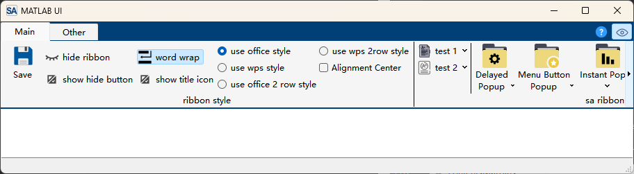

# 自定义样式

SARibbon可以自定义qss样式，以实现不同的ribbon风格效果，这里以Matlab的ribbon风格举例来如何自定义qss样式

## Matlab界面

`Matlab2024`的界面如下


`Matlab2024`的ribbon界面有如下特点：
- `Matlab2024`的ribbon界面使用了原生系统边框
- 由于使用了系统边框因此没有标题栏
- 没有Office系列Ribbon的`Application Button`

下面将详细介绍如何使用`SARibbon`的QSS,实现`Matlab2024`的界面

## SARibbon实现Matlab界面的代码层面改动

### 使用原生边框

`SARibbon`的`SARibbonMainWindow`提供了`SARibbonMainWindowStyleFlag::UseNativeFrame`这个标志，这个标志表示使用原生边框，使用原生边框时，`SARibbon`将不会绘制标题栏，此标志需要在构造函数中设置，因此，你的MainWindow的构造函数应如下：

```c++ hl_lines="3 4"
MainWindow::MainWindow(QWidget* par)
    : SARibbonMainWindow(par,
                         SARibbonMainWindowStyleFlag::UseNativeFrame
                             | SARibbonMainWindowStyleFlag::UseRibbonMenuBar)  // 使用原生边框，使用ribbon
{

}
```

!!! tips "注意"
    不要忘记了SARibbonMainWindowStyleFlag::UseRibbonMenuBar标志位


### 调整为紧凑样式

SARibbon默认是带标题栏，标题栏下面布局tabbar的宽松样式，在原生边框下，标题栏是多余的，因此需要把标题栏去掉

通过`SARibbonBar::setRibbonStyle`可设置预定的几种样式，其中`SARibbonBar::RibbonStyleCompactThreeRow`就是去除标题栏的三行布置样式

在构造函数中调整ribbon的布局：

```c++ hl_lines="8"
MainWindow::MainWindow(QWidget* par)
    : SARibbonMainWindow(par,
                         SARibbonMainWindowStyleFlag::UseNativeFrame
                             | SARibbonMainWindowStyleFlag::UseRibbonMenuBar)  // 使用原生边框，使用ribbon
{
    SARibbonBar* ribbon = ribbonBar();
    //! matlab ui 由于使用系统边框，应该设置为紧凑模式，避免上面的留白
    ribbon->setRibbonStyle(SARibbonBar::RibbonStyleCompactThreeRow);
}
```

### 去除`Application Button`

`Matlab2024`的界面没有`Application Button`，`SARibbon`默认会创建一个`Application Button`，可以通过`SARibbonBar::setApplicationButton`传入一个空指针取消此按钮

```c++ hl_lines="10"
MainWindow::MainWindow(QWidget* par)
    : SARibbonMainWindow(par,
                         SARibbonMainWindowStyleFlag::UseNativeFrame
                             | SARibbonMainWindowStyleFlag::UseRibbonMenuBar)  // 使用原生边框，使用ribbon
{
    SARibbonBar* ribbon = ribbonBar();
    //! matlab ui 由于使用系统边框，应该设置为紧凑模式，避免上面的留白
    ribbon->setRibbonStyle(SARibbonBar::RibbonStyleCompactThreeRow);
    //! matlab ui 没有Application button，传入nullptr取消Application button
    ribbon->setApplicationButton(nullptr);
}
```

至此，从布局层面，和matlab ui保持一致（为了更好看效果，这里添加了一些按钮）


### 调整左右内边距

通过上面的效果，发现ribbon左右两边有一个内边距，这是因为`SARibbonMainWindow`创建`SARibbonBar`的时候，默认会给`SARibbonBar`设置左右各3px的内边距

对比`Matlab`的`ribbon`界面，`Matlab`界面左右没有边距的，你可以通过`setContentsMargins`设置为其它值：

```c++ hl_lines="8"
MainWindow::MainWindow(QWidget* par)
    : SARibbonMainWindow(par,
                         SARibbonMainWindowStyleFlag::UseNativeFrame
                             | SARibbonMainWindowStyleFlag::UseRibbonMenuBar)  // 使用原生边框，使用ribbon
{
    SARibbonBar* ribbon = ribbonBar();
    ...
    ribbon->setContentsMargins(0, 0, 0, 0);
    ...
}
```

接下来则使用qss进行样式定制

### 加载自定义样式

自定义样式你可以新建一个`theme-matlab.qss`文件，并把它添加到qrc资源文件中

添加完成后，可以在构造函数的最后把资源文件读取出来，并设置给MainWindow：

```c++ hl_lines="13"
MainWindow::MainWindow(QWidget* par)
    : SARibbonMainWindow(par,
                         SARibbonMainWindowStyleFlag::UseNativeFrame
                             | SARibbonMainWindowStyleFlag::UseRibbonMenuBar)  // 使用原生边框，使用ribbon
{
    SARibbonBar* ribbon = ribbonBar();
    ...
    //! 从资源文件里加载主题
    QFile file(":/ribbon-theme/theme-matlab.qss");
    if (file.open(QIODevice::ReadOnly | QIODevice::Text)) {
        QString qss = QString::fromUtf8(file.readAll());
        // 设置qss
        QTimer::singleShot(0, [ this, qss ]() { this->setStyleSheet(qss); });
    }
}
```

!!! warning "注意"
    注意这里的第13行，这里使用了`QTimer::singleShot`把`setStyleSheet`投递到队列中，让构造函数完成后执行样式设置，可以保证样式的生效
    另外你也可以把setStyleSheet放在`showEvent`中执行

这样你的程序启动后就会加载你的qss样式

下面将介绍如何使用qss进行样式定制

## SARibbon的QSS定制

自定义`SARibbon`主题样式可以参考`SARibbon`的内置主题进行参考，`SARibbon`的内置主题位于`src/SARibbonBar/resource`下面

### 背景颜色设置

在自定义一个`SARibbon`主题样式时，需要确定几个基本颜色：
- tab栏背景色（#004076）
- category背景颜色（#f5f5f5）
- 文字颜色（black）
- 按钮颜色（透明）
- 按钮选中颜色（#d9d9d9）
- 按钮hover颜色（#d9d9d9）


`Matlab`的背景颜色为`#004076`,因此，先把`SARibbonBar`的背景色设置为`#004076`

```css
SARibbonBar {
  background-color: #004076;
  border: none;
  color: black;
}
```

接着是要设置`SARibbonCategory`的背景色为`#f5f5f5`

```css
/*SARibbonCategory*/
SARibbonCategory {
  background-color: #f5f5f5;
}
```

通过上面的样式，你的界面的效果如下：



### 按钮设置

`Matlab`的按钮选中颜色和hover颜色为`#d9d9d9`，没选中状态为透明色，但是这里有一点需要注意：在`QToolButton::MenuButtonPopup`模式下，大的`SARibbonToolButton`会分为部分，如果设置为透明，在`QToolButton::MenuButtonPopup`模式下的弹出菜单下，上面半部分的按钮其实属于未选中状态，如果未选中状态设置为透明，而此时整个按钮是被渲染为选中状态，这时候上半部分的未选中状态是看不出来的

!!! warning "SARibbonToolButton的QSS设置注意事项"
    `SARibbonToolButton`的未选中状态应该设置为Category/pannel的背景同样的颜色，不应该设置为透明色

上述例子中category背景颜色为`#f5f5f5`,那么`SARibbonToolButton`的QSS应该如下：

```css
/*SARibbonToolButton*/
SARibbonToolButton {
  border: none;
  color: black;
  background-color: #f5f5f5; /*这里不能设置为transparent*/
}

SARibbonToolButton:pressed {
  background-color: #d9d9d9;
}

SARibbonToolButton:checked {
  background-color: #d9d9d9;
}

SARibbonToolButton:hover {
  background-color: #d9d9d9;
}
```

运行效果如下：


这时能看到`SARibbonToolButton`在`QToolButton::MenuButtonPopup`模式，上下两部分能明显区分出来

### Tab栏设置

Tab栏对应的类是`SARibbonTabBar`,通常Tab栏主要设置的是tab的样式，可以通过`SARibbonTabBar::tab`来对tab标签进行设置

`Matlab`的Tab栏离左边有个几像素的间距，因此需要给`SARibbonTabBar::tab`的`margin-left`属性进行设置5px的偏移

同时，能看到`Matlab`的Tab栏的宽度基本固定，这里可以通过`SARibbonTabBar::tab`的`min-width`属性限定

具体的QSS如下：

```css
/*SARibbonTabBar*/
SARibbonTabBar {
  background-color: transparent;
}

SARibbonTabBar::tab {
  color: white;
  border: 1px solid transparent;
  background: transparent;
  margin-top: 0px;
  margin-right: 0px;
  margin-left: 5px;
  margin-bottom: 0px;
  min-width: 100px;
}

SARibbonTabBar::tab:selected {
  color: black;
  background: #f5f5f5;
}

SARibbonTabBar::tab:hover:!selected {
    color: white;
    background: transparent;
    border-top:1px solid #f5f5f5;
    border-right:1px solid #f5f5f5;
    border-left:1px solid #f5f5f5;
    border-bottom:1px solid transparent;
}
```

上面的qss运行效果如下：


`SARibbonTabBar::tab:hover:!selected`是设置未选中的tab，但鼠标移动过去的效果，这里可以设置为把边框高亮，让鼠标移动过去后能明显显示