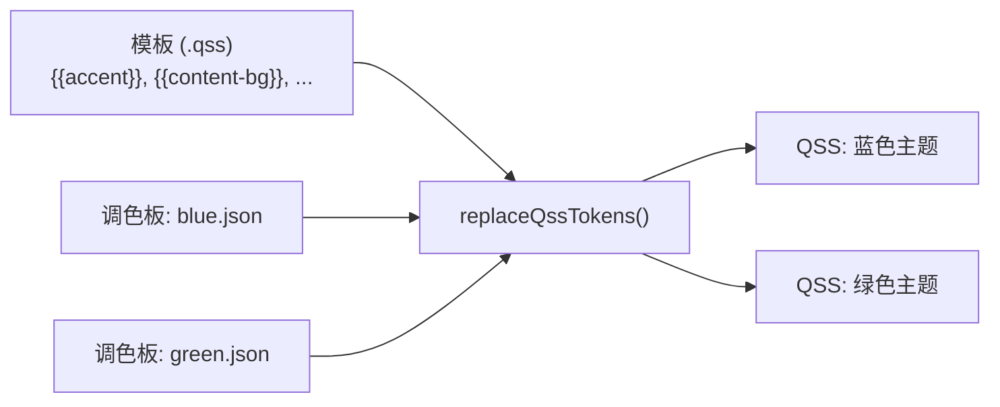

# JSON主题配置指南

- ✅ **模板+调色板架构**：`.qss` 模板包含 `{{token}}` 占位符，`.json` 调色板提供实际颜色值
- ✅ **一个模板→多种变体**：无需复制QSS即可更换颜色，只需提供不同的调色板JSON
- ✅ **三层颜色体系**：`keyColors`（主要标记）、`derived`（通过规则计算）、`fixed`（绝对值）
- ✅ **渐变支持**：调色板中的 `qlineargradient(...)` 值可在QSS中生成渐变背景
- ✅ **暗色模式反转**：`isDark` 标志自动反转派生规则，确保正确对比度
- ✅ **编程式覆盖**：C++ setter（`setAccentColor`等）可动态重新计算派生颜色

主题切换API和内置主题概述请参阅 [SARibbon主题切换](./SARibbon-theme.md)。超出调色板范围的完整QSS自定义请参阅 [自定义样式](./design-your-theme.md)。

## 1. 简介

SARibbon采用**模板+调色板**架构生成主题QSS。核心思路：

- **模板**（`.qss` 文件）定义视觉结构——哪些选择器存在、设置什么属性——但使用 `{{token}}` 占位符代替硬编码颜色
- **调色板**（`.json` 文件）定义填充这些占位符的颜色值

这种分离意味着**一个模板只需更换调色板即可产生多种视觉不同的主题**。例如，`office2016.qss` + `office2016-blue.json` 生成蓝色Office 2016主题，而同一模板 + `office2016-green.json` 则生成绿色变体——无需QSS复制。



本指南涵盖完整的JSON调色板规范、所有值格式（包括渐变）、颜色层语义、暗色模式行为，以及创建自定义调色板的实用流程。

## 2. JSON调色板规范参考

### 2.1 顶层字段

调色板JSON文件的结构如下：

```json
{
  "name": "My Theme",
  "version": "1.0",
  "isDark": false,
  "keyColors": { ... },
  "derived": { ... },
  "fixed": { ... },
  "comments": { ... }
}
```

| 字段 | 类型 | 必填 | 默认值 | 说明 |
|------|------|------|--------|------|
| `name` | string | 否 | `""` | 人类可读的标签，引擎不使用 |
| `version` | string | 否 | — | 用于跟踪的规范版本号 |
| `isDark` | bool | 否 | `false` | 暗色模式标志：为 `true` 时反转派生规则 |
| `keyColors` | object | **是** | — | 主要设计标记（名称→十六进制颜色字符串或 `qlineargradient(...)`） |
| `derived` | object | 否 | — | 从keyColors通过变亮/变暗规则计算的颜色 |
| `fixed` | object | 否 | — | 不依赖键色的绝对颜色值 |
| `comments` | object | 否 | — | 仅用于人类文档（引擎不解析） |

!!! note "说明"
    `comments` 字段存在于部分内置调色板中（如 `office2021-blue.json`、`dark-default.json`），但在其他调色板中不存在（`win7-default.json`、`office2013-default.json`）。它将标记名映射到UI描述，纯属信息性质。

### 2.2 颜色值格式

#### 十六进制颜色（标准格式）

```json
"accent": "#225497"
```

带 `#` 前缀的6位十六进制是最常用的格式。引擎使用 `QColor(string)` 进行解析，因此Qt支持的所有格式均有效：`#RRGGBB`、`#RGB`（缩写）、`#AARRGGBB`（含透明度）。`#` 前缀可选——`QColor` 两种都能处理。

#### Qt命名颜色

```json
"text-color": "transparent"
```

Qt命名颜色（`transparent`、`white`、`black`、`red` 等）只要 `QColor(string)` 能解析就有效。建议谨慎使用——十六进制值更精确。

#### qlineargradient（Win7风格渐变）

```json
"app-btn-bg": "qlineargradient(spread:pad, x1:0, y1:0, x2:0, y2:1, stop:0 #467FBD, stop:0.5 #2A5FAC, stop:0.51 #1A4088, stop:1 #419ACF)"
```

**渐变格式参考：**

```
qlineargradient(spread:<方法>, x1:<浮点>, y1:<浮点>, x2:<浮点>, y2:<浮点>, stop:<浮点> <颜色> [, stop:<浮点> <颜色> ...])
```

| 参数 | 可选值 | 说明 |
|------|--------|------|
| `spread` | `pad`, `repeat`, `reflect` | 渐变超出边界时的延伸方式 |
| `x1, y1` | 浮点数（通常0-1） | 起始点（相对坐标） |
| `x2, y2` | 浮点数（通常0-1） | 终止点（相对坐标） |
| `stop` | `<位置> <颜色>` | 颜色停止点。位置0=起始，1=终止。颜色为十六进制。 |

**常见渐变模式（以Win7为例）：**

*垂直渐变（从上到下）：*

```
x1:0, y1:0, x2:0, y2:1   →   从上到下
```

用于：`app-btn-bg`、`app-btn-hover-bg`、`app-btn-pressed-bg`、`gallery-selected-bg`

*Win7应用程序按钮渐变分解（教程示例）：*

```json
"app-btn-bg": "qlineargradient(spread:pad, x1:0, y1:0, x2:0, y2:1,
    stop:0    #467FBD,
    stop:0.5  #2A5FAC,
    stop:0.51 #1A4088,
    stop:1    #419ACF)"
```

各停止点说明：

- `stop:0`：按钮顶部 = 浅蓝色 `#467FBD`
- `stop:0.5`：50%位置 = 中蓝色 `#2A5FAC`
- `stop:0.51`：51%位置 = 深蓝色 `#1A4088`（产生明显的颜色断裂以模拟3D效果）
- `stop:1`：底部 = 明亮的青蓝色 `#419ACF`

*如何创建自己的渐变变体：*

```json
"app-btn-bg": "qlineargradient(spread:pad, x1:0, y1:0, x2:0, y2:1,
    stop:0    #BF4646,
    stop:0.5  #AC2A2A,
    stop:0.51 #881A1A,
    stop:1    #CF4141)"
```

此例将蓝色渐变替换为红色渐变，同时保持相同的停止点结构。

!!! note "硬颜色断裂"
    `stop:0.5` 和 `stop:0.51` 技术（停止点间距1%）会在渐变中创建一条可见的水平线，模拟Windows 7"分割按钮"的3D效果。

**渐变的内部处理方式：**

当 `loadFromJson()` 在 `fixed` 中遇到 `QColor()` 无法解析的值（如 `qlineargradient(...)`）时，会将该值作为原始字符串存储在内部的 `m_rawStrings` 映射中。`rawValue()` 方法直接返回该字符串，`replaceQssTokens()` 将其原样写入QSS输出——不进行颜色转换。

!!! note "透明度修饰符"
    `replaceQssTokens()` 支持 `{{token|opacity(value)}}` 语法，可将十六进制颜色转换为带指定透明度通道的 `#AARRGGBB` 格式。例如，`{{accent|opacity(0.5)}}` 产生 `#80225497`（50%透明的accent色）。此功能存在于引擎中，但目前所有内置模板均未使用。

### 2.3 暗色主题：`isDark` 字段

| `isDark` | `"fn": "lighten"` | `"fn": "darken"` |
|----------|-------------------|------------------|
| `false`（默认） | `QColor::lighter(100 + amount)` | `QColor::darker(100 + amount)` |
| `true` | `QColor::darker(100 + amount)` | `QColor::lighter(100 + amount)` |

此反转确保对比度正确：在暗色主题中，悬停状态应该比背景*更亮*，而非更暗。

**示例：**

```json
{
  "isDark": true,
  "keyColors": {
    "content-bg": "#2d2d2d"
  },
  "derived": {
    "content-hover-bg": { "fn": "darken", "base": "content-bg", "amount": 15 }
  }
}
```

当 `isDark: true` 时，`"fn": "darken"` 被反转为 `lighter(115)`，因此 `content-hover-bg` 变为 `#3a3a3a`——比 `#2d2d2d` 更亮，这正是暗色主题悬停状态的正确行为。

## 3. 三层颜色体系：keyColors / derived / fixed

### 3.1 keyColors（主要设计标记）

影响最大的颜色。更改这些会自动传播到派生颜色。

**所有内置主题的约定：**

| 标记 | 作用 | 颜色变体是否更改？ |
|------|------|-------------------|
| `accent` | Ribbon栏+Tab栏背景、选中Tab下划线（部分模板） | **是** — 定义主题的标识色 |
| `content-bg` | Category/Panel/ToolButton/Menu/Gallery背景 | **是** — "画布"颜色 |
| `text-color` | 所有主要文字（按钮、菜单、画廊） | **是** — 必须与 `content-bg` 形成对比 |
| `subtitle` | 面板标题、辅助文字 | 可选 |
| `*` | （标记集因模板而异） | 取决于模板 |
| `tab-accent` | 选中Tab文字+下划线（仅office2021） | 固定值，不跟随调色板变体 |

!!! note "模板专属标记"
    某些标记仅在特定模板中存在，用于解决模板间的视觉差异化需求。例如，`office2021.qss` 使用 `tab-accent`（fixed）和 `tab-accent-hover`（derived）为选中/hover Tab指定独立于 `accent` 的高亮色，避免 `accent` 作为浅灰背景色时选中Tab不可见。其他模板（如 office2016、win7）则直接使用 `accent` 或 `white` 等通用标记。

**内置调色板对比（展示变体差异）：**

| 标记 | office2016-blue | office2016-green | office2016-dark | office2021-blue | office2021-green | office2021-dark | dark-default |
|------|----------------|-----------------|-----------------|-----------------|-----------------|-----------------|--------------|
| `accent` | `#225497` | `#2d7d46` | `#1e1e1e` | `#e5e3e5` | `#dce8d6` | `#1e1e1e` | `#1e1e1e` |
| `content-bg` | `#f1f1f1` | `#f1f1f1` | `#2d2d2d` | `#ffffff` | `#ffffff` | `#2d2d2d` | `#2d2d2d` |
| `text-color` | `#333333` | `#333333` | `#e0e0e0` | `#242424` | `#242424` | `#e0e0e0` | `#e0e0e0` |
| `tab-accent` | — | — | — | `#2760a7` | `#3d9141` | `#6a9eff` | — |

此表展示：同一模板（`office2016.qss`），三种不同调色板 → 三种视觉不同的主题。这是调色板系统的核心概念。

!!! note "两种调色板设计模式"
    内置主题对悬停/按下颜色采用两种方式：

    1. **派生规则**（如 `office2021-blue.json`）：`accent-hover` 通过 `"fn": "darken", "base": "accent", "amount": 10` 从 `accent` 派生。键色更改时自动传播。
    2. **直接keyColors**（如 `dark-default.json`）：`accent-hover` 和 `content-hover-bg` 直接以固定十六进制值列在 `keyColors` 中。精确控制但键色更改时需手动更新。

    两种模式均有效。派生规则推荐用于可维护性；直接keyColors适用于计算值不符合设计意图的情况。

    此外，模板专属标记（如 `tab-accent`）也可能采用**派生+fixed 组合**模式：`tab-accent` 在 fixed 中定义为各配色变体的专属高亮色（Blue: `#2760a7`、Green: `#3d9141`、Dark: `#6a9eff`），而 `tab-accent-hover` 在 derived 中从 `accent` 派生，使得悬停时颜色随调色板自动变化。

### 3.2 derived（计算颜色）

每个派生条目包含三个字段：

```json
"token-name": {
    "fn": "lighten" | "darken",
    "base": "<keyColor标记名>",
    "amount": <整数>
}
```

**`amount` 语义：**

- 源颜色强度 = 100（不变）
- `lighten(15)` → `lighter(100 + 15 = 115)` → 变亮15%
- `darken(10)` → `darker(100 + 10 = 110)` → 变暗10%

**Setter调用时的重新计算：**

当调用 `setAccentColor()`、`setContentBgColor()` 或 `setTextColor()` 时，所有派生颜色会根据存储的规则和当前键色自动重新计算。这意味着可以使用C++ setter代替编辑JSON：

```cpp
palette.loadFromFile(":/SARibbonTheme/resource/palettes/office2021-blue.json");
palette.setAccentColor(QColor("#d93025"));  // 从"accent"派生的颜色自动更新
```

!!! note "三个硬编码的Setter标记名"
    `setAccentColor()` 写入 `"accent"`，`setContentBgColor()` 写入 `"content-bg"`，`setTextColor()` 写入 `"text-color"`。每次调用都会触发 `recalculateDerived()`。其他标记的更新需直接在JSON中修改或访问内部映射。

### 3.3 fixed（绝对颜色）

用于键色更改时**不应**变化的颜色。示例：

- `"white": "#ffffff"` — 纯白色始终是纯白色
- `"black": "#000000"` — 纯黑色始终是纯黑色
- `"close-bg": "#e81123"` — 关闭按钮红色（品牌色，非派生）
- `"qlineargradient(...)"` — 渐变（仅作为固定值有意义）

!!! important "重要"
    `qlineargradient(...)` 值**只能**出现在 `fixed` 中。它们不是有效的 `QColor` 字符串，因此 `loadFromJson()` 会检测到并将其存储在内部的 `m_rawStrings` 映射而非 `m_fixedColors` 中。`rawValue()` 方法优先检查 `m_rawStrings`，确保渐变被原样返回而非转换为十六进制颜色。

### 3.4 颜色查找优先级

当调用 `color("tokenName")` 或 `rawValue("tokenName")` 时：

**`color()` 查找顺序：**

| 优先级 | 层 | 说明 |
|--------|-----|------|
| 1（最高） | `derived` | 从规则计算的颜色。同名时覆盖keyColors/fixed。 |
| 2 | `keyColors` | 主要设计标记 |
| 3（最低） | `fixed` | 绝对值 |

**`rawValue()` 查找顺序：**

| 优先级 | 层 | 说明 |
|--------|-----|------|
| 1（最高） | `m_rawStrings` | 非颜色字符串（渐变等）——在所有颜色层之前检查 |
| 2 | `derived` | 计算颜色 → 以十六进制名称返回（如 `#225497`） |
| 3 | `keyColors` | 主要设计标记 → 以十六进制名称返回 |
| 4（最低） | `fixed` | 绝对值 → 以十六进制名称返回 |

!!! note "rawValue() 与 variables() 的差异"
    `rawValue()` 优先检查 `m_rawStrings`（渐变优先于颜色）。`variables()` 将 `m_rawStrings` 插入在最后（颜色优先于渐变）。这是有意设计——渐变不是颜色，不应出现在"颜色"查找中，但在生成最终QSS输出时，渐变需要优先于同名的颜色标记。

## 4. Win7渐变配置（深入指南）

本节以Win7调色板的渐变使用为教程，讲解如何创建基于渐变的主题。

### 4.1 为什么Win7使用渐变

Windows 7原生Ribbon使用渐变背景为应用程序按钮和画廊选中项创建3D"玻璃"效果。这无法用单一平面颜色表达，因此使用 `qlineargradient`。

### 4.2 Win7中的四个渐变标记

| 标记 | UI元素 | 渐变描述 |
|------|--------|----------|
| `app-btn-bg` | 应用程序按钮（默认） | 从亮蓝到青色的平滑垂直渐变 |
| `app-btn-hover-bg` | 应用程序按钮（悬停） | 更亮的变体，端点更鲜艳 |
| `app-btn-pressed-bg` | 应用程序按钮（按下） | 更暗、更柔和的变体 |
| `gallery-selected-bg` | 画廊选中项 | 金黄色渐变用于选中高亮 |

这是整个调色板系统中**仅有的4个使用 `qlineargradient` 的标记**。所有其他标记使用平面十六进制颜色。

### 4.3 渐变在QSS中的使用方式

在 `win7.qss` 中，这些标记的使用方式与颜色标记完全相同：

```css
SARibbonApplicationButton {
    background-color: {{app-btn-bg}};  /* 解析为 qlineargradient(...) */
}
SARibbonApplicationButton:hover {
    background-color: {{app-btn-hover-bg}};
}
```

Qt的QSS引擎原生将 `qlineargradient(...)` 作为 `background-color` 值处理——渐变由Qt的样式系统直接渲染。

### 4.4 创建自定义Win7渐变颜色变体

完整示例：将Win7的蓝色渐变改为绿色：

```json
{
  "name": "Windows 7 Green",
  "version": "1.0",
  "isDark": false,
  "keyColors": {
    "accent":     "#e3e8e4",
    "content-bg": "#ffffff",
    "text-color": "#444444",
    "subtitle":   "#666666"
  },
  "derived": {},
  "fixed": {
    "white": "#ffffff",
    "black": "#000000",
    "hover-bg": "#e4fde3",
    "hover-border": "#70d760",
    "tab-hover-border": "#3dc050",
    "border-color": "#c2c4c0",
    "separator": "#c0c2be",
    "focus-border": "#50e050",
    "focus-bg": "#64f36a",
    "tab-selected-border": "#bac9c0",
    "selection-bg": "#9bf7a0",
    "menu-bg": "#fcfcfc",
    "menu-border": "#84a692",
    "menu-btn-hover": "#80ff8a",
    "scroll-border": "#c5d2c8",
    "sys-button-hover": "#f5f6f5",
    "sys-button-pressed": "#cacbca",
    "close-bg": "#e81123",
    "close-bg-pressed": "#f1707a",
    "app-btn-bg": "qlineargradient(spread:pad, x1:0, y1:0, x2:0, y2:1, stop:0 #46BF76, stop:0.5 #2AAC52, stop:0.51 #1A8832, stop:1 #41CF80)",
    "app-btn-hover-bg": "qlineargradient(spread:pad, x1:0, y1:0, x2:0, y2:1, stop:0 #7BEB8A, stop:0.5 #47CD66, stop:0.51 #11CF3E, stop:1 #80FF8A)",
    "app-btn-pressed-bg": "qlineargradient(spread:pad, x1:0, y1:0, x2:0, y2:1, stop:0 #46BB72, stop:0.5 #2FAE50, stop:0.51 #1C8A36, stop:1 #35C976)",
    "gallery-selected-bg": "qlineargradient(spread:pad, x1:0, y1:0, x2:0, y2:1, stop:0 #FDEEB3, stop:0.1282 #FDE38A, stop:0.8333 #FCE58C, stop:1 #FDFDEB)"
  }
}
```

使用方式：

```cpp
SA::SARibbonThemePalette palette;
palette.loadFromFile(":/my-palettes/win7-green.json");
SA::applyRibbonTheme(this, ribbonBar(), SARibbonTheme::RibbonThemeWindows7, palette);
```

### 4.5 渐变设计技巧

1. **更换颜色时保持停止点结构不变** — `stop:x` 位置定义渐变形状，只更改 `#colors`
2. **保持各停止点的对比度一致** — 如果原始渐变是 `#浅 → #中 → #深`，变体中保持相同的明度递进
3. **使用 `0.5`/`0.51` 技巧创建3D断裂** — 1%间距创建可见线条，模拟Windows 7"分割按钮"外观
4. **使用 `SA::getBuiltInRibbonThemeQss()` 测试** — 打印生成的QSS以在加载前验证渐变语法

## 5. 实用手册

### 5.1 创建任意Office主题的绿色变体

```bash
# 复制蓝色调色板作为起点
cp office2021-blue.json office2021-green.json
# 编辑：将accent从中性白色改为绿色调
#   "accent": "#e5e3e5" → "#dce8d6"
#   "input-focus": "#269bf4" → "#3d9141"
#   "selection-bg": "#9bbbf7" → "#a8dba8"
#   等等
```

### 5.2 创建浅色主题的暗色变体

```json
{
  "isDark": true,
  "keyColors": {
    "accent": "#1a1a1a",
    "content-bg": "#2d2d2d",
    "text-color": "#e0e0e0",
    "subtitle": "#999999"
  }
  // isDark为true时派生规则自动反转
  // ... 根据需要添加更多标记
}
```

### 5.3 调试调色板：验证所有标记已解析

```cpp
SA::SARibbonThemePalette palette;
palette.loadFromFile(":/my-palettes/custom.json");

// 加载模板并解析标记
QFile templateFile(":/SARibbonTheme/resource/templates/office2016.qss");
templateFile.open(QIODevice::ReadOnly | QIODevice::Text);
QString result = SA::replaceQssTokens(
    QString::fromUtf8(templateFile.readAll()), palette);

if (result.contains("{{")) {
    qWarning() << "生成的QSS中有未替换的标记！";
    qDebug() << result;
}
```

未替换的标记表示调色板中缺少对应的条目。`replaceQssTokens()` 也会在运行时为每个未替换的标记输出 `qWarning`。

### 5.4 使用编程式Setter进行动态调整

```cpp
palette.loadFromFile(":/SARibbonTheme/resource/palettes/office2021-blue.json");
palette.setAccentColor(userSelectedColor);          // 传播到派生颜色
SA::applyRibbonTheme(this, ribbonBar(), SARibbonTheme::RibbonThemeOffice2021Blue, palette);
```

三个Setter（`setAccentColor`、`setContentBgColor`、`setTextColor`）各自触发 `recalculateDerived()`，因此引用了更改的基础标记的任何派生颜色都会自动更新。

## 6. 完整的Win7标记→UI映射表

将 `win7-default.json` 中的每个标记映射到其影响的QSS选择器：

**keyColors：**

| 标记 | 值 | QSS选择器 | 控制内容 |
|------|-----|-----------|----------|
| `accent` | `#e3e6e8` | `SARibbonBar`、`SARibbonApplicationWidget` | Ribbon栏背景、应用程序菜单背景 |
| `content-bg` | `#ffffff` | `SARibbonCategory` | Category背景 |
| `text-color` | `#444444` | `SARibbonToolButton`、`SARibbonButtonGroupWidget > QToolButton`、`SARibbonMenu` 等 | 所有正文文字 |
| `subtitle` | `#666666` | `SARibbonPanelLabel` | 面板标题标签 |

**fixed（平面颜色）：**

| 标记 | 值 | QSS选择器 | 控制内容 |
|------|-----|-----------|----------|
| `white` | `#ffffff` | `SARibbonTabBar::tab:selected`（background）、`SARibbonGalleryViewport`、`SARibbonToolButton` | 白色背景 |
| `black` | `#000000` | `SARibbonTabBar::tab:selected`（color）、`SARibbonToolButton:hover`（color） | 选中/悬停时的黑色文字 |
| `hover-bg` | `#fdeeb3` | 大多数按钮、工具按钮、按钮组的 `:hover` 伪状态 | 悬停背景（金黄色） |
| `hover-border` | `#ffd700` | `SARibbonButtonGroupWidget > QToolButton:pressed/checked` 边框 | 悬停/按下边框 |
| `tab-hover-border` | `#ecbc3d` | `SARibbonTabBar::tab:hover:!selected` 边框 | Tab悬停边框 |
| `border-color` | `#c0c2c4` | `SARibbonPanel > SARibbonButtonGroupWidget`、`SARibbonPanel > QLineEdit`、`SARibbonPanel > QComboBox` | 面板和输入框的边框颜色 |
| `separator` | `#bec0c2` | `SARibbonSeparatorWidget` | 分隔线颜色 |
| `focus-border` | `#fcbf21` | `SARibbonToolButton:focus` | 焦点环边框 |
| `focus-bg` | `#fcd364` | `SARibbonToolButton:focus`（background） | 焦点背景 |
| `tab-selected-border` | `#bac9db` | `SARibbonTabBar::tab:selected` | 选中Tab边框 |
| `selection-bg` | `#9bbbf7` | `SARibbonPanel > QLineEdit`、`SARibbonPanel > QComboBox:editable` | 文本选中高亮 |
| `menu-bg` | `#fcfcfc` | `SARibbonMenu` | 菜单背景 |
| `menu-border` | `#8492a6` | `SARibbonMenu` | 菜单边框 |
| `menu-btn-hover` | `#ffe580` | `SARibbonButtonGroupWidget > QToolButton[popupMode="1"]::menu-button:hover` | 菜单按钮弹出悬停 |
| `scroll-border` | `#c5d2e0` | `SARibbonCategoryScrollButton` | Category滚动按钮边框 |
| `sys-button-hover` | `#f5f6f6` | `#SAMinimizeWindowButton:hover`、`#SAMaximizeWindowButton:hover`、`SARibbonCategoryScrollButton:hover` | 系统按钮悬停 |
| `sys-button-pressed` | `#cacacb` | `#SAMinimizeWindowButton:pressed` | 系统按钮按下 |
| `close-bg` | `#e81123` | `#SACloseWindowButton:hover` | 关闭按钮悬停（红色） |
| `close-bg-pressed` | `#f1707a` | `#SACloseWindowButton:pressed` | 关闭按钮按下（浅红色） |

**fixed（渐变 / 原始字符串）：**

| 标记 | 值类型 | QSS选择器 | 控制内容 |
|------|--------|-----------|----------|
| `app-btn-bg` | `qlineargradient(...)` | `SARibbonApplicationButton` | 应用程序按钮背景（蓝色渐变） |
| `app-btn-hover-bg` | `qlineargradient(...)` | `SARibbonApplicationButton:hover` | 应用程序按钮悬停（更亮渐变） |
| `app-btn-pressed-bg` | `qlineargradient(...)` | `SARibbonApplicationButton:pressed` | 应用程序按钮按下（更暗渐变） |
| `gallery-selected-bg` | `qlineargradient(...)` | `SARibbonGalleryGroup::item:selected` | 画廊选中项高亮（金色渐变） |

## 7. 附录：所有内置调色板文件

| 资源路径 | 主题 | `isDark` |
|---|---|---|
| `:/SARibbonTheme/resource/palettes/office2016-blue.json` | Office 2016 Blue | `false` |
| `:/SARibbonTheme/resource/palettes/office2016-green.json` | Office 2016 Green | `false` |
| `:/SARibbonTheme/resource/palettes/office2016-dark.json` | Office 2016 Dark | `true` |
| `:/SARibbonTheme/resource/palettes/office2021-blue.json` | Office 2021 Blue | `false` |
| `:/SARibbonTheme/resource/palettes/office2021-green.json` | Office 2021 Green | `false` |
| `:/SARibbonTheme/resource/palettes/office2021-dark.json` | Office 2021 Dark | `true` |
| `:/SARibbonTheme/resource/palettes/dark-default.json` | Dark | `true` |
| `:/SARibbonTheme/resource/palettes/dark2-default.json` | Dark2 | `true` |
| `:/SARibbonTheme/resource/palettes/win7-default.json` | Windows 7 | `false` |
| `:/SARibbonTheme/resource/palettes/office2013-default.json` | Office 2013 | `false` |

磁盘上的源文件位于 `src/SARibbonBar/resource/palettes/`。

## 8. 附录：所有内置模板文件

| 资源路径 | 使用该模板的主题 |
|---|---|
| `:/SARibbonTheme/resource/templates/office2016.qss` | Office2016Blue、Office2016Green、Office2016Dark |
| `:/SARibbonTheme/resource/templates/office2021.qss` | Office2021Blue、Office2021Green、Office2021Dark |
| `:/SARibbonTheme/resource/templates/dark.qss` | Dark |
| `:/SARibbonTheme/resource/templates/dark2.qss` | Dark2 |
| `:/SARibbonTheme/resource/templates/win7.qss` | Windows7 |
| `:/SARibbonTheme/resource/templates/office2013.qss` | Office2013 |

此外，`:/SARibbonTheme/resource/theme-base.qss` 总会附加到每个模板输出之前。它包含共享选择器（透明背景、无边框、通用尺寸等），不含标记占位符。

磁盘上的源文件位于 `src/SARibbonBar/resource/templates/`。