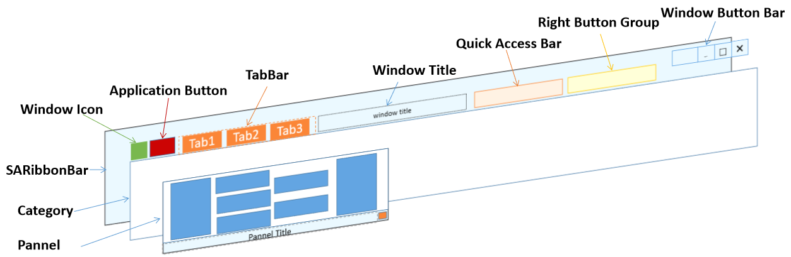
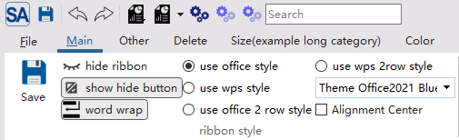
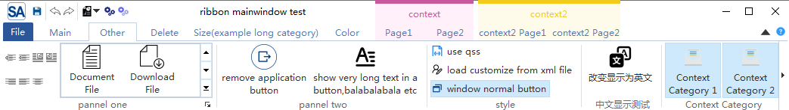
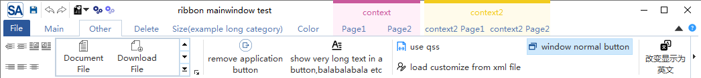
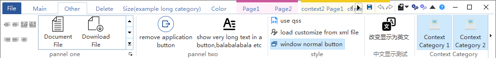
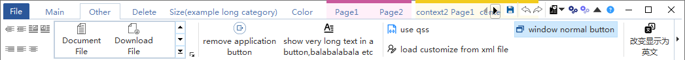

# SARibbon布局方式

SARibbon 支持四种布局方案：宽松三行、宽松两行、紧凑三行、紧凑两行，你可以动态切换它们的模式

SARibbon的样式枚举定义如下（位于SARibbonBar中）：

```cpp
enum RibbonStyleFlag
{
    RibbonStyleLoose    = 0x0001,  // bit:0000 0001
    RibbonStyleCompact  = 0x0002,  // bit:0000 0010
    RibbonStyleThreeRow = 0x0010,  // bit:0001 0000
    RibbonStyleTwoRow   = 0x0020,  // bit:0010 0000

    RibbonStyleLooseThreeRow   = RibbonStyleLoose | RibbonStyleThreeRow,    ///< 宽松结构，3行模式
    RibbonStyleCompactThreeRow = RibbonStyleCompact | RibbonStyleThreeRow,  ///< 紧凑结构，3行模式
    RibbonStyleLooseTwoRow     = RibbonStyleLoose | RibbonStyleTwoRow,      ///< 宽松结构，2行模式
    RibbonStyleCompactTwoRow   = RibbonStyleCompact | RibbonStyleTwoRow     ///< 紧凑结构，2行模式
};
```

宽松模式下各个控件的布局如下图所示


SARibbon中把带有标题栏和tab结合一起的布局方式称之为紧凑布局（Compact），紧凑模式下各个控件的布局如下图所示



在使用SARibbonWidget时，建议使用紧凑模式，避免有较大的标题栏留白

在使用原生边框的时候（`SARibbonMainWindowStyleFlag::UseRibbonMenuBar|SARibbonMainWindowStyleFlag::UseNativeFrame`），建议使用紧凑模式，避免有较大的标题栏留白

!!! example "示例"
    你可以运行`example/MainWindowExample`例子，此例子可以设置不同的样式观察不同样式的ribbon风格和布局



SARibbon提供了`SARibbonBar::setRibbonStyle`函数，可以定义当前的布局方案，枚举`SARibbonBar::RibbonStyle`定义了四种布局方案：

- `SARibbonBar::RibbonStyleLooseThreeRow`宽松结构，3行模式(v0.x版本为`SARibbonBar::OfficeStyle`)



- `SARibbonBar::RibbonStyleLooseTwoRow`宽松结构，2行模式(v0.x版本为`SARibbonBar::OfficeStyleTwoRow`)(文字换行效果)



- `SARibbonBar::RibbonStyleCompactThreeRow`紧凑结构，3行模式(v0.x版本为`SARibbonBar::WpsLiteStyle`)



- `SARibbonBar::RibbonStyleCompactTwoRow`紧凑结构，2行模式(v0.x版本为`SARibbonBar::WpsLiteStyleTwoRow`)(文字换行效果)



上面可以看到，在2行模式下，文字换行会导致图标非常小，因此，建议2行模式下，不要使用文字换行，可以通过`SARibbonBar::setEnableWordWrap`函数设置是否文字换行

关于SARibbon的按钮布局，你可以参阅：[Ribbon按钮布局说明](./layout-of-ribbonbutton.md)