# SARibbon布局方式

- ✅ **六种布局方案**：宽松三行、宽松两行、紧凑三行、紧凑两行、宽松单行、紧凑单行，运行时动态切换
- ✅ **组合控制函数**：setTabOnTitle + setEnableShowPanelTitle + setPanelLayoutMode + setEnableWordWrap + setEnableIconRightText 五函数组合
- ✅ **Panel三种占位**：Large/Medium/Small 行占比，3行模式全部生效，2行模式 Medium等同 Small，单行模式全部等效为 Small
- ✅ **文字换行控制**：setEnableWordWrap 决定按钮文字是否换行，2行模式建议关闭
- ✅ **图标右文字控制**：setEnableIconRightText 在单行模式下启用图标左、文字右的横向布局
- ✅ **布局模式推荐**：无边框用宽松布局，原生边框/嵌入用紧凑布局，空间极度受限用单行布局

## 布局选择决策流程

根据窗口类型和需求选择合适的布局方案：

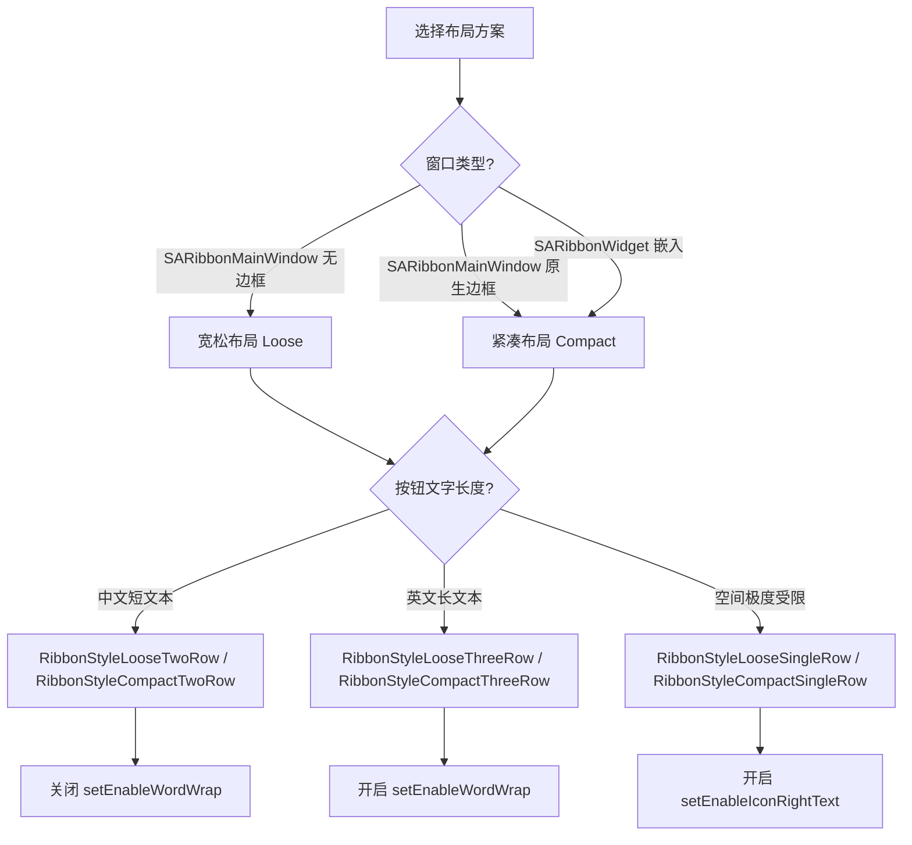
```mermaid
flowchart TD
    A[选择布局方案] --> B{窗口类型?}
    B -->|SARibbonMainWindow 无边框| C[宽松布局 Loose]
    B -->|SARibbonMainWindow 原生边框| D[紧凑布局 Compact]
    B -->|SARibbonWidget 嵌入| D
    C --> E{按钮文字长度?}
    D --> E
    E -->|中文短文本| F[RibbonStyleLooseTwoRow / RibbonStyleCompactTwoRow]
    E -->|英文长文本| G[RibbonStyleLooseThreeRow / RibbonStyleCompactThreeRow]
    E -->|空间极度受限| J[RibbonStyleLooseSingleRow / RibbonStyleCompactSingleRow]
    G --> H[开启 setEnableWordWrap]
    F --> I[关闭 setEnableWordWrap]
    J --> K[开启 setEnableIconRightText]
```

---

SARibbon 支持六种布局方案：**宽松三行**、**宽松两行**、**紧凑三行**、**紧凑两行**、**宽松单行**、**紧凑单行**，你可以动态切换它们的模式

## 布局方案速查

| 布局方案 | 枚举值 | 特点 | 推荐场景 |
|---------|-------|------|---------|
| 宽松三行 | `RibbonStyleLooseThreeRow` | 独立标题栏 + Tab栏 + 3行Panel | 传统 Office 风格，功能按钮较多 |
| 宽松两行 | `RibbonStyleLooseTwoRow` | 独立标题栏 + Tab栏 + 2行Panel | 屏幕高度有限但需要标题栏 |
| 紧凑三行 | `RibbonStyleCompactThreeRow` | Tab栏与标题合并 + 3行Panel | WPS 风格，节省垂直空间 |
| 紧凑两行 | `RibbonStyleCompactTwoRow` | Tab栏与标题合并 + 2行Panel | 最紧凑布局，适合嵌入式或小窗口 |
| 宽松单行 | `RibbonStyleLooseSingleRow` | 独立标题栏 + Tab栏 + 1行Panel | 空间极度受限，仅需图标+文字横向排列 |
| 紧凑单行 | `RibbonStyleCompactSingleRow` | Tab栏与标题合并 + 1行Panel | 最精简布局，Panel 仅一行按钮 |

!!! tip "如何选择布局方案"
    - **SARibbonMainWindow** 使用无边框模式时，建议使用宽松布局（Loose），因为标题栏由 SARibbon 绘制
    - **SARibbonMainWindow** 使用原生边框模式时（`UseNativeFrame`），建议使用紧凑布局（Compact），避免标题栏留白
    - **SARibbonWidget** 嵌入到其他窗口时，建议使用紧凑布局（Compact）
    - **空间极度受限**时（如嵌入式设备、小尺寸窗口），建议使用单行布局（SingleRow），配合 `setEnableIconRightText`

## SARibbon布局设置

SARibbon提供了`SARibbonBar::setRibbonStyle`函数，可以定义当前的布局方案，枚举`SARibbonBar::RibbonStyle`定义了六种布局方案：

```cpp
enum RibbonStyleFlag
{
    RibbonStyleLoose    = 0x0001,  // bit:0000 0001
    RibbonStyleCompact  = 0x0002,  // bit:0000 0010
    RibbonStyleThreeRow = 0x0010,  // bit:0001 0000
    RibbonStyleTwoRow   = 0x0020,  // bit:0010 0000
    RibbonStyleSingleRow = 0x0040, // bit:0100 0000

    RibbonStyleLooseThreeRow   = RibbonStyleLoose | RibbonStyleThreeRow,    ///< 宽松结构，3行模式
    RibbonStyleCompactThreeRow = RibbonStyleCompact | RibbonStyleThreeRow,  ///< 紧凑结构，3行模式
    RibbonStyleLooseTwoRow     = RibbonStyleLoose | RibbonStyleTwoRow,      ///< 宽松结构，2行模式
    RibbonStyleCompactTwoRow   = RibbonStyleCompact | RibbonStyleTwoRow,    ///< 紧凑结构，2行模式
    RibbonStyleLooseSingleRow   = RibbonStyleLoose | RibbonStyleSingleRow,  ///< 宽松结构，1行模式
    RibbonStyleCompactSingleRow = RibbonStyleCompact | RibbonStyleSingleRow ///< 紧凑结构，1行模式
};
```

- `SARibbonBar::RibbonStyleLooseThreeRow`宽松结构，3行模式(v0.x版本为`SARibbonBar::OfficeStyle`)

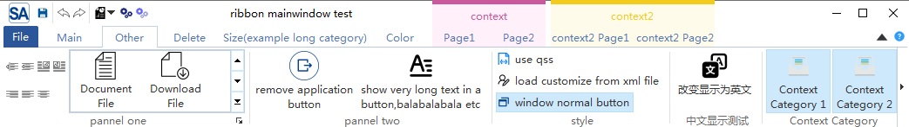

- `SARibbonBar::RibbonStyleLooseTwoRow`宽松结构，2行模式(v0.x版本为`SARibbonBar::OfficeStyleTwoRow`)(文字换行效果)

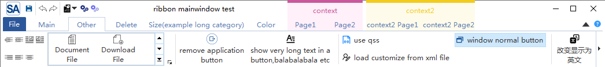

- `SARibbonBar::RibbonStyleCompactThreeRow`紧凑结构，3行模式(v0.x版本为`SARibbonBar::WpsLiteStyle`)

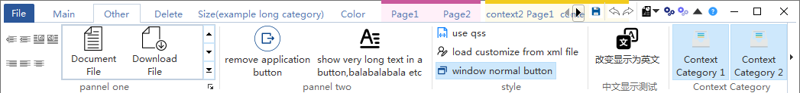

- `SARibbonBar::RibbonStyleCompactTwoRow`紧凑结构，2行模式(v0.x版本为`SARibbonBar::WpsLiteStyleTwoRow`)(文字换行效果)

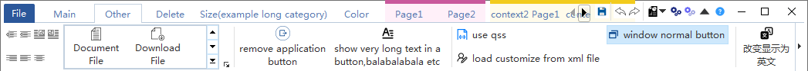

上面可以看到，在2行模式下，文字换行会导致图标非常小，因此，建议2行模式下，不要使用文字换行，可以通过`SARibbonBar::setEnableWordWrap`函数设置是否文字换行

- `SARibbonBar::RibbonStyleLooseSingleRow`宽松结构，1行模式，图标在左文字在右横向排列

- `SARibbonBar::RibbonStyleCompactSingleRow`紧凑结构，1行模式，Tab栏与标题合并，图标在左文字在右横向排列

单行模式的特点：

- 所有按钮（Large、Medium、Small）等效为 Small 横向布局，图标在左、文字在右
- Panel 标题默认隐藏，可通过 `setEnableShowPanelTitle(true)` 强制显示
- 文字不换行
- 高度最精简，适合嵌入式设备或窗口空间极度受限的场景
- 建议搭配 `SARibbonBar::setEnableIconRightText(true)` 确保所有按钮使用图标左、文字右的横向布局

关于SARibbon的按钮布局，你可以参阅：[Ribbon按钮布局说明](./layout-of-ribbonbutton.md)

函数`SARibbonBar::setRibbonStyle`实际上是一组布局控制函数的组合，`SARibbonBar::setRibbonStyle`的大致实现如下：

```cpp
void SARibbonBar::setRibbonStyle(SARibbonBar::RibbonStyles v)
{
    // 执行判断
    setEnableWordWrap(isThreeRowStyle(v));
    setTabOnTitle(isCompactStyle());
    setEnableShowPanelTitle(isThreeRowStyle(v));
    setPanelLayoutMode(isThreeRowStyle(v) ? SARibbonPanel::ThreeRowMode
                     : isSingleRowStyle(v) ? SARibbonPanel::SingleRowMode
                     : SARibbonPanel::TwoRowMode);
    if (isSingleRowStyle(v)) {
        setEnableIconRightText(true);   // 单行模式默认启用图标右文字
    }
    ...
}
```

可以看到，SARibbonBar的布局实际上主要通过`SARibbonBar::setTabOnTitle`、`SARibbonBar::setEnableShowPanelTitle`、`SARibbonBar::setPanelLayoutMode`、`SARibbonPanel::setEnableWordWrap`、`SARibbonBar::setEnableIconRightText`这五个函数的组合来控制

这五个函数的主要功能如下：

- `SARibbonBar::setTabOnTitle`: 设置是否将tab栏按钮放在标题栏上，这样tab栏和标题栏共用不会有单独的标题栏
- `SARibbonBar::setEnableShowPanelTitle`: 设置是否显示panel底部的标题
- `SARibbonBar::setPanelLayoutMode`: 设置panel的布局模式（3行模式、2行模式或单行模式）
- `SARibbonPanel::setEnableWordWrap`: 设置panel的按钮文字是否可以换行，如果可以将会预留2行来显示文本（图标可显示区域会变小）
- `SARibbonBar::setEnableIconRightText`: 设置按钮是否使用图标左、文字右的横向布局，单行模式下默认启用

## panel的布局方案

`SARibbonPanel`提供了三个添加action的方法：

- `addLargeAction`
- `addMediumAction`
- `addSmallAction`

在标准的panel中，一个action（按钮）有3种布局，以office word为例，panel的三种布局其实是所占行数:

- 第一种，占满整个panel，称之为`large`
- 第二种，一个panel下可以放置2个按钮，称之为`medium`
- 第三种，一个panel放置3个按钮，称之为`small`

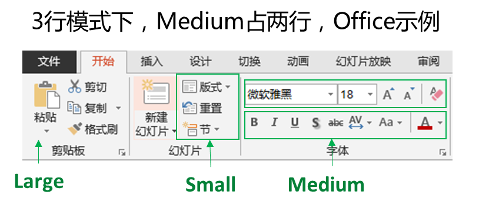

枚举`SARibbonPanelItem::RowProportion`是为了表征每个窗体在panel所占行数的情况，在panel布局中会常用到，这个枚举定义如下：

```cpp
/**
  * @brief 定义了行的占比，ribbon中有large，media和small三种占比
  */
enum RowProportion {
    None            ///< 为定义占比，这时候将会依据expandingDirections来判断，如果能有Qt::Vertical，就等同于Large，否则就是Small
    , Large         ///< 大占比，一个widget的高度会充满整个panel
    , Medium        ///< 中占比，在@ref SARibbonPanel::panelLayoutMode 为 @ref SARibbonPanel::ThreeRowMode 时才会起作用，且要同一列里两个都是Medium时，会在三行中占据两行
    , Small         ///< 小占比，占SARibbonPanel的一行，Medium在不满足条件时也会变为Small，但不会变为Large
};
```

`SARibbonPanel`里管理的每个action都会带有一个私有的属性（`SARibbonPanelItem::RowProportion`），这个属性决定了这个action在panel里的布局

panel的布局方式可以通过`SARibbonPanel::setPanelLayoutMode`来设置，这个函数接收`SARibbonPanel::PanelLayoutMode`枚举，枚举定义如下：

```cpp
enum PanelLayoutMode
{
    ThreeRowMode,   ///< 三行模式
    TwoRowMode,     ///< 两行模式
    SingleRowMode   ///< 单行模式
};
```

### 3行模式

三行模式是传统的panel布局方式，如下图所示：

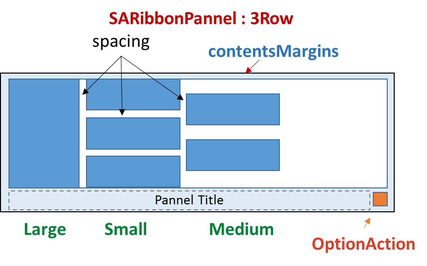

3行模式下有三种占位(`SARibbonPanelItem::RowProportion`)，分别为`large`、`medium`和`small`

3行模式下的panel会显示panel的标题在`Panel Title`区域，另外还有一个`OptionAction`的区域，这个是给这个action添加特殊触发使用的，如果没有设置`OptionAction`，这个区域是隐藏。

### 2行模式

2行模式是WPS的改进布局法（具体是否是WPS首先这样做的不清楚，我是按照WPS的布局进行参考的），如下图所示：

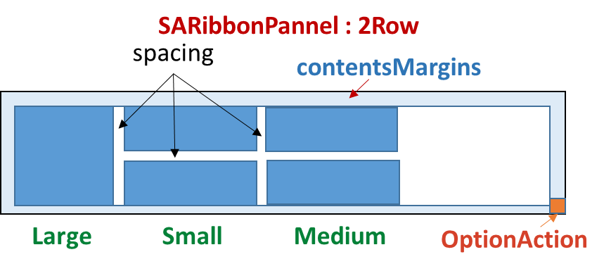

2行模式下medium和small占位(`SARibbonPanelItem::RowProportion`)是一样的，不做区分。

!!! warning "2行模式注意事项"
    默认2行模式下panel是不显示标题的，但你可以通过函数`SARibbonBar::setEnableShowPanelTitle`让其显示panel标题,同理，三行模式下你也可以通过此函数让其不显示标题

### 单行模式

单行模式是 v2.8.0 新增的布局方案，所有按钮在同一行内按横向排列，图标在左侧、文字在右侧，适合空间极度受限的场景。如下图所示：


单行模式下 Large、Medium 和 Small 行占比（`SARibbonPanelItem::RowProportion`）都等效为 Small，不做区分。所有按钮使用图标左、文字右的横向布局。

!!! warning "单行模式注意事项"
    - 单行模式下 Panel 标题默认隐藏
    - 建议搭配 `SARibbonBar::setEnableIconRightText(true)` 确保所有按钮使用图标左、文字右的横向布局
    - 单行模式下文字不换行，长文本按钮会被截断

## 不同布局下的控件排布

不同布局下的ribbon内置控件有不同的排布形式

宽松模式下各个控件的布局如下图所示

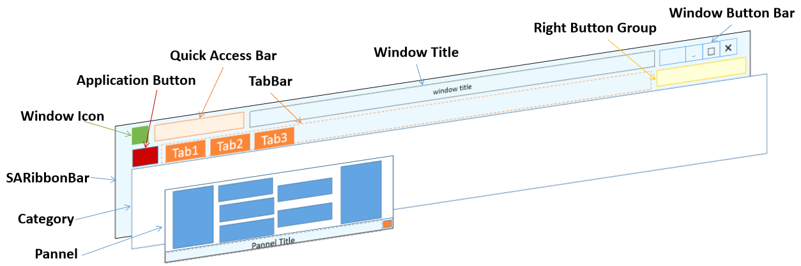

SARibbon中把带有标题栏和tab结合一起的布局方式称之为紧凑布局（Compact），紧凑模式下各个控件的布局如下图所示

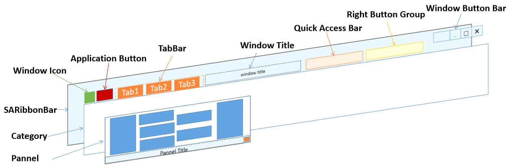

在使用SARibbonWidget时，建议使用紧凑模式，避免有较大的标题栏留白

在使用原生边框的时候（`SARibbonMainWindowStyleFlag::UseRibbonMenuBar|SARibbonMainWindowStyleFlag::UseNativeFrame`），建议使用紧凑模式，避免有较大的标题栏留白

你可以运行`example/MainWindowExample`例子，此例子可以设置不同的样式观察不同样式的ribbon风格和布局

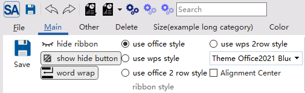

在此例子中，你可以点击`use office style`、`use wps style`、`use office 2row style`、`use wps 2row style`、`use single row style`按钮，查看不同样式的ribbon风格和布局的变化

## 动态切换布局示例

以下代码演示如何在运行时动态切换布局方案：

```cpp
void MainWindow::switchRibbonStyle(int styleIndex)
{
    SARibbonBar* ribbon = ribbonBar();
    switch (styleIndex) {
    case 0:
        ribbon->setRibbonStyle(SARibbonBar::RibbonStyleLooseThreeRow);
        break;
    case 1:
        ribbon->setRibbonStyle(SARibbonBar::RibbonStyleCompactThreeRow);
        break;
    case 2:
        ribbon->setRibbonStyle(SARibbonBar::RibbonStyleLooseTwoRow);
        break;
    case 3:
        ribbon->setRibbonStyle(SARibbonBar::RibbonStyleCompactTwoRow);
        break;
    case 4:
        ribbon->setRibbonStyle(SARibbonBar::RibbonStyleLooseSingleRow);
        break;
    case 5:
        ribbon->setRibbonStyle(SARibbonBar::RibbonStyleCompactSingleRow);
        break;
    }
}
```

你也可以通过组合五个底层函数实现更灵活的自定义布局：

```cpp
// 示例：紧凑单行布局 + 不显示Panel标题 + 图标右文字
SARibbonBar* ribbon = ribbonBar();
ribbon->setTabOnTitle(true);                    // Tab栏放在标题栏上
ribbon->setEnableShowPanelTitle(false);         // 不显示Panel标题
ribbon->setPanelLayoutMode(SARibbonPanel::SingleRowMode);  // 单行模式
ribbon->setEnableIconRightText(true);           // 图标左、文字右横向布局
ribbon->setEnableWordWrap(false);               // 文字不换行
```
