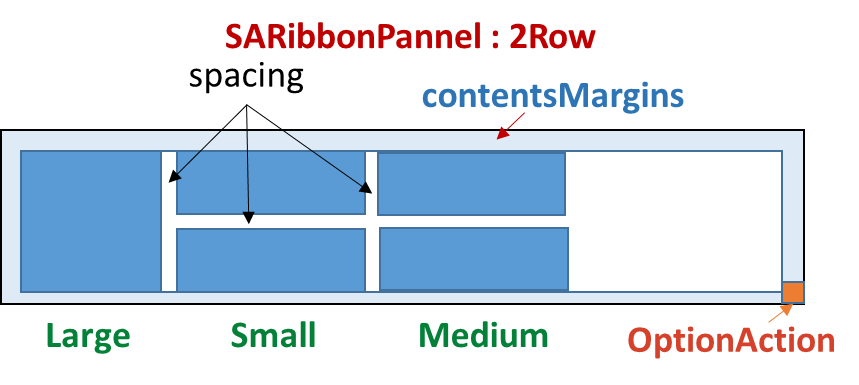

# SARibbon布局方式

SARibbon 支持四种布局方案：**宽松三行**、**宽松两行**、**紧凑三行**、**紧凑两行**，你可以动态切换它们的模式

## SARibbon布局设置

SARibbon提供了`SARibbonBar::setRibbonStyle`函数，可以定义当前的布局方案，枚举`SARibbonBar::RibbonStyle`定义了四种布局方案：

```cpp
enum RibbonStyleFlag
{
    RibbonStyleLoose    = 0x0001,  // bit:0000 0001
    RibbonStyleCompact  = 0x0002,  // bit:0000 0010
    RibbonStyleThreeRow = 0x0010,  // bit:0001 0000
    RibbonStyleTwoRow   = 0x0020,  // bit:0010 0000

    RibbonStyleLooseThreeRow   = RibbonStyleLoose | RibbonStyleThreeRow,    ///< 宽松结构，3行模式
    RibbonStyleCompactThreeRow = RibbonStyleCompact | RibbonStyleThreeRow,  ///< 紧凑结构，3行模式
    RibbonStyleLooseTwoRow     = RibbonStyleLoose | RibbonStyleTwoRow,      ///< 宽松结构，2行模式
    RibbonStyleCompactTwoRow   = RibbonStyleCompact | RibbonStyleTwoRow     ///< 紧凑结构，2行模式
};
```

- `SARibbonBar::RibbonStyleLooseThreeRow`宽松结构，3行模式(v0.x版本为`SARibbonBar::OfficeStyle`)


- `SARibbonBar::RibbonStyleLooseTwoRow`宽松结构，2行模式(v0.x版本为`SARibbonBar::OfficeStyleTwoRow`)(文字换行效果)


- `SARibbonBar::RibbonStyleCompactThreeRow`紧凑结构，3行模式(v0.x版本为`SARibbonBar::WpsLiteStyle`)


- `SARibbonBar::RibbonStyleCompactTwoRow`紧凑结构，2行模式(v0.x版本为`SARibbonBar::WpsLiteStyleTwoRow`)(文字换行效果)


上面可以看到，在2行模式下，文字换行会导致图标非常小，因此，建议2行模式下，不要使用文字换行，可以通过`SARibbonBar::setEnableWordWrap`函数设置是否文字换行

关于SARibbon的按钮布局，你可以参阅：[Ribbon按钮布局说明](./layout-of-ribbonbutton.md)

函数`SARibbonBar::setRibbonStyle`实际上是一组布局控制函数的组合，`SARibbonBar::setRibbonStyle`的大致实现如下：

```cpp
void SARibbonBar::setRibbonStyle(SARibbonBar::RibbonStyles v)
{
    // 执行判断
    setEnableWordWrap(isThreeRowStyle(v));
    setTabOnTitle(isCompactStyle());
    setEnableShowPanelTitle(isThreeRowStyle(v));
    setPanelLayoutMode(isThreeRowStyle(v) ? SARibbonPanel::ThreeRowMode : SARibbonPanel::TwoRowMode);
    ...
}
```

可以看到，SARibbonBar的布局实际上主要通过`SARibbonBar::setTabOnTitle`、`SARibbonBar::setEnableShowPanelTitle`、`SARibbonBar::setPanelLayoutMode`、`SARibbonPanel::setEnableWordWrap`这四个函数的组合来控制

这四个函数的主要功能如下：
- `SARibbonBar::setTabOnTitle`: 设置是否将tab栏按钮放在标题栏上，这样tab栏和标题栏共用不会有单独的标题栏
- `SARibbonBar::setEnableShowPanelTitle`: 设置是否显示panel底部的标题
- `SARibbonBar::setPanelLayoutMode`: 设置panel的布局模式（3行模式还是2行模式）
- `SARibbonPanel::setEnableWordWrap`: 设置panel的按钮文字是否可以换行，如果可以将会预留2行来显示文本（图标可显示区域会变小）

你可以通过上面四个函数组合出更多的布局方式

## panel的布局方案

`SARibbonPanel`提供了三个添加action的方法：
- `addLargeAction`
- `addMediumAction`
- `addSmallAction`

在标准的panel中，一个action（按钮）有3种布局，以office word为例，panel的三种布局其实是所占行数:

- 第一种，占满整个panel，称之为`large`
- 第二种，一个panel下可以放置2个按钮，称之为`medium`
- 第三种，一个panel放置3个按钮，称之为`small`


枚举`SARibbonPanelItem::RowProportion`是为了表征每个窗体在panel所占行数的情况，在panel布局中会常用到，这个枚举定义如下：

```cpp
/**
  * @brief 定义了行的占比，ribbon中有large，media和small三种占比
  */
enum RowProportion {
    None            ///< 为定义占比，这时候将会依据expandingDirections来判断，如果能有Qt::Vertical，就等同于Large，否则就是Small
    , Large         ///< 大占比，一个widget的高度会充满整个panel
    , Medium        ///< 中占比，在@ref SARibbonPanel::panelLayoutMode 为 @ref SARibbonPanel::ThreeRowMode 时才会起作用，且要同一列里两个都是Medium时，会在三行中占据两行
    , Small         ///< 小占比，占SARibbonPanel的一行，Medium在不满足条件时也会变为Small，但不会变为Large
};
```

`SARibbonPanel`里管理的每个action都会带有一个私有的属性（`SARibbonPanelItem::RowProportion`），这个属性决定了这个action在panel里的布局

panel的布局方式可以通过`SARibbonPanel::setPanelLayoutMode`来设置，这个函数接收`SARibbonPanel::PanelLayoutMode`枚举，枚举定义如下：

```cpp
enum PanelLayoutMode
{
    ThreeRowMode,///< 三行模式
    TwoRowMode ///< 两行模式
};
```

### 3行模式

三行模式是传统的panel布局方式，如下图所示：


3行模式下有三种占位(`SARibbonPanelItem::RowProportion`)，分别为`large`、`medium`和`small`

3行模式下的panel会显示panel的标题在`Panel Title`区域，另外还有一个`OptionAction`的区域，这个是给这个action添加特殊触发使用的，如果没有设置`OptionAction`，这个区域是隐藏。

### 2行模式

2行模式是WPS的改进布局法（具体是否是WPS首先这样做的不清楚，我是按照WPS的布局进行参考的），如下图所示：



2行模式下medium和small占位(`SARibbonPanelItem::RowProportion`)是一样的，不做区分。

!!! warning "2行模式注意事项"
    默认2行模式下panel是不显示标题的，但你可以通过函数`SARibbonBar::setEnableShowPanelTitle`让其显示panel标题,同理，三行模式下你也可以通过此函数让其不显示标题


## 不同布局下的控件排布

不同布局下的ribbon内置控件有不同的排布形式

宽松模式下各个控件的布局如下图所示


SARibbon中把带有标题栏和tab结合一起的布局方式称之为紧凑布局（Compact），紧凑模式下各个控件的布局如下图所示


在使用SARibbonWidget时，建议使用紧凑模式，避免有较大的标题栏留白

在使用原生边框的时候（`SARibbonMainWindowStyleFlag::UseRibbonMenuBar|SARibbonMainWindowStyleFlag::UseNativeFrame`），建议使用紧凑模式，避免有较大的标题栏留白

你可以运行`example/MainWindowExample`例子，此例子可以设置不同的样式观察不同样式的ribbon风格和布局


在此例子中，你可以点击`use office style`、`use wps style`、`use office 2row style`、`use wps 2row style`按钮，查看四种样式的ribbon风格和布局的变化
