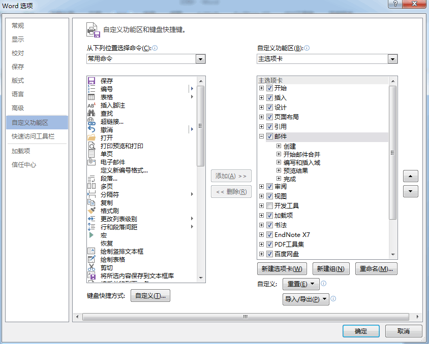
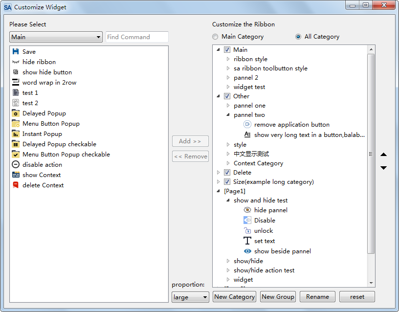
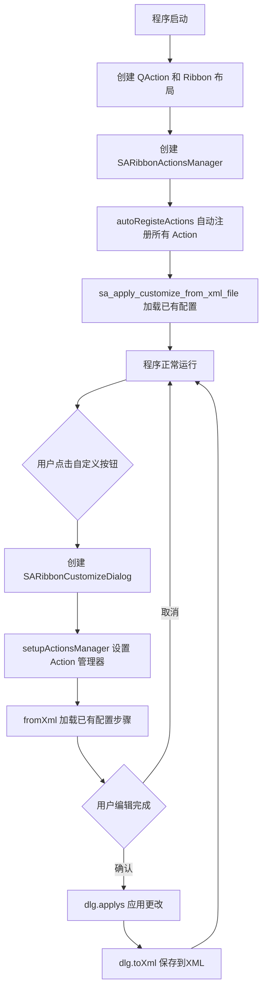

# Ribbon的用户配置化

- ✅ **Office风格自定义界面**：SARibbonCustomizeDialog 提供类似 Office 的完整自定义对话框
- ✅ **Action自动注册**：autoRegisteActions 自动遍历并注册所有 QAction，按 Category 分类
- ✅ **XML持久化**：自定义配置保存为 XML 文件，启动时自动加载还原用户界面
- ✅ **Widget嵌入模式**：SARibbonCustomizeWidget 可嵌入到自己的设置页面中
- ✅ **完整工作流**：创建→注册→加载→编辑→应用→保存，一站式闭环

---

## SARibbon的自定义功能

Ribbon的自定义是Ribbon的一个特色，参考了Office和WPS的自定义界面，用户可以为自己的Ribbon定义非常多的内容，甚至可以定义出一个完全和原来不一样的界面。

以下是Office的自定义界面：



## 核心类说明

SARibbon参考Office和WPS的界面，封装了方便使用的自定义类：

| 类名 | 作用 | 用户是否直接使用 |
|------|------|----------------|
| `SARibbonActionsManager` | 管理所有 QAction，支持按 Category 分类 | 是 |
| `SARibbonCustomizeDialog` | 自定义对话框（封装了 Widget） | 是 |
| `SARibbonCustomizeWidget` | 自定义控件，可嵌入到其他对话框 | 可选 |
| `SARibbonCustomizeData` | 存储单条自定义操作数据 | 内部使用 |
| `SARibbonActionsManagerModel` | 为 Widget 提供数据模型 | 内部使用 |

实际用户使用仅会面对`SARibbonActionsManager`和`SARibbonCustomizeDialog`/`SARibbonCustomizeWidget`，其余类用户正常不会使用。

`SARibbonActionsManager`是用来管理`QAction`，把想要自定义的`QAction`添加到`SARibbonActionsManager`中管理，并可以对`QAction`进行分类，以便在`SARibbonCustomizeDialog`/`SARibbonCustomizeWidget`中显示

`SARibbonCustomizeDialog`/`SARibbonCustomizeWidget`是具体的显示窗口，`SARibbonCustomizeDialog`把`SARibbonCustomizeWidget`封装为对话框，如果要实现office那样集成到配置对话框中可以使用`SARibbonCustomizeWidget`，`SARibbonCustomizeDialog`的效果如下图所示：



## 给界面添加自定义功能

这里演示如何添加自定义功能

首先定义`SARibbonActionsManager`作为MainWindow的成员变量

```cpp
//MainWindow.h 中定义成员变量
SARibbonActionsManager* m_ribbonActionMgr;///< 用于管理所有action
```

在MainWindow的初始化过程中，还需要创建大量的`QAction`，`QAction`的父对象指定为MainWindow，另外还会生成ribbon布局，例如添加category，添加pannel等操作，在上述操作完成后添加如下步骤，自动让`SARibbonActionsManager`管理所有的`QAction`

```cpp
//MainWindow的初始化，生成QAction
//生成ribbon布局
m_ribbonActionMgr = new SARibbonActionsManager(mainWinowPtr);
m_ribbonActionMgr->autoRegisteActions(mainWinowPtr);
```

`SARibbonActionsManager`的关键函数`autoRegisteActions`可以遍历 `SARibbonMainWindow`下的所有子object，找到action并注册，并会遍历所有`SARibbonCategory`,把`SARibbonCategory`下的action按`SARibbonCategory`的title name进行分类，此函数还会把`SARibbonMainWindow`下面的action，但不在任何一个category下的作为NotInRibbonCategoryTag标签注册，默认名字会赋予not in ribbon

在需要调用`SARibbonCustomizeDialog`的地方如下操作：

```cpp
QString cfgpath = "customization.xml";
SARibbonCustomizeDialog dlg(this, this);

dlg.setupActionsManager(m_ribbonActionMgr);
dlg.fromXml(cfgpath);//调用这一步是为了把已经存在的自定义步骤加载进来，在保存时能基于原有的自定义步骤上追加
if (QDialog::Accepted == dlg.exec()) {
    dlg.applys();//应用自定义步骤
    dlg.toXml(cfgpath);//把自定义步骤保存到文件中
}
```

在MainWindow生成前还需要把自定义的内容加载，因此在构造函数最后应该加入如下语句：

```cpp
//MainWindow的构造函数最后
sa_apply_customize_from_xml_file("customization.xml", this, m_ribbonActionMgr);
```

`sa_apply_customize_from_xml_file`是`SARibbonCustomizeWidget.h`中提供的函数，直接把配置文件中的自定义内容应用到MainWindow中。

这样软件每次启动都会按照配置文件加载。

## 完整工作流程



## 完整示例代码

以下是将自定义功能集成到 MainWindow 的完整示例（参考 `example/MainWindowExample`）：

```cpp
// === MainWindow.h ===
class MainWindow : public SARibbonMainWindow
{
    Q_OBJECT
public:
    MainWindow(QWidget* par = nullptr);
private slots:
    void onActionCustomizeTriggered();
private:
    void initRibbon();
    SARibbonActionsManager* m_ribbonActionMgr { nullptr };
};

// === MainWindow.cpp ===
MainWindow::MainWindow(QWidget* par) : SARibbonMainWindow(par)
{
    initRibbon();
    
    // 创建ActionsManager并自动注册
    m_ribbonActionMgr = new SARibbonActionsManager(this);
    m_ribbonActionMgr->autoRegisteActions(this);
    
    // 加载已有的自定义配置
    sa_apply_customize_from_xml_file("customization.xml", this, m_ribbonActionMgr);
}

void MainWindow::onActionCustomizeTriggered()
{
    QString cfgpath = "customization.xml";
    SARibbonCustomizeDialog dlg(this, this);
    dlg.setupActionsManager(m_ribbonActionMgr);
    dlg.fromXml(cfgpath);  // 加载已有步骤
    
    if (QDialog::Accepted == dlg.exec()) {
        dlg.applys();        // 应用自定义
        dlg.toXml(cfgpath);  // 保存配置
    }
}
```

!!! warning "注意"
    `autoRegisteActions` 必须在所有 Category、Panel、Action 都创建完成后调用，否则无法注册所有 Action。

!!! tip "提示"
    如果你希望把自定义对话框嵌入到自己的设置页面中，可以使用 `SARibbonCustomizeWidget` 代替 `SARibbonCustomizeDialog`，两者的 API 基本一致。
