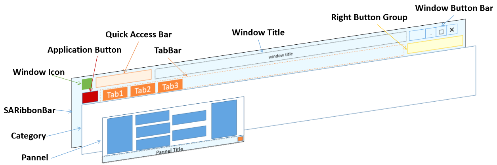

# Ribbon界面的层次结构

理解 SARibbon 的层次结构是构建界面的基础。其结构清晰，层次分明：

1. **`SARibbonBar`**: 最顶层的Ribbon菜单，管理整个 Ribbon 界面。它包含：
    - **`Application Button`**: 左上角的主菜单按钮。
    - **`Quick Access Bar`**: 位于最顶部的快速工具栏。
    - **`SARibbonTabBar`**: 显示各个 `Category` 标签页的标签栏。
    - **`SARibbonStackedWidget`**: 一个堆栈窗口，用于显示当前激活的 `Category` 内容。
    - **`Right Button Group`**: 位于右上角的按钮组。
    - **`Window Button Bar`** : 系统按钮，通过它可以在系统按钮旁边添加按钮。

2. **`SARibbonCategory` (分类页)**: 代表一个功能场景，如“主页”、“插入”、“设计”。每个 `Category` 包含一个或多个 `Panel`。它被添加到 `SARibbonTabBar` 上作为一个标签，并在 `SARibbonStackedWidget` 中管理其内容。

3. **`SARibbonPanel` (面板)**: 是 `Category` 内的功能分组容器，类似于一个增强版的工具栏。一个 `Panel` 可以包含多个 `QAction`（表现为按钮）、`QWidget`（如组合框、编辑框）或 `SARibbonButtonGroupWidget`（按钮组）。

4. **`SARibbonContextCategory` (上下文分类页)**: 一种特殊的 `Category`，默认隐藏，仅在特定条件（如选中特定对象）下才显示。

其布局如下图所示（宽松模式）

