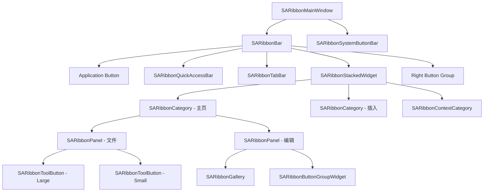

# Ribbon界面的层次结构

理解 SARibbon 的层次结构是构建界面的基础。其结构清晰，层次分明：

1. **`SARibbonBar`**: 最顶层的Ribbon菜单，管理整个 Ribbon 界面。它包含：
    - **`Application Button`**: 左上角的主菜单按钮。
    - **`Quick Access Bar`**: 位于最顶部的快速工具栏。
    - **`SARibbonTabBar`**: 显示各个 `Category` 标签页的标签栏。
    - **`SARibbonStackedWidget`**: 一个堆栈窗口，用于显示当前激活的 `Category` 内容。
    - **`Right Button Group`**: 位于右上角的按钮组。
    - **`Window Button Bar`** : 系统按钮，通过它可以在系统按钮旁边添加按钮。

2. **`SARibbonCategory` (分类页)**: 代表一个功能场景，如"主页"、"插入"、"设计"。每个 `Category` 包含一个或多个 `Panel`。它被添加到 `SARibbonTabBar` 上作为一个标签，并在 `SARibbonStackedWidget` 中管理其内容。

3. **`SARibbonPanel` (面板)**: 是 `Category` 内的功能分组容器，类似于一个增强版的工具栏。一个 `Panel` 可以包含多个 `QAction`（表现为按钮）、`QWidget`（如组合框、编辑框）或 `SARibbonButtonGroupWidget`（按钮组）。

4. **`SARibbonContextCategory` (上下文分类页)**: 一种特殊的 `Category`，默认隐藏，仅在特定条件（如选中特定对象）下才显示。

其布局如下图所示（宽松模式）


## 层次关系图

下面的类图展示了 SARibbon 各组件之间的包含关系：


```mermaid
graph TD
    MW[SARibbonMainWindow] --> RB[SARibbonBar]
    MW --> WBB[SARibbonSystemButtonBar]
    RB --> AB[Application Button]
    RB --> QAB[SARibbonQuickAccessBar]
    RB --> TB[SARibbonTabBar]
    RB --> SW[SARibbonStackedWidget]
    RB --> RBG[Right Button Group]
    SW --> CAT1[SARibbonCategory - 主页]
    SW --> CAT2[SARibbonCategory - 插入]
    SW --> CCAT[SARibbonContextCategory]
    CAT1 --> P1[SARibbonPanel - 文件]
    CAT1 --> P2[SARibbonPanel - 编辑]
    P1 --> BTN1[SARibbonToolButton - Large]
    P1 --> BTN2[SARibbonToolButton - Small]
    P2 --> GAL[SARibbonGallery]
    P2 --> BGW[SARibbonButtonGroupWidget]
```

## 各组件一览

| 组件 | 类名 | 获取方式 | 说明 |
|------|------|---------|------|
| Ribbon 栏 | `SARibbonBar` | `ribbonBar()` | 整个 Ribbon 界面的顶层管理器 |
| 应用按钮 | `SARibbonApplicationButton` | `ribbonBar()->applicationButton()` | 左上角的主菜单按钮 |
| 快速访问栏 | `SARibbonQuickAccessBar` | `ribbonBar()->quickAccessBar()` | 标题栏上的快捷操作工具栏 |
| 标签栏 | `SARibbonTabBar` | 内部管理 | 显示 Category 标签的标签栏 |
| 分类页 | `SARibbonCategory` | `ribbonBar()->addCategoryPage()` | 功能分类页面（如"主页"） |
| 面板 | `SARibbonPanel` | `category->addPanel()` | 面板内放置按钮和控件 |
| 工具按钮 | `SARibbonToolButton` | `panel->addLargeAction()` 等 | 支持大/中/小三种显示模式 |
| 画廊 | `SARibbonGallery` | `panel->addGallery()` | 网格形式展示图标选项 |
| 按钮组 | `SARibbonButtonGroupWidget` | `new SARibbonButtonGroupWidget()` | 紧密排列的按钮组合 |
| 上下文标签 | `SARibbonContextCategory` | `ribbonBar()->addContextCategory()` | 按需显示的特殊标签 |
| 右侧按钮组 | `SARibbonButtonGroupWidget` | `ribbonBar()->rightButtonGroup()` | 右上角的功能按钮组 |
| 系统按钮栏 | `SARibbonSystemButtonBar` | `windowButtonBar()` | 窗口最大化/最小化/关闭按钮 |

## 在代码中的体现

下面是一段典型的 Ribbon 界面构建代码，展示了各层级组件的创建和嵌套关系：

```cpp
// 获取 RibbonBar（第一层）
SARibbonBar* ribbon = ribbonBar();

// 创建 Category（第二层）
SARibbonCategory* categoryMain = ribbon->addCategoryPage(tr("Main"));
categoryMain->setObjectName("categoryMain");

// 创建 Panel（第三层）
SARibbonPanel* panelFile = categoryMain->addPanel(tr("File"));

// 在 Panel 中添加按钮（第四层）
QAction* actNew = new QAction(QIcon(":/icon/new.svg"), tr("New"), this);
panelFile->addLargeAction(actNew);

QAction* actSave = new QAction(QIcon(":/icon/save.svg"), tr("Save"), this);
panelFile->addSmallAction(actSave);

// 设置快速访问栏
SARibbonQuickAccessBar* quickBar = ribbon->quickAccessBar();
quickBar->addAction(actSave);

// 设置右侧按钮组
SARibbonButtonGroupWidget* rightGroup = ribbon->rightButtonGroup();
QAction* actHelp = new QAction(QIcon(":/icon/help.svg"), tr("Help"), this);
rightGroup->addAction(actHelp);
```
