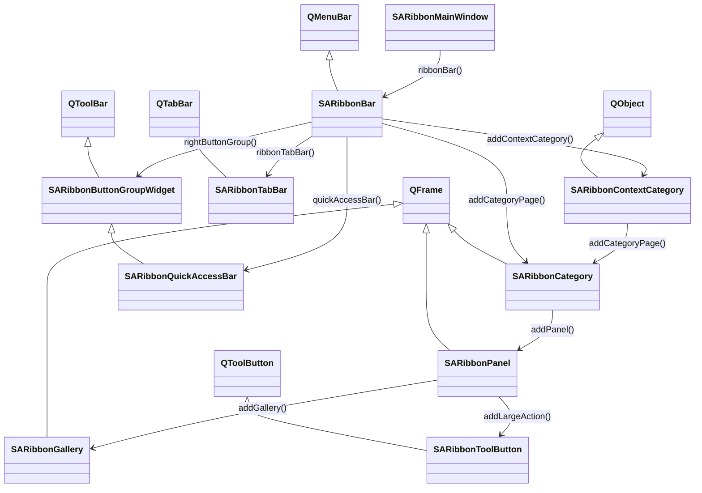

# Ribbon界面的层次结构

理解 SARibbon 的层次结构是构建界面的基础。Ribbon 采用严格的四层嵌套模型：**RibbonBar → Category → Panel → ToolButton/Widget**，每一层都有明确的职责和 API。

## 主要功能特性

**特性**

- ✅ **四层嵌套布局**：SARibbonBar 管理 Category，Category 管理 Panel，Panel 管理 ToolButton 和 Widget
- ✅ **上下文分类页**：SARibbonContextCategory 支持按条件显示/隐藏特定标签组（如选中对象时出现"图片工具"标签）
- ✅ **画廊组件**：SARibbonGallery 提供网格形式的选项选择器，支持弹出式分组浏览
- ✅ **快速访问栏与右侧按钮组**：内置 SARibbonQuickAccessBar 和 SARibbonButtonGroupWidget，支持高频操作的一键访问
- ✅ **多层级导航查找**：按名称、索引、ObjectName 在各层级间快速定位组件

## 层次关系图

下面展示了 SARibbon 各组件之间的**继承关系**与**包含关系**。实线表示继承，虚线表示组合/聚合：


```mermaid
classDiagram
    class QMenuBar
    class QFrame
    class QTabBar
    class QToolButton
    class QToolBar
    class QObject

    class SARibbonMainWindow
    class SARibbonBar
    class SARibbonCategory
    class SARibbonPanel
    class SARibbonToolButton
    class SARibbonTabBar
    class SARibbonQuickAccessBar
    class SARibbonButtonGroupWidget
    class SARibbonContextCategory
    class SARibbonGallery

    QMenuBar <|-- SARibbonBar
    QFrame <|-- SARibbonCategory
    QFrame <|-- SARibbonPanel
    QTabBar <|-- SARibbonTabBar
    QToolButton <|-- SARibbonToolButton
    QToolBar <|-- SARibbonButtonGroupWidget
    SARibbonButtonGroupWidget <|-- SARibbonQuickAccessBar
    QObject <|-- SARibbonContextCategory
    QFrame <|-- SARibbonGallery

    SARibbonMainWindow --> SARibbonBar : ribbonBar()
    SARibbonBar --> SARibbonTabBar : ribbonTabBar()
    SARibbonBar --> SARibbonCategory : addCategoryPage()
    SARibbonBar --> SARibbonContextCategory : addContextCategory()
    SARibbonBar --> SARibbonQuickAccessBar : quickAccessBar()
    SARibbonBar --> SARibbonButtonGroupWidget : rightButtonGroup()
    SARibbonCategory --> SARibbonPanel : addPanel()
    SARibbonPanel --> SARibbonToolButton : addLargeAction()
    SARibbonPanel --> SARibbonGallery : addGallery()
    SARibbonContextCategory --> SARibbonCategory : addCategoryPage()
```

上图的包含关系说明了 Ribbon 的构建方向：从 `SARibbonMainWindow` 获取 `SARibbonBar`，然后逐层添加 Category、Panel，最后放入按钮和控件。

## 组件查找表

下表列出了 Ribbon 层次结构中每个核心组件的类名、职责和创建/获取方式：

| 层次 | 类名 | 职责 | 创建/获取方式 |
|------|------|------|--------------|
| 窗口容器 | `SARibbonMainWindow` | Ribbon 应用的顶级窗口，替代 QMainWindow | 继承此类作为主窗口 |
| Ribbon 栏 | `SARibbonBar` | 顶层管理器，替代 QMenuBar | `ribbonBar()` 从主窗口获取 |
| 标签栏 | `SARibbonTabBar` | 显示 Category 标签页的导航栏 | `ribbonTabBar()` 获取 |
| 分类页 | `SARibbonCategory` | 一个功能场景（如"主页"、"插入"） | `addCategoryPage()` 添加 |
| 上下文分类 | `SARibbonContextCategory` | 条件触发的分类组（如"图表工具"） | `addContextCategory()` 添加 |
| 面板 | `SARibbonPanel` | Category 内的功能分组容器 | `category->addPanel()` 添加 |
| 工具按钮 | `SARibbonToolButton` | 承载 QAction 的 Ribbon 专用按钮 | `panel->addLargeAction()` 等自动创建 |
| 画廊 | `SARibbonGallery` | 网格形式的选项选择器 | `panel->addGallery()` 添加 |
| 快速访问栏 | `SARibbonQuickAccessBar` | 顶部高频命令工具栏 | `quickAccessBar()` 获取 |
| 右侧按钮组 | `SARibbonButtonGroupWidget` | 右上角功能按钮组 | `rightButtonGroup()` 获取 |
| 应用按钮 | `QAbstractButton` | 左上角应用菜单入口 | `applicationButton()` 获取 |

## 层次结构文字说明

`SARibbonBar` 继承自 `QMenuBar`，在 `SARibbonMainWindow` 中完全替代了传统的菜单栏。与传统 Menu/ToolBar 的平级关系不同，Ribbon 具有严格的层级：**SARibbonBar** 之下是 **SARibbonCategory**（标签页），Category 之下是 **SARibbonPanel**（面板），Panel 之下是 **SARibbonToolButton**（工具按钮），ToolButton 内部管理着 **QAction**。

`SARibbonCategory` 代表一个完整的功能场景，例如 Word 中的"开始"、"插入"、"设计"。每个 Category 可以包含多个 Panel，并且 Category 通过 `SARibbonTabBar` 显示为用户可见的标签页。通过 `SARibbonStackedWidget` 实现当前激活 Category 的切换显示。

`SARibbonPanel` 是 Category 内的功能分组容器。每个 Panel 可放置多个 QAction（自动包装为 SARibbonToolButton）、任意 QWidget（如组合框、编辑框）、以及 SARibbonGallery 等控件。Panel 支持两行和三行两种布局模式，分别对应 WPS 风格的紧凑布局和 Office 风格的宽松布局。

`SARibbonToolButton` 是专为 Ribbon 设计的工具按钮，支持 Large/Small 两种尺寸模式。图标尺寸会根据按钮尺寸动态自适应，不能通过 `setIconSize` 手动设置。大按钮模式还支持文字自动换行以优化空间利用。

`SARibbonContextCategory` 是一种特殊的分类管理器（继承自 QObject），它内部可以管理多个 `SARibbonCategory`。上下文分类通常用于特定条件触发，例如在 Word 中选中图片后才出现"图片工具"标签。通过 `show()`/`hide()` 控制其显隐。

## 各层次导航方法

SARibbon 在各层级均提供了按名称、按索引、按 ObjectName 的查找方法，便于在复杂界面中定位组件。

### SARibbonBar 层级查找

| 方法 | 返回值 | 说明 |
|------|--------|------|
| `categoryByIndex(int index)` | `SARibbonCategory*` | 按索引获取 Category，越界返回 nullptr |
| `categoryByName(const QString& title)` | `SARibbonCategory*` | 按名称查找 Category |
| `categoryByObjectName(const QString& objname)` | `SARibbonCategory*` | 按 ObjectName 查找 Category |
| `categoryIndex(const SARibbonCategory* c)` | `int` | 获取 Category 在标签栏中的索引 |
| `categoryPages(bool getAll)` | `QList<SARibbonCategory*>` | 获取所有 Category 列表 |
| `iterateCategory(FpCategoryIterate fp)` | `bool` | 遍历所有 Category，回调返回 false 时停止 |
| `iteratePanel(FpPanelIterate fp)` | `bool` | 跨 Category 遍历所有 Panel |

### SARibbonCategory 层级查找

| 方法 | 返回值 | 说明 |
|------|--------|------|
| `panelByIndex(int index)` | `SARibbonPanel*` | 按索引获取 Panel，越界返回 nullptr |
| `panelByName(const QString& title)` | `SARibbonPanel*` | 按名称查找 Panel |
| `panelByObjectName(const QString& objname)` | `SARibbonPanel*` | 按 ObjectName 查找 Panel |
| `panelIndex(SARibbonPanel* p)` | `int` | 获取 Panel 在 Category 中的索引 |
| `panelList()` | `QList<SARibbonPanel*>` | 获取所有 Panel 列表 |
| `panelCount()` | `int` | 获取 Panel 数量 |
| `iteratePanel(FpPanelIterate fp)` | `bool` | 遍历所有 Panel |

### SARibbonPanel 层级查找

| 方法 | 返回值 | 说明 |
|------|--------|------|
| `actionToRibbonToolButton(QAction* action)` | `SARibbonToolButton*` | 通过 QAction 查找对应的 ToolButton |
| `actionIndex(QAction* act)` | `int` | 获取 Action 在 Panel 中的布局索引 |
| `ribbonToolButtons()` | `QList<SARibbonToolButton*>` | 获取所有按钮列表 |
| `iterateButton(FpRibbonToolButtonIterate fp)` | `bool` | 遍历所有按钮 |
| `lastAddActionButton()` | `SARibbonToolButton*` | 获取最后添加的按钮 |

!!! info "导航提示"

    `SARibbonPanel` 的方法（如 `actionToRibbonToolButton`）返回的按钮是由 Panel 自动创建管理的，开发者无需手动 new 这些按钮，只需创建 QAction 并通过 `addLargeAction`/`addSmallAction` 等方法添加到 Panel 即可。

## 完整代码示例

下面演示从一个继承 `SARibbonMainWindow` 的主窗口出发，如何逐层构建完整的 Ribbon 界面：

```cpp
// mainwindow.h
#include "SARibbonMainWindow.h"
class MainWindow : public SARibbonMainWindow
{
    Q_OBJECT
public:
    explicit MainWindow(QWidget* parent = nullptr);
private:
    void setupRibbon();
};
```

上述头文件声明了主窗口类。它必须继承 `SARibbonMainWindow`，这是使用 SARibbon 的前提条件。

```cpp
// mainwindow.cpp
#include "mainwindow.h"
#include "SARibbonBar.h"
#include "SARibbonCategory.h"
#include "SARibbonPanel.h"
#include "SARibbonGallery.h"
#include "SARibbonButtonGroupWidget.h"
#include "SARibbonQuickAccessBar.h"
#include "SARibbonContextCategory.h"
#include <QAction>
#include <QToolBar>

MainWindow::MainWindow(QWidget* parent) : SARibbonMainWindow(parent)
{
    setupRibbon();
}
```

构造函数中直接调用 `setupRibbon()` 初始化 Ribbon 界面。

```cpp
void MainWindow::setupRibbon()
{
    // 步骤1：获取 RibbonBar（第一层）
    SARibbonBar* ribbon = ribbonBar();
    ribbon->setRibbonStyle(SARibbonBar::RibbonStyleLooseThreeRow);
    ribbon->setWindowTitleAligment(Qt::AlignCenter);

    // 步骤2：创建 Category 分类页（第二层）
    SARibbonCategory* categoryHome = ribbon->addCategoryPage(tr("开始"));
    categoryHome->setObjectName("categoryHome");

    SARibbonCategory* categoryInsert = ribbon->addCategoryPage(tr("插入"));
    categoryInsert->setObjectName("categoryInsert");

    // 步骤3：在"开始"Category 中创建 Panel 面板（第三层）
    SARibbonPanel* panelFile = categoryHome->addPanel(tr("文件操作"));
    SARibbonPanel* panelEdit = categoryHome->addPanel(tr("编辑操作"));

    // 步骤4：在 Panel 中添加 Action 按钮（第四层）
    QAction* actNew = new QAction(QIcon(":/icons/new.svg"), tr("新建"), this);
    actNew->setObjectName("actNew");
    panelFile->addLargeAction(actNew);

    QAction* actOpen = new QAction(QIcon(":/icons/open.svg"), tr("打开"), this);
    actOpen->setObjectName("actOpen");
    panelFile->addLargeAction(actOpen);

    QAction* actSave = new QAction(QIcon(":/icons/save.svg"), tr("保存"), this);
    actSave->setObjectName("actSave");
    panelFile->addMediumAction(actSave);

    QAction* actUndo = new QAction(QIcon(":/icons/undo.svg"), tr("撤销"), this);
    actUndo->setObjectName("actUndo");
    panelEdit->addSmallAction(actUndo);

    QAction* actRedo = new QAction(QIcon(":/icons/redo.svg"), tr("重做"), this);
    actRedo->setObjectName("actRedo");
    panelEdit->addSmallAction(actRedo);

    // 步骤5：添加 Gallery 画廊组件
    SARibbonGallery* gallery = panelInsert->addGallery();
    QList<QAction*> galleryActions;
    // ... 添加 galleryActions ...
    gallery->addCategoryActions(tr("样式"), galleryActions);

    // 步骤6：配置快速访问栏
    SARibbonQuickAccessBar* quickBar = ribbon->quickAccessBar();
    quickBar->addAction(actSave);
    quickBar->addAction(actUndo);

    // 步骤7：配置右侧按钮组
    SARibbonButtonGroupWidget* rightGroup = ribbon->rightButtonGroup();
    QAction* actHelp = new QAction(QIcon(":/icons/help.svg"), tr("帮助"), this);
    rightGroup->addAction(actHelp);

    // 步骤8：创建上下文分类（条件触发显示）
    SARibbonContextCategory* ctxCategory = ribbon->addContextCategory(
        tr("绘图工具"), QColor(255, 100, 50));
    SARibbonCategory* ctxPage = ctxCategory->addCategoryPage(tr("格式"));
    SARibbonPanel* ctxPanel = ctxPage->addPanel(tr("形状"));
    // ... 为 ctxPanel 添加 actions ...
    ribbon->hideContextCategory(ctxCategory);  // 默认隐藏
}
```

上述代码完整演示了从获取 `SARibbonBar` 到创建 Category、Panel、添加 Action 的全流程。每一步对应 Ribbon 层次结构中的一个层级。

!!! tip "最佳实践"

    - 为每个 Category 和 QAction 设置 `setObjectName`，便于后续通过 `categoryByObjectName` 等方法快速定位组件
    - 上下文分类创建后默认是隐藏的，需要通过 `showContextCategory()` 或 `hideContextCategory()` 控制显隐
    - `setRibbonStyle` 可在运行时动态调用，切换时会自动重排所有 Panel 和按钮的布局
    - Gallery 组件适合用在"样式选择"、"主题预览"等需要网格展示多个选项的场景

## API 核心方法摘要

### SARibbonBar 核心方法

| 方法 | 返回值 | 说明 |
|------|--------|------|
| `addCategoryPage(const QString& title)` | `SARibbonCategory*` | 创建并添加一个新的分类页 |
| `insertCategoryPage(const QString& title, int index)` | `SARibbonCategory*` | 在指定索引位置插入分类页 |
| `removeCategory(SARibbonCategory* category)` | `void` | 移除并删除分类页 |
| `addContextCategory(...)` | `SARibbonContextCategory*` | 创建上下文分类组 |
| `showContextCategory(...)` / `hideContextCategory(...)` | `void` | 控制上下文分类显隐 |
| `setRibbonStyle(RibbonStyles v)` | `void` | 设置 Ribbon 布局样式 |
| `quickAccessBar()` | `SARibbonQuickAccessBar*` | 获取快速访问栏 |
| `rightButtonGroup()` | `SARibbonButtonGroupWidget*` | 获取右侧按钮组 |
| `ribbonTabBar()` | `SARibbonTabBar*` | 获取标签栏 |
| `applicationButton()` | `QAbstractButton*` | 获取应用按钮 |

### SARibbonCategory 核心方法

| 方法 | 返回值 | 说明 |
|------|--------|------|
| `addPanel(const QString& title)` | `SARibbonPanel*` | 创建并添加面板 |
| `insertPanel(const QString& title, int index)` | `SARibbonPanel*` | 在指定位置插入面板 |
| `removePanel(SARibbonPanel* panel)` | `bool` | 移除并删除面板 |
| `panelByIndex(int index)` | `SARibbonPanel*` | 按索引获取面板 |
| `panelByName(const QString& title)` | `SARibbonPanel*` | 按名称查找面板 |
| `panelList()` | `QList<SARibbonPanel*>` | 获取所有面板列表 |
| `isContextCategory()` | `bool` | 判断是否为上下文分类 |

### SARibbonPanel 核心方法

| 方法 | 返回值 | 说明 |
|------|--------|------|
| `addLargeAction(QAction* action)` | `void` | 添加大尺寸按钮 |
| `addMediumAction(QAction* action)` | `void` | 添加中等尺寸按钮（三行模式） |
| `addSmallAction(QAction* action)` | `void` | 添加小尺寸按钮 |
| `addWidget(QWidget* w, RowProportion rp)` | `QAction*` | 添加自定义控件 |
| `addGallery(bool expanding)` | `SARibbonGallery*` | 添加画廊组件 |
| `addSeparator()` | `QAction*` | 添加分隔线 |
| `actionToRibbonToolButton(QAction* action)` | `SARibbonToolButton*` | 通过 Action 获取对应按钮 |

!!! note "Qt版本兼容性"

    SARibbon 同时支持 Qt 5.12+ 和 Qt 6.x。在 Qt 5 中使用 `QOverload` 连接信号，在 Qt 6 中可直接使用函数指针语法。SARibbon 内部已处理了版本差异，用户代码无需额外适配。

## 参考资料

- 完整示例项目：`example/MainWindowExample/mainwindow.cpp`
- SARibbonBar 类参考：`src/SARibbonBar/SARibbonBar.h`
- SARibbonCategory 类参考：`src/SARibbonBar/SARibbonCategory.h`
- SARibbonPanel 类参考：`src/SARibbonBar/SARibbonPanel.h`
- SARibbonToolButton 类参考：`src/SARibbonBar/SARibbonToolButton.h`
- SARibbonContextCategory 类参考：`src/SARibbonBar/SARibbonContextCategory.h`
- SARibbonGallery 类参考：`src/SARibbonBar/SARibbonGallery.h`
- Ribbon 界面布局说明：[layout-of-SARibbon.md](../use-guide/layout-of-SARibbon.md)
- Ribbon 按钮布局说明：[layout-of-ribbonbutton.md](../use-guide/layout-of-ribbonbutton.md)
