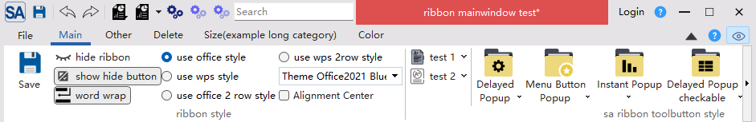

# 标题栏设置

SARibbon 的标题栏（Title Bar）是位于 Ribbon 界面最顶部的区域，用于显示应用程序的窗口标题（windowTitle）。SARibbon 允许您完整定制标题栏的高度、背景颜色、文字颜色、对齐方式，以及标题图标和功能按钮。

**主要功能特性**

- ✅ **自定义标题高度**：通过 `setTitleBarHeight()` 精确控制标题栏高度
- ✅ **标题颜色定制**：支持设置标题文字颜色和背景色（QBrush）
- ✅ **标题对齐方式**：支持左对齐、居中对齐，模拟 WPS 风格
- ✅ **标题图标支持**：通过 `SARibbonTitleIconWidget` 显示窗口图标及右键菜单
- ✅ **显示/隐藏切换**：支持动态隐藏或显示标题栏
- ✅ **词换行控制**：通过 `enableWordWrap` 控制标题文字是否自动换行

## 核心 API

`SARibbonBar` 提供以下标题栏相关属性与方法：

| 方法 | 参数 | 返回值 | 说明 |
|------|------|--------|------|
| `setWindowTitleTextColor()` | `const QColor&` | `void` | 设置标题栏文字颜色 |
| `windowTitleTextColor()` | 无 | `QColor` | 获取当前标题文字颜色 |
| `setWindowTitleAligment()` | `Qt::Alignment` | `void` | 设置标题文字对齐方式 |
| `windowTitleAligment()` | 无 | `Qt::Alignment` | 获取标题文字对齐方式 |
| `setWindowTitleBackgroundBrush()` | `const QBrush&` | `void` | 设置标题栏背景画刷 |
| `windowTitleBackgroundBrush()` | 无 | `QBrush` | 获取标题栏背景画刷 |
| `setTitleVisible()` | `bool` | `void` | 设置标题栏显隐状态 |
| `isTitleVisible()` | 无 | `bool` | 查询标题栏是否可见 |
| `setTitleBarHeight()` | `int, bool` | `void` | 设置标题栏高度 |
| `titleBarHeight()` | 无 | `int` | 获取标题栏高度 |
| `setTabBarBaseLineColor()` | `const QColor&` | `void` | 设置 Tab 栏底线颜色 |
| `tabBarBaseLineColor()` | 无 | `QColor` | 获取 Tab 栏底线颜色 |
| `setEnableWordWrap()` | `bool` | `void` | 启用/禁用标题词换行 |
| `isEnableWordWrap()` | 无 | `bool` | 查询词换行是否启用 |
| `setEnableShowPanelTitle()` | `bool` | `void` | 启用/禁用 Panel 标题显示 |
| `isEnableShowPanelTitle()` | 无 | `bool` | 查询 Panel 标题是否显示 |
| `setTabOnTitle()` | `bool` | `void` | 设置 Tab 覆盖标题栏 |
| `isTabOnTitle()` | 无 | `bool` | 查询 Tab 是否覆盖标题 |
| `setTitleIconVisible()` | `bool` | `void` | 设置标题图标显隐 |
| `isTitleIconVisible()` | 无 | `bool` | 查询标题图标是否可见 |
| `titleIconWidget()` | 无 | `SARibbonTitleIconWidget*` | 获取标题图标控件指针 |

## 常见场景

| 场景 | 推荐方法 | 说明 |
|------|---------|------|
| 未注册/试用提示 | `setWindowTitleBackgroundBrush()` + `setWindowTitleTextColor()` | 红色背景 + 白色文字，醒目提示用户软件状态 |
| 只读模式 | 灰色背景 + 深色文字 | 表示当前文档不可编辑 |
| 隐藏标题栏 | `setTitleVisible(false)` | 适用于紧凑模式、原生边框模式 |
| 自定义对齐 | `setWindowTitleAligment(Qt::AlignLeft)` | 标题左对齐，类似 WPS 风格 |
| 标题图标显示 | `setTitleIconVisible(true)` | 显示窗口图标，支持左键点击和右键菜单 |

## 设置标题栏颜色和样式

您可以通过以下代码实现特殊的标题栏显示：

```cpp
void MainWindow::setWindowTitleColor()
{
    SARibbonBar* ribbon = ribbonBar();
    if (!ribbon) {
        return;
    }
    // 设置标题背景为红色
    ribbon->setWindowTitleBackgroundBrush(QColor(222, 79, 79));
    // 设置标题文字颜色为白色
    ribbon->setWindowTitleTextColor(Qt::white);
    // 更新显示
    ribbon->update();
}
```

上面代码的显示效果如下：



## 使用 QSS 样式表设置标题栏

除代码设置外，还可以通过 Qt Style Sheets (QSS) 定制标题栏样式：

```css
/* 设置标题栏背景色和文字颜色 */
SARibbonBar {
    background-color: #4A90E2;        /* 蓝色背景 */
    color: #FFFFFF;                   /* 白色文字 */
    font-family: "Microsoft YaHei";  /* 字体 */
    font-size: 13px;
    font-weight: bold;               /* 粗体 */
}

/* 鼠标悬停时的高亮效果 */
SARibbonBar:hover {
    background-color: #5BA0F2;
}
```

!!! tip "QSS 实时预览"
    修改 QSS 后需要调用 `ribbon->update()` 才能立即看到效果。可在开发阶段使用 QSS 调试工具实时预览样式。

## 重置标题栏

在某些场景中，您需要在动态改变标题栏颜色后恢复为默认状态：

```cpp
void MainWindow::resetTitleBar()
{
    SARibbonBar* ribbon = ribbonBar();
    if (!ribbon) {
        return;
    }
    // 恢复为透明背景（使用主题默认色）
    ribbon->setWindowTitleBackgroundBrush(Qt::NoBrush);
    // 恢复为默认文字颜色（跟随主题）
    ribbon->setWindowTitleTextColor(QColor());
    ribbon->update();
}
```

!!! info "默认值说明"
    调用 `setWindowTitleTextColor(QColor())` 或 `setWindowTitleBackgroundBrush(Qt::NoBrush)` 可恢复为主题默认值。QColor() 构造无效颜色对象，表示使用系统默认色。

## 完整代码示例

以下示例演示在 `MainWindow` 构造函数中完整初始化标题栏：

```cpp
MainWindow::MainWindow(QWidget* parent)
    : SARibbonMainWindow(parent)
{
    // 创建 SARibbonBar
    SARibbonBar* ribbon = new SARibbonBar(this);
    setMenuBar(ribbon);

    // 设置标题栏高度
    ribbon->setTitleBarHeight(40, true);

    // 设置标题文字颜色和对齐方式
    ribbon->setWindowTitleTextColor(QColor(33, 33, 33));
    ribbon->setWindowTitleAligment(Qt::AlignCenter);

    // 启用标题图标
    ribbon->setTitleIconVisible(true);

    // 启用 Tab 覆盖标题栏（紧凑风格）
    ribbon->setTabOnTitle(true);

    // 设置 Panel 标题显示
    ribbon->setEnableShowPanelTitle(true);

    // 创建 Ribbon 分类和面板
    SARibbonCategory* category = ribbon->addCategoryPage(tr("主页"));
    category->addPanel(tr("文件"));

    setCentralWidget(new QWidget(this));
}
```

!!! tip "提示"
    标题栏设置仅在宽松模式（Loose）下可见。在紧凑模式下，标题栏和 Tab 栏合并，标题栏背景色设置不会有明显效果，但文字颜色仍然生效。
