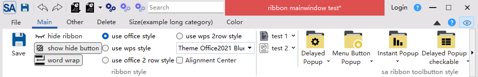

# 标题栏设置

SARibbon 的标题栏（Title Bar）是位于 Ribbon 界面最顶部的区域，用于显示应用程序的窗口标题（windowTitle）。SARibbon 允许您对标题栏高度进行定制，同时可修改其文字颜色、背景颜色以及对齐方式。在office系列软件，会通过改变标题栏的背景颜色来进行明显的提示，如软件没有注册，会把标题栏变为红色。

SARibbon通过下面方法改变标题栏的背景和字体及对齐方式（位于`SARibbonBar`类）：

```cpp
// 设置标题颜色
void setWindowTitleTextColor(const QColor& clr);
QColor windowTitleTextColor() const;

// 设置是否显示标题
void setTitleVisible(bool on = false);
bool isTitleVisible() const;

// 设置标题的背景颜色
void setWindowTitleBackgroundBrush(const QBrush& bk);
QBrush windowTitleBackgroundBrush() const;

// 设置标题的对齐方式
void setWindowTitleAligment(Qt::Alignment al);
Qt::Alignment windowTitleAligment() const;
```

你可以通过这些函数实现特殊的标题栏显示：

```cpp
void MainWindow::setWindowTitleColor()
{
    SARibbonBar* ribbon = ribbonBar();
    if (!ribbon) {
        return;
    }
    // 设置标题背景为红色
    ribbon->setWindowTitleBackgroundBrush(QColor(222, 79, 79));
    // 设置标题颜色为白色
    ribbon->setWindowTitleTextColor(Qt::white);
    // 更新显示
    ribbon->update();
}
```

上面代码显示效果如下：

