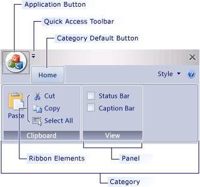

# SARibbon简介

[Click here for English](./readme.md)

<div align="center">
<p>


</p>
<p>


</p>
</div>

QQ交流群:755294806、434014314(已满)

<div align="center">

</div>

项目文档：[https://czyt1988.github.io/SARibbon/](https://czyt1988.github.io/SARibbon/)

详细使用教程: [SARibbon使用指南](./docs/SARibbon-User-Guide(cn).md) 

||Windows(latest)|Linux ubuntu(latest)|Mac(latest)|
|:-|:-|:-|:-|
|Qt5.12 LTS|[](https://github.com/czyt1988/SARibbon/actions/workflows/cmake-win-qt5.12.yml)|[](https://github.com/czyt1988/SARibbon/actions/workflows/cmake-linux-qt5.12.yml)|[](https://github.com/czyt1988/SARibbon/actions/workflows/cmake-mac-qt5.12.yml)|
|Qt5.14|[](https://github.com/czyt1988/SARibbon/actions/workflows/cmake-win-qt5.14.yml)|[](https://github.com/czyt1988/SARibbon/actions/workflows/cmake-linux-qt5.14.yml)|[](https://github.com/czyt1988/SARibbon/actions/workflows/cmake-mac-qt5.14.yml)|
|Qt5.15 LTS|[](https://github.com/czyt1988/SARibbon/actions/workflows/cmake-win-qt5.15.yml)|[](https://github.com/czyt1988/SARibbon/actions/workflows/cmake-linux-qt5.15.yml)|[](https://github.com/czyt1988/SARibbon/actions/workflows/cmake-mac-qt5.15.yml)|
|Qt6.2 LTS|[](https://github.com/czyt1988/SARibbon/actions/workflows/cmake-win-qt6.2.yml)|[](https://github.com/czyt1988/SARibbon/actions/workflows/cmake-linux-qt6.2.yml)|[](https://github.com/czyt1988/SARibbon/actions/workflows/cmake-mac-qt6.2.yml)|
|Qt6.5 LTS|[](https://github.com/czyt1988/SARibbon/actions/workflows/cmake-win-qt6.5.yml)|[](https://github.com/czyt1988/SARibbon/actions/workflows/cmake-linux-qt6.5.yml)|[](https://github.com/czyt1988/SARibbon/actions/workflows/cmake-mac-qt6.5.yml)|
|Qt6.8 LTS|[](https://github.com/czyt1988/SARibbon/actions/workflows/cmake-win-qt6.8.yml)|[](https://github.com/czyt1988/SARibbon/actions/workflows/cmake-linux-qt6.8.yml)|[](https://github.com/czyt1988/SARibbon/actions/workflows/cmake-mac-qt6.8.yml)|


这是一个`Qt`下的`Ribbon`界面控件，提供了类似微软Office系列软件的操作界面。

- `SARibbon`适用于大型软件、工业软件、复杂软件的ui
- `SARibbon`在设计时参考了MFC Ribbon接口的命名风格
- `SARibbon`的界面样式参考了微软Office系列软件以及WPS软件的Ribbon界面，并结合了两者的优点
- `SARibbon`是一个可定义多种主题风格的Ribbon控件，它能通过qss快速的定义出自己想要的主题风格

为了方便大型软件的开发，`SARibbon`对常用的一些功能性控件进行了封装，例如：[颜色选择按钮和颜色选择画板](https://github.com/czyt1988/SAColorWidgets)

## 功能特点

- 针对Ribbon的布局和显示


- 支持最小化模式，ribbon只显示标签（默认双击标签会进行切换）,支持上下文标签tab


- 支持quickAccessBar（word快速菜单）和rightButtonGroup，在不同布局模式下会有不同的显示效果
- 支持4种不同的ribbon button，普通按钮，延迟弹出菜单按钮，菜单按钮，action菜单按钮（action菜单按钮是此ribbon控件最主要解决的问题之一）


- 支持4种不同风格的布局样式


- 支持qss对ribbon进行自定义设置，可实时切换主题,内置了6种不同风格的主题

win7主题：

office2013主题：

office2016主题：

office2021主题：

dark主题：

dark2主题：


- 提供Gallery控件


- 支持超长滚动和Option Action


- 提供居中对齐模式


- 支持4K屏和多屏幕扩展
- 支持linux和MacOS（界面未做深度适配）

MIT协议，欢迎大家使用并提出意见

[gitee(码云) - https://gitee.com/czyt1988/SARibbon](https://gitee.com/czyt1988/SARibbon)

[github - https://github.com/czyt1988/SARibbon](https://github.com/czyt1988/SARibbon)

## 构建

这里建议使用cmake进行构建，cmake构建完成后并进行安装（install），使用cmake构建，你的工程既可以用cmake引入SARibbonBar，也可以使用qmake引入SARibbonBar

SARibbon提供qmake和cmake两种构建方式，同时提供了一个集成的SARibbon.h和SARibbon.cpp文件可以快速静态的嵌入到工程中

> SARibbon支持第三方无边框库[QWindowkit](https://github.com/stdware/qwindowkit)，同时也支持简单的无边框方案，如果你需要操作系统原生的窗口支持，如windows7以后的贴边处理，windows11的最大化按钮悬停的效果，建议开启[QWindowkit](https://github.com/stdware/qwindowkit)库，[QWindowkit](https://github.com/stdware/qwindowkit)库还能较好解决多屏幕移动问题

开启`QWindowkit`后的效果如下：


如果你要依赖[QWindowkit](https://github.com/stdware/qwindowkit)库，需要先编译[QWindowkit](https://github.com/stdware/qwindowkit)库，[QWindowkit](https://github.com/stdware/qwindowkit)库作为SARibbon项目的submodules，如果在`git clone`时没有附带`--recursive`参数，需要执行`submodule update`命令:

```shell
git submodule update --init --recursive
```

> 用户指定使用[QWindowkit](https://github.com/stdware/qwindowkit)后，要求C++标准最低为C++17否则最低要求为c++14

### 编译为动态库

具体构建过程，见文档：[SARibbon构建说明](./doc/SARibbon-Build-Instructions(cn).md)

### 静态引入工程

你可以不对SARibbon库进行构建，直接引入

SARibbon提供了合并好的`SARibbon.h`文件和`SARibbon.cpp`文件，资源文件也都合并进`SARibbon.cpp`中，只需要在自己的工程中引入这两个文件即可，无需编译为动态库，可以参考StaticExample例子（位于`example/StaticExample`）

#### 使用qmake

使用qmake编译，有如下步骤：

- 1. 把`SARibbon.h`、`SARibbon.cpp`、`SARibbon.pri`（位于`./src`目录下）拷贝到自己工程目录下
- 2. 在自己工程的pro文件中引入`SARibbon.pri`文件，如：`include($$PWD/SARibbon.pri)`

qmake可以通过`SARibbon.pri`文件设置是否开启第三方无边框库

#### 使用cmake

使用cmake的话参考StaticExample（位于`example/StaticExample`）例子的cmake编写方式编写，把`SARibbon.h`、`SARibbon.cpp`引入工程即可

```cmake

set(SARIBBON_FILES
    SARibbon.h
    SARibbon.cpp
)
add_executable({you-target} 
            {你项目的cpp和头文件}
            ${SARIBBON_FILES}
)
```

如果你需要使用`QWindowkit`,你的工程要引入`QWindowkit`库，并且增加预定义宏：

```cmake
find_package(QWindowKit)
target_link_libraries({you-target} PRIVATE QWindowKit::Widgets)
target_compile_definitions({you-target} PRIVATE SARIBBON_USE_3RDPARTY_FRAMELESSHELPER=1)
```

否则你需要把它设置为0

```cmake
target_compile_definitions({you-target} PRIVATE SARIBBON_USE_3RDPARTY_FRAMELESSHELPER=0)
```

## 使用方法

### 引入库

在编译完成后，按照如下方法引入SARibbon

#### qmake

- 1. 把`SARibbon.h`、`SARibbon.cpp`、`SARibbon.pri`（位于`./src`目录下）拷贝到自己工程目录下
- 2. 在自己工程的pro文件中引入`SARibbon.pri`文件，如：`include($$PWD/SARibbon.pri)`

 `SARibbon.pri`文件可进行设置，具体可参见文件中的注释

#### cmake

如果你是动态构建，在执行install后使用此库

cmake引入方法：

设置你的`SARibbonBar`安装目录，如：

```
set(SARibbonBar_DIR "[你的SARibbonBar安装根目录]/lib/cmake")
```

通过find_package引入

```cmake
find_package(SARibbonBar REQUIRED)
...
target_link_libraries({your_target_name} PUBLIC SARibbonBar::SARibbonBar)
```


## 快速开始

**更详细的教程请参阅:** [SARibbon使用指南](./doc/SARibbon-User-Guide(cn).md) 

Ribbon是把菜单栏和工具栏合并了，并通过一个tab控件进行展示，Ribbon是无法简单的使用Tab+Toolbar替代的，涉及到很多细节问题，`SARibbon`在设计时参考了MFC Ribbon接口的命名风格，标签页称之为`Category`(种类)，每个`Category`下面有多个`pannel`（面板），面板下面管理着toolbutton，`pannel`有点类似传统的`Toolbar`，其层次结构如下图所示，这些命名参考了MFC的ribbon界面类



一些常见的名词解释如下

- **Category 类别**，代表一个标签所呈现的内容，对应`SARibbonCategory`
- **Context Category 上下文类别**，这个是一种特殊的类别，它正常不显示，需要基于上下文判断是否应该显示，最常用的就是word中插入图片后，会有图片修改相关的标签出现，如果没选中图片，这个标签就消失，这个就是上下文类别，对应`SARibbonContextCategory`
- **Pannel 面板**，这个是一组菜单的集合，类似一个Toolbar，对应`SARibbonPannel`
- **Application Button 应用按钮**，标签栏最左边的按钮（word就是对应文件按钮），这个按钮会触发一些特殊的页面或菜单，对应`SARibbonApplicationButton`,可以隐藏
- **Quick Access Bar 快速响应栏**，位于最顶部的一个简单工具栏，用于放置一些常用的action，对应`SARibbonQuickAccessBar`
- **Gallery 预览控件**,这是Ribbon最吸引眼球的控件，用直观的图像把功能显示出来，甚至有些会根据上下文进行实时渲染，典型的就是word开始标签下的样式选择，对应`SARibbonGallery`

SARibbonBar的层次如下图所示：


> 注：不同的布局方案影响着`Category`和`Quick Access Bar`的摆放方式，具体可见[SARibbonBar布局方案](#SARibbonBar布局方案)

**你可以通过`example/MainWindowExample`例子来学习SARibbon的使用，你也可以点击这个例子的窗口，体验SARibbon的一些功能**

**更详细的教程请参阅:** [SARibbon使用指南](./doc/SARibbon-User-Guide(cn).md) 

## 更多截图

- 这是使用SARibbon构建的软件截图


[github - https://github.com/czyt1988/data-workbench](https://github.com/czyt1988/data-workbench)

[gitee - https://gitee.com/czyt1988/data-workbench](https://gitee.com/czyt1988/data-workbench)

具体Ribbon的生成代码可见：

[https://github.com/czyt1988/data-workbench/blob/master/src/APP/DAAppRibbonArea.cpp](https://github.com/czyt1988/data-workbench/blob/master/src/APP/DAAppRibbonArea.cpp)

## 文档生成

你可以通过doxygen生成qch和html类型的文档，`doc/Doxyfile-qch-cn`文件用于生成`.qch`格式的qt帮助文档,你可以把它集成到qt creator当中，`doc/Doxyfile-wiki-cn`文件用于生成html格式的文档，方便你在浏览器中查阅

## 常见问题

### 1、高分屏显示问题

针对高分屏显示，有如下两个方面准备

1 - 在main函数中为QApplication设置`Qt::AA_EnableHighDpiScaling`属性

这个属性使得应用程序自动检测显示器的像素密度来实现自动缩放，示例代码如下：

```cpp
int main(int argc, char* argv[])
{
#if (QT_VERSION >= QT_VERSION_CHECK(5, 6, 0))
    QApplication::setAttribute(Qt::AA_EnableHighDpiScaling);
    QApplication::setAttribute(Qt::AA_UseHighDpiPixmaps);
#endif
    QApplication a(argc, argv);
    ......
}
```

2 - 在main函数中为QApplication设置缩放策略：`QApplication::setHighDpiScaleFactorRoundingPolicy`

Qt5.6提供了`Qt::AA_EnableHighDpiScaling`，但不能完全解决，Qt5.14开始提供了高分屏缩放策略设置`QApplication::setHighDpiScaleFactorRoundingPolicy`，同`AA_EnableHighDpiScaling`一样需要在main函数前面设置

```cpp
int main(int argc, char* argv[])
{
#if (QT_VERSION >= QT_VERSION_CHECK(5, 6, 0))
    QApplication::setAttribute(Qt::AA_EnableHighDpiScaling);
    QApplication::setAttribute(Qt::AA_UseHighDpiPixmaps);
#endif
#if (QT_VERSION >= QT_VERSION_CHECK(5, 14, 0))
    QApplication::setHighDpiScaleFactorRoundingPolicy(Qt::HighDpiScaleFactorRoundingPolicy::PassThrough);
#endif
    QApplication a(argc, argv);
    ......
}
```

如果你使用OpenGL窗口发生了一些奇怪的问题，你可以把上面这些语句去掉看看，最新版Qt已经不需要进行上述的处理了

### 2、快捷键问题

经常有人反馈使用SARibbonBar后，没有被激活的tab页的快捷键没有响应，只有激活的标签页的快捷键才有反应，如果是传统的toolbar模式，由于action所在的toolbar一直在最前端，因此快捷键一直生效，但如果是SARibbonBar，action所在的pannel是会隐藏的，隐藏后快捷键就不生效，如果想快捷键无论Pannel是否隐藏都生效，设置快捷键的`shortcutContext`属性为`Qt::ApplicationShortcut`也无效，这时，可以通过Qt的`QWidget::addAction`函数把带快捷键的action添加到MainWindow中

例如：

```cpp
void MainWindow::initRibbon(){
    SARibbonCategory* categoryMain = ribbon->addCategoryPage(tr("Main"));
    SARibbonPannel* pannel = categoryMain->addPannel(tr("io"));
    //这里省略action的创建过程
    QAction* actSave = new QAction(this);
    ...
    //给action设置快捷键
    actSave->setShortcut(QKeySequence(QLatin1String("Ctrl+S")));
    //把action添加到pannel中
    pannel->addLargeAction(actSave);
    //把action添加到MainWindow中，这样切换到其他标签页，也可以响应快捷键
    addAction(actSave);
}
```

### 3、主题设置不生效

某些版本的qt，在构造函数设置主题会不完全生效，可以使用QTimer投放到队列最后执行，如：

```cpp
QTimer::singleShot(0, this, [ this ]() { 
    this->setRibbonTheme(SARibbonMainWindow::RibbonThemeDark); 
    });
```

### 4、遇到宏重定义

出现这个错误是在使用SARibbon.h/cpp时，这是因为早期版本的一些写在cpp里的调试宏没有做`#ifdef`处理，多个cpp合并后就会出现问题，用共享库不会出现此问题，如果遇到此问题，更新到v2.2.8以上版本即可

### 5、最大最小化图标不在右上角而在左上角

如果你遇到这个问题，确认编译的库文件和头文件是否匹配，通常这个问题发生在局部更新上，也就是仅仅替换了dll，而没有替换h文件导致的，有些工程在拉取了最新的SARibbon版本后，更新完直接替换lib和dll文件，头文件没有替换就会发生此问题，修复此问题的方法是确保所有文件的版本一致性，你可以把原来涉及的文件都删除掉，如果你用cmake安装的话，将涉及如下文件/文件夹：

```txt
bin/SARibbonBar.dll
include/SARibbonBar[文件夹]
lib/SARibbonBar.lib
lib/qmake/SARibbonBar[文件夹]
lib/cmake/SARibbonBar[文件夹]
SARibbonBar_amalgamate
```

### 6、图标没有显示

如果你遇到图标不显示，例如最大最小化按钮没有图标但有按钮，那么说明你的运行环境没有找到Qt的svg插件，你的程序目录下应该要有`imageformats/qsvg.dll`插件，你可以运行windeployqt拉取你程序的依赖，或者确保你的环境变量PATH配置中能找到`plugins/imageformats`文件夹

### 7、提示Could not create pixmap from :\SARibbon\image\resource\xxx.svg

此问题同问题6，你的程序目录下应该要有`imageformats/qsvg.dll`插件

## 给我一个鼓励

如果项目对你有用，请你给我一个鼓励：
<div style="text-align:center">
    
</div>
