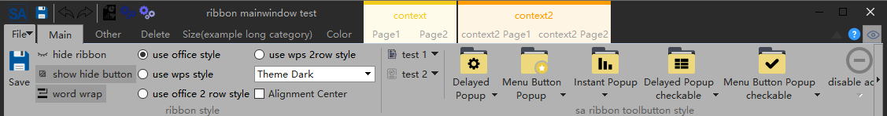
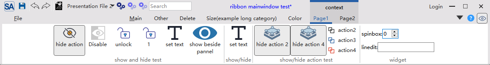
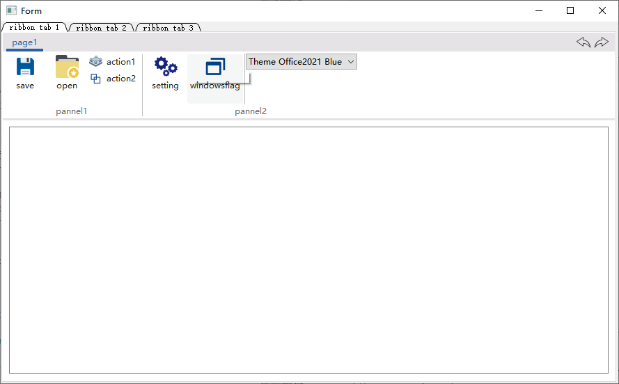
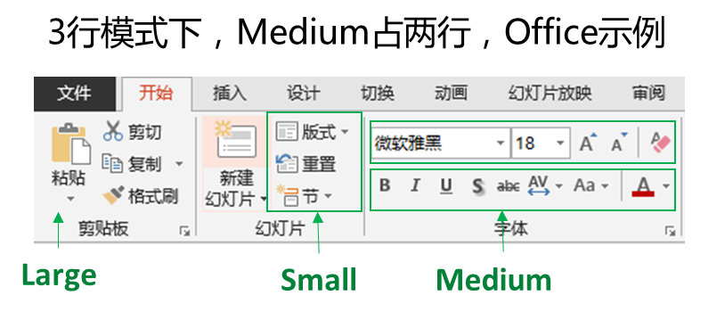

[Click here for English](./readme.md)

<div align="center">
<p>


</p>
<p>


</p>
</div>

QQ交流群:434014314

<div align="center">

</div>


||Windows(2019, latest)|Linux ubuntu(20.04, latest)|Mac(11-latest)|
|:-|:-|:-|:-|
|Qt5.12|[](https://github.com/czyt1988/SARibbon/actions/workflows/cmake-win-qt5.12.yml)|[](https://github.com/czyt1988/SARibbon/actions/workflows/cmake-linux-qt5.12.yml)|[](https://github.com/czyt1988/SARibbon/actions/workflows/cmake-mac-qt5.12.yml)|
|Qt5.13|[](https://github.com/czyt1988/SARibbon/actions/workflows/cmake-win-qt5.13.yml)|[](https://github.com/czyt1988/SARibbon/actions/workflows/cmake-linux-qt5.13.yml)|[](https://github.com/czyt1988/SARibbon/actions/workflows/cmake-mac-qt5.13.yml)|
|Qt5.14|[](https://github.com/czyt1988/SARibbon/actions/workflows/cmake-win-qt5.14.yml)|[](https://github.com/czyt1988/SARibbon/actions/workflows/cmake-linux-qt5.14.yml)|[](https://github.com/czyt1988/SARibbon/actions/workflows/cmake-mac-qt5.14.yml)|
|Qt5.15|[](https://github.com/czyt1988/SARibbon/actions/workflows/cmake-win-qt5.15.yml)|[](https://github.com/czyt1988/SARibbon/actions/workflows/cmake-linux-qt5.15.yml)|[](https://github.com/czyt1988/SARibbon/actions/workflows/cmake-mac-qt5.15.yml)|
|Qt6.0|[](https://github.com/czyt1988/SARibbon/actions/workflows/cmake-win-qt6.0.yml)|[](https://github.com/czyt1988/SARibbon/actions/workflows/cmake-linux-qt6.0.yml)|[](https://github.com/czyt1988/SARibbon/actions/workflows/cmake-mac-qt6.0.yml)|
|Qt6.1|[](https://github.com/czyt1988/SARibbon/actions/workflows/cmake-win-qt6.1.yml)|[](https://github.com/czyt1988/SARibbon/actions/workflows/cmake-linux-qt6.1.yml)|[](https://github.com/czyt1988/SARibbon/actions/workflows/cmake-mac-qt6.1.yml)|
|Qt6.2|[](https://github.com/czyt1988/SARibbon/actions/workflows/cmake-win-qt6.2.yml)|[](https://github.com/czyt1988/SARibbon/actions/workflows/cmake-linux-qt6.2.yml)|[](https://github.com/czyt1988/SARibbon/actions/workflows/cmake-mac-qt6.2.yml)|
|Qt6.3|[](https://github.com/czyt1988/SARibbon/actions/workflows/cmake-win-qt6.3.yml)|[](https://github.com/czyt1988/SARibbon/actions/workflows/cmake-linux-qt6.3.yml)|[](https://github.com/czyt1988/SARibbon/actions/workflows/cmake-mac-qt6.3.yml)|
|Qt6.4|[](https://github.com/czyt1988/SARibbon/actions/workflows/cmake-win-qt6.4.yml)|[](https://github.com/czyt1988/SARibbon/actions/workflows/cmake-linux-qt6.4.yml)|[](https://github.com/czyt1988/SARibbon/actions/workflows/cmake-mac-qt6.4.yml)|
|Qt6.5|[](https://github.com/czyt1988/SARibbon/actions/workflows/cmake-win-qt6.5.yml)|[](https://github.com/czyt1988/SARibbon/actions/workflows/cmake-linux-qt6.5.yml)|[](https://github.com/czyt1988/SARibbon/actions/workflows/cmake-mac-qt6.5.yml)|
|Qt6.6|[](https://github.com/czyt1988/SARibbon/actions/workflows/cmake-win-qt6.6.yml)|[](https://github.com/czyt1988/SARibbon/actions/workflows/cmake-linux-qt6.6.yml)|[](https://github.com/czyt1988/SARibbon/actions/workflows/cmake-mac-qt6.6.yml)|

# SARibbon简介

这是一个`Qt`下的`Ribbon`界面控件，提供了类似微软Office系列软件的操作界面。

- `SARibbon`适用于大型软件、工业软件、复杂软件的ui
- `SARibbon`在设计时参考了MFC Ribbon接口的命名风格
- `SARibbon`的界面样式参考了微软Office系列软件以及WPS软件的Ribbon界面，并结合了两者的优点
- `SARibbon`是一个可定义多种主题风格的Ribbon控件，它能通过qss快速的定义出自己想要的主题风格

为了方便大型软件的开发，`SARibbon`对常用的一些功能性控件进行了封装，例如：[颜色选择按钮和颜色选择画板](https://github.com/czyt1988/SAColorWidgets)

## 功能特点

- 针对Ribbon的布局和显示


- 支持最小化模式，ribbon只显示标签（默认双击标签会进行切换）,支持上下文标签tab


- 支持quickAccessBar（word快速菜单），在不同布局模式下会有不同的显示效果


- 支持4种不同的ribbon button，普通按钮，延迟弹出菜单按钮，菜单按钮，action菜单按钮（action菜单按钮是此ribbon控件最主要解决的问题之一）


- 支持4种不同风格的布局样式


- 支持qss对ribbon进行自定义设置，可实时切换主题,内置了5种不同风格的主题

win7主题：

office2013主题：

office2016主题：

office2021主题：

dark主题：


- 提供Gallery控件


- 支持超长滚动和Option Action


- 提供居中对齐模式



- 支持4K屏和多屏幕扩展
- 支持linux和MacOS（界面未做深度适配）


MIT协议，欢迎大家使用并提出意见

[gitee(码云) - https://gitee.com/czyt1988/SARibbon](https://gitee.com/czyt1988/SARibbon)

[github - https://github.com/czyt1988/SARibbon](https://github.com/czyt1988/SARibbon)


# 构建

SARibbon提供qmake和cmake两种构建方式，同时提供了一个集成的SARibbon.h和SARibbon.cpp文件方便静态的嵌入到单一工程

> SARibbon支持第三方无边框库[QWindowkit](https://github.com/stdware/qwindowkit)，同时也支持简单的无边框方案，如果你需要操作系统原生的窗口支持，如windows7以后的贴边处理，windows11的最大化按钮悬停的效果，建议开启[QWindowkit](https://github.com/stdware/qwindowkit)库，[QWindowkit](https://github.com/stdware/qwindowkit)库还能较好解决多屏幕移动问题

开启`QWindowkit`后的效果如下：


如果你要依赖[QWindowkit](https://github.com/stdware/qwindowkit)库，需要先编译[QWindowkit](https://github.com/stdware/qwindowkit)库，[QWindowkit](https://github.com/stdware/qwindowkit)库作为SARibbon项目的submodules，如果在`git clone`时没有附带`--recursive`参数，需要执行`submodule update`命令:

```shell
git submodule update --init --recursive
```

> 用户指定使用[QWindowkit](https://github.com/stdware/qwindowkit)后，要求C++标准最低为C++17否则最低要求为c++14

## 编译为动态库

具体构建过程，见文档：[SARibbon构建](./doc/how-to-build-cn.md)

## 直接引入工程（静态）

SARibbon提供了合并好的`SARibbon.h`文件和`SARibbon.cpp`文件，只需要在自己的工程中引入这两个文件，同时把资源文件和第三方库文件引入就可以使用，无需编译为动态库或者静态库，可以参考StaticExample例子（位于`src/example/StaticExample`），静态嵌入将使用到`SARibbon.h`、`SARibbon.cpp`、`SARibbon.pri`、`SARibbonBar/resource.qrc`这4个文件，以及`SARibbonBar/resource`这个文件夹：

你的工程目录将如下所示：

```
|-you-project-dir
|  |-you-project.pro
|  |-SARibbon.h
|  |-SARibbon.cpp
|  |-SARibbon.pri
|  |-SARibbonBar
|     |-resource.qrc
|     |-resource(直接把SARibbonBar下的resource完整复制过来)
|        |-resource files
```

使用qmake编译，有如下步骤：

- 1. 把`SARibbon.h`、`SARibbon.cpp`、`SARibbon.pri`拷贝到自己工程目录下
- 2. 在自己工程目录下创建`SARibbonBar`文件夹
- 3. 把源码中的`src/SARibbonBar/resource.qrc`文件拷贝到自己工程目录下的`SARibbonBar`文件夹
- 4. 把源码`src/SARibbonBar`下的`resource`文件夹和`3rdparty`文件夹拷贝到自己工程目录下的`SARibbonBar`文件夹中
- 5. 在自己工程的pro文件中引入`SARibbon.pri`文件，如：`include($$PWD/SARibbon.pri)`

使用cmake的话参考StaticExample（位于`src/example/StaticExample`）例子的cmake编写方式


# 使用方法

## 引入库

在编译完成后，按照如下方法引入SARibbon

### qmake

如果使用qmake，在编译完成后，你只需把如下文件按目录结构拷贝到你的工程中

先在你的工程中建立一个3rdparty文件夹，再把整个SARibbon文件夹拷贝过去，SARibbon内部已经有几个pri文件可以很方便的让你把工程引入到自己目录中，`./importSARibbonBarLib.pri`文件是用于引入SARibbon库的

在自己的Qt工程pro文件中加入如下语句即可

```shell
include($$PWD/3rdparty/SARibbon/importSARibbonBarLib.pri)
```

qmake的编译过程会在SARibbon下生成`bin_qt{Qt version}_{MSVC/GNU}_x{32/64}`文件夹，库文件和dll文件都在此文件夹下，importSARibbonBarLib.pri会自动把这个文件夹下的库引用进来

此时你的工程目录结构大致如下：

```
|-[you-project-dir]
|  |-you-project.pro
|  |-[3rdparty]
|     |-[SARibbon](直接把SARibbon完整复制过来)
|        |-importSARibbonBarLib.pri
|        |-SARibbonBar.pri
|        |-common.pri
|        |-[bin_qtx.x.x_{MSVC/GNU}_x{32/64}]
|        |-[src]
|        |   |-[SARibbonBar]
```

### cmake

cmake在执行install后，会把必要的文件拷贝到安装目录下，cmake文件编写时可参考`src/example/MainWindowExample/CMakeLists.txt`

具体见文档：[SARibbon构建](./doc/how-to-build-cn.md)

## 快速开始

Ribbon是把菜单栏和工具栏合并了，并通过一个tab控件进行展示，Ribbon是无法简单的使用Tab+Toolbar替代的，涉及到很多细节问题，`SARibbon`在设计时参考了MFC Ribbon接口的命名风格，标签页称之为`Category`(种类)，每个`Category`下面有多个`pannel`（面板），面板下面管理着toolbutton，`pannel`有点类似传统的`Toolbar`，其层次结构如下图所示，这些命名参考了MFC的ribbon界面类


一些常见的名词解释如下

- **Category 类别**，代表一个标签所呈现的内容，对应`SARibbonCategory`
- **Context Category 上下文类别**，这个是一种特殊的类别，它正常不显示，需要基于上下文判断是否应该显示，最常用的就是word中插入图片后，会有图片修改相关的标签出现，如果没选中图片，这个标签就消失，这个就是上下文类别，对应`SARibbonContextCategory`
- **Pannel 面板**，这个是一组菜单的集合，类似一个Toolbar，对应`SARibbonPannel`
- **Application Button 应用按钮**，标签栏最左边的按钮（word就是对应文件按钮），这个按钮会触发一些特殊的页面或菜单，对应`SARibbonApplicationButton`,可以隐藏
- **Quick Access Bar 快速响应栏**，位于最顶部的一个简单工具栏，用于放置一些常用的action，对应`SARibbonQuickAccessBar`
- **Gallery 预览控件**,这是Ribbon最吸引眼球的控件，用直观的图像把功能显示出来，甚至有些会根据上下文进行实时渲染，典型的就是word开始标签下的样式选择，对应`SARibbonGallery`

SARibbonBar的层次如下图所示：


> 注：不同的布局方案影响着`Category`和`Quick Access Bar`的摆放方式，具体可见[SARibbonBar布局方案](#SARibbonBar布局方案)

### 在MainWindow中使用Ribbon

要MainWindow中使用SARibbon，需要把`QMainWindow`替换为`SARibbonMainWindow`，`SARibbonMainWindow`修改了`QMainWindow`对menubar的渲染方式

> 注意，如果使用ui文件，要把原来ui文件的菜单删除，否则可能引起一些异常

示例代码如下:

```cpp
#include "SARibbonMainWindow.h"
class MainWindow : public SARibbonMainWindow
{
    Q_OBJECT
public:
    MainWindow(QWidget* par = nullptr);
    ...
}
```

`SARibbonMainWindow`也支持普通模式的渲染，其构造函数为：

```cpp
SARibbonMainWindow(QWidget *parent = nullptr, bool useRibbon = true);
```

第二个参数如果设置为false，将会使用普通的菜单工具栏模式，预留这个接口是为了一些项目需要能在ribbon和经典菜单工具栏切换的场景设计的，Ribbon状态和经典状态不支持热切换，如果需要切换，用户可以设置一个配置文件或者注册表，在应用重启时给第二个参数传入false即可进入到经典菜单工具栏模式

### 在QWidget或QDialog中使用SARibbonBar

SARibbonBar支持在QWidget或者QDialog上使用，具体可见例子：`src/example/WidgetWithRibbon`

你只需要把SARibbonBar当做一个普通窗口使用即可，下面大致介绍一下在QWidget中创建`SARibbonBar`的过程

首先在头文件声明SARibbonBar的窗口指针

```cpp
private:
    Ui::Widget* ui;
    SARibbonBar* mRibbonBar { nullptr };
```

在Widget的构造函数中创建`SARibbonBar`,Widget的ui文件中有个`QVBoxLayout`布局，把`SARibbonBar`放置在最顶层，同时，由于QWidget模式下，没有必要再显示标题，可以调用`SARibbonBar::setTitleVisible`方法把标题隐藏。applicationbutton在QWidget如果没有必要也可以通过`SARibbonBar::setApplicationButton`传入一个空指针取消掉，最后由于SARibbonBar的主题是在`SARibbonMainWindow`方法中设置的，在QWidget中设置主题可通过全局函数`sa_set_ribbon_theme`进行设置

```cpp
#include "SARibbonBar.h"
#include "SARibbonCategory.h"
#include "SARibbonPannel.h"
#include "SARibbonMainWindow.h"
Widget::Widget(QWidget* parent) : QWidget(parent), ui(new Ui::Widget)
{
    // 注意：ui文件中有个QVBoxLayout布局
    ui->setupUi(this);
    // 直接创建SARibbonBar
    mRibbonBar = new SARibbonBar(this);
    // QWidget模式下，没有必要再显示标题
    mRibbonBar->setTitleVisible(false);
    // QWidget模式下，直接使用紧凑模式效果更好
    mRibbonBar->setRibbonStyle(SARibbonBar::RibbonStyleCompactThreeRow);
    // 取消applicationbutton
    mRibbonBar->setApplicationButton(nullptr);
    //设置主题，这里虽然没用到SARibbonMainWindow，但Ribbon的主题是SARibbonMainWindow中定义的，因此要引入SARibbonMainWindow.h
    sa_set_ribbon_theme(mRibbonBar, SARibbonMainWindow::RibbonThemeOffice2013);

    // QWidgets设置一个QVBoxLayout，把窗口放到QVBoxLayout的第二个布局中，第一个布局给SARibbonBar
    // 这样，SARibbonBar就会在最上面
    ui->verticalLayout->insertWidget(0, mRibbonBar);

    buildRibbon(mRibbonBar);
}
```

效果如下：




### 创建Category和Pannel

创建ribbon的顺序是：先创建类别(Category)，再创建面板(Pannel)，最后创建对应的toolbutton（action）

使用`SARibbonBar::addCategoryPage`把Category添加到SARibbonBar中，使用`SARibbonCategory::addPannel`把`Pannel`添加到`Category`中,使用`SARibbonPannel::addAction`可以在Pannel上添加action

下面的代码，演示了添加一个action的示例：

```cpp
//添加主标签页 - 通过addCategoryPage工厂函数添加
SARibbonCategory* categoryMain = ribbon->addCategoryPage(tr("Main"));
 //使用addPannel函数来创建SARibbonPannel，效果和new SARibbonPannel再addPannel一样
SARibbonPannel* pannel1 = categoryMain->addPannel("Panel 1");
QAction* actSave = new QAction(this);
actSave->setText("save");
actSave->setIcon(QIcon(":/icon/icon/save.svg"));
actSave->setObjectName("actSave");
actSave->setShortcut(QKeySequence(QLatin1String("Ctrl+S")));
pannel1->addLargeAction(actSave);
```

上面的操作添加了一个按钮，效果如下图所示：


用户也可以直接new出SARibbonCategory，并添加到pannel中，下面的代码效果和上面的一样：

```cpp
SARibbonCategory* categoryMain = new SARibbonCategory(tr("Main"));
ribbon->addCategoryPage(categoryMain);
SARibbonPannel* pannel1 = new SARibbonPannel("Panel 1");
categoryMain->addPannel(pannel1);
QAction* actSave = new QAction(this);
...
pannel1->addLargeAction(actSave);
```

Ribbon的图标有大有小，通过`addLargeAction`、`addMediumAction`、`addSmallAction`可以组合出不同的布局样式

具体可见[./src/example/MainWindowExample/mainwindow.cpp](./src/example/MainWindowExample/mainwindow.cpp)

### ContextCategory 上下文标签

所谓上下文标签是指在特殊情况下才出现的标签/标签组，例如office word在选中图片时会出现图片编辑的上下文标签，如下图所示：


SARibbon中上下文标签对应的类为`SARibbonContextCategory`

上下文标签一般在程序初始化的时候就创建好，平时隐藏，等待需要显示的时候再显示，创建上下文标签如下：

由于上下文标签需要使用时唤起，因此，用一个成员变量保存起来是一个比较好的选择，当然也可以遍历查找（`SARibbonBar::contextCategoryList`可以例举所有的`SARibbonContextCategory`）

头文件：

```cpp
SARibbonContextCategory* m_contextCategory;
```

cpp文件:
```cpp
SARibbonBar* ribbon = ribbonBar();
//创建一个contextCategory，颜色随机
m_contextCategory   = ribbon->addContextCategory(tr("context"), QColor());
SARibbonCategory* contextCategoryPage1 = m_contextCategory->addCategoryPage(tr("Page1"));
//对contextCategoryPage1进行操作
......
SARibbonCategory* contextCategoryPage2 = m_contextCategory->addCategoryPage(tr("Page2"));
//对contextCategoryPage2进行操作
......
```

由`SARibbonContextCategory`创建的`SARibbonCategory`归`SARibbonContextCategory`管理，只有`SARibbonContextCategory`“显示了”,其管理的`SARibbonCategory`才显示，**注意：** `SARibbonContextCategory`并不是一个窗口，所以，它的“显示”打了引号

要显示一个上下文只需要调用`SARibbonBar::showContextCategory`/`SARibbonBar::hideContextCategory`即可:

```cpp
void MainWindow::onShowContextCategory(bool on)
{
    if (on) {
        this->ribbonBar()->showContextCategory(m_contextCategory);
    } else {
        this->ribbonBar()->hideContextCategory(m_contextCategory);
    }
}
```

**注意：** 如果要删除`contextCategory`需要调用`SARibbonBar::destroyContextCategory`，而不是直接delete，调用`SARibbonBar::destroyContextCategory`之后无需再对ContextCategory的指针delete

不同样式的contextCategory有不一样的风格，具体可见：[SARibbon样式](#SARibbon样式)以及[不同样式下的显示对比](#不同样式下的显示对比)

### ApplicationButton

ribbon界面左上角有个特殊且明显的按钮，称之为`applicationButton`，这个按钮一般用于调出菜单，SARibbonBar在构造时默认就创建了`applicationButton`，可以通过如下方式设置其文字：

```cpp
SARibbonBar* ribbon = ribbonBar();
ribbon->applicationButton()->setText(("File"));
```

默认的applicationButton继承自`SARibbonApplicationButton`,而`SARibbonApplicationButton`继承自`QPushButton`，因此你可以对其进行`QPushButton`所有的操作，当然如果想设置自己的Button作为applicationButton也是可以的，只需要调用`SARibbonBar::setApplicationButton`函数即可

### QuickAccessBar和rightButtonGroup

QuickAccessBar是左上角的快速工具栏，rightButtonGroup是右上角的快速工具栏，在office模式下分左右两边，在wps模式下，左右将合起来，统一放到右边


SARibbon中：

- QuickAccessBar对应`SARibbonQuickAccessBar`类
- rightButtonGroup对应`SARibbonButtonGroupWidget`类

SARibbonBar在初始化时会默认创建QuickAccessBar和RightButtonGroup，通过`SARibbonBar::quickAccessBar`和`SARibbonBar::rightButtonGroup`即可获取其指针进行操作，示例如下：

```cpp
QAction* MainWindow::createAction(const QString& text, const QString& iconurl, const QString& objName)
{
    QAction* act = new QAction(this);
    act->setText(text);
    act->setIcon(QIcon(iconurl));
    act->setObjectName(objName);
    return act;
}

void MainWindow::initQuickAccessBar(){
    SARibbonBar* ribbon = ribbonBar();
    SARibbonQuickAccessBar* quickAccessBar = ribbon->quickAccessBar();
    quickAccessBar->addAction(createAction("save", ":/icon/icon/save.svg", "save-quickbar"));
    quickAccessBar->addSeparator();
    quickAccessBar->addAction(createAction("undo", ":/icon/icon/undo.svg"),"undo");
    quickAccessBar->addAction(createAction("redo", ":/icon/icon/redo.svg"),"redo");
    quickAccessBar->addSeparator();
}
void MainWindow::initRightButtonGroup(){
    SARibbonBar* ribbon = ribbonBar();
    SARibbonButtonGroupWidget* rightBar = ribbon->rightButtonGroup();
    QAction* actionHelp = createAction("help", ":/icon/icon/help.svg","help");
    connect(actionHelp, &QAction::triggered, this, &MainWindow::onActionHelpTriggered);
    rightBar->addAction(actionHelp);
}
```

### SARibbonBar布局方案

 `SARibbon`支持4种ribbon布局方案，布局方案参考了`office`的ribbon风格和`WPS`的ribbon风格，布局方案的切换可
通过`void SARibbonBar::setRibbonStyle(RibbonStyle v)`实现

`office`模式是最常见的ribbon模式，`tab`和标题栏占用位置较多，`WPS`设计的ribbon模式进行了改良，它为了减小ribbon的高度，把标签和标题栏设置在一起，这样减少了一个标题栏高度，有效利用了垂直空间，同时还把pannel的按钮布局由最大摆放3个变为摆放两个，进一步压缩了垂直空间

office的word界面和WPS Word界面截图对比


在正常屏幕下，WPS 样式会比 Office 样式减少至少30像素左右的垂直高度，相比1920*1080的屏幕来说，相当于节约了接近3%的垂直空间

SARibbon中把带有标题栏的称之为宽松布局（Loose），宽松布局的各个元素如下图排列：


这个布局和office的默认布局是一致的

SARibbon中把带有标题栏和tab结合一起的布局方式称之为紧凑布局（Compact），紧凑布局的各个元素如下图排列：


SARibbonBar提供了`setRibbonStyle`函数，可以定义当前的布局方案，枚举`SARibbonBar::RibbonStyle`定义了四种布局方案：

- `SARibbonBar::RibbonStyleLooseThreeRow`宽松结构，3行模式(v0.x版本为`SARibbonBar::OfficeStyle`)


- `SARibbonBar::RibbonStyleLooseTwoRow`宽松结构，2行模式(v0.x版本为`SARibbonBar::OfficeStyleTwoRow`)


- `SARibbonBar::RibbonStyleCompactThreeRow`紧凑结构，3行模式(v0.x版本为`SARibbonBar::WpsLiteStyle`)


- `SARibbonBar::RibbonStyleCompactTwoRow`紧凑结构，2行模式(v0.x版本为`SARibbonBar::WpsLiteStyleTwoRow`)


### SARibbonBar文字换行，及图标大小

通过`SARibbonBar::setEnableWordWrap`函数可以控制SARibbonBar的文字是否换行，`SARibbonBar`的高度是固定的，文字是否换行会影响图标显示的大小，因此，如果你想图标看起来更大，可以设置文字不换行

在`SARibbonBar::RibbonStyleCompactTwoRow`的布局模式下，文字不换行的显示效果如下：


SARibbonBar文字设置为不换行后，会使图标的显示空间变得更大

### 不同的“按钮”布局方式

`SARibbonPannel`提供了三个添加action的方法：
- `addLargeAction`
- `addMediumAction`
- `addSmallAction`

在标准的pannel中，一个action（按钮）有3种布局，以office word为例，pannel的三种布局其实是所占行数:

- 第一种，占满整个pannel，称之为`large`
- 第二种，一个pannel下可以放置2个按钮，称之为`medium`
- 第三种，一个pannel放置3个按钮，称之为`samll`



枚举`SARibbonPannelItem::RowProportion`是为了表征每个窗体在pannel所占行数的情况，在pannel布局中会常用到，这个枚举定义如下：

```cpp
/**
  * @brief 定义了行的占比，ribbon中有large，media和small三种占比
  */
enum RowProportion {
    None            ///< 为定义占比，这时候将会依据expandingDirections来判断，如果能有Qt::Vertical，就等同于Large，否则就是Small
    , Large         ///< 大占比，一个widget的高度会充满整个pannel
    , Medium        ///< 中占比，在@ref SARibbonPannel::pannelLayoutMode 为 @ref SARibbonPannel::ThreeRowMode 时才会起作用，且要同一列里两个都是Medium时，会在三行中占据两行
    , Small         ///< 小占比，占SARibbonPannel的一行，Medium在不满足条件时也会变为Small，但不会变为Large
};
```

`SARibbonPannel`里管理的每个action都会带有一个私有的属性（`SARibbonPannelItem::RowProportion`），这个属性决定了这个action在pannel里的布局

### SARibbonPannel的布局模式

#### 3行模式

三行模式是传统的pannel布局方式，如下图所示：


3行模式下有三种占位(`SARibbonPannelItem::RowProportion`)，分别为large、medium和small

3行模式下的pannel会显示pannel的标题在`Pannel Title`区域，另外还有一个`OptionAction`的区域，这个是给这个action添加特殊触发使用的，如果没有设置`OptionAction`，这个区域是隐藏。

#### 2行模式

2行模式是WPS的改进布局法（具体是否是WPS首先这样做的不清楚，我是按照WPS的布局进行参考的），如下图所示：


2行模式下medium和small占位(`SARibbonPannelItem::RowProportion`)是一样的，不做区分。

2行模式下pannel是不显示标题的

### SARibbon的自定义功能

ribbon的自定义是ribbon的一个特色，参考了office和wps的自定义界面，用户可以为自己的ribbon定义非常多的内容，甚至可以定义出一个完全和原来不一样的界面。

以下是office的自定义界面


SARibbon参考office和wps的界面，封装了方便使用的`SARibbonCustomize**`类，包括如下5个类：

> - SARibbonCustomizeDialog
> - SARibbonCustomizeWidget
> - SARibbonCustomizeData
> - SARibbonActionsManager
> - SARibbonActionsManagerModel

实际用户使用仅会面对`SARibbonActionsManager`和`SARibbonCustomizeDialog`/`SARibbonCustomizeWidget`，其余类用户正常不会使用。

`SARibbonActionsManager`是用来管理`QAction`，把想要自定义的`QAction`添加到`SARibbonActionsManager`中管理，并可以对`QAction`进行分类，以便在`SARibbonCustomizeDialog`/`SARibbonCustomizeWidget`中显示

`SARibbonCustomizeDialog`/`SARibbonCustomizeWidget`是具体的显示窗口，`SARibbonCustomizeDialog`把`SARibbonCustomizeWidget`封装为对话框，如果要实现office那样集成到配置对话框中可以使用`SARibbonCustomizeWidget`，`SARibbonCustomizeDialog`的效果如下图所示：


#### 给界面添加自定义功能

这里演示如何添加自定义功能

首先定义`SARibbonActionsManager`作为MainWindow的成员变量

```cpp
//MainWindow.h 中定义成员变量
SARibbonActionsManager* m_ribbonActionMgr;///< 用于管理所有action
```

在MainWindow的初始化过程中，还需要创建大量的`QAction`，`QAction`的父对象指定为MainWindow，另外还会生成ribbon布局，例如添加category，添加pannel等操作，在上述操作完成后添加如下步骤，自动让`SARibbonActionsManager`管理所有的`QAction`

```cpp
//MainWindow的初始化，生成QAction
//生成ribbon布局
m_ribbonActionMgr = new SARibbonActionsManager(mainWinowPtr);
m_ribbonActionMgr->autoRegisteActions(mainWinowPtr);
```

`SARibbonActionsManager`的关键函数`autoRegisteActions`可以遍历 `SARibbonMainWindow`下的所有子object，找到action并注册，并会遍历所有`SARibbonCategory`,把`SARibbonCategory`下的action按`SARibbonCategory`的title name进行分类，此函数还会把`SARibbonMainWindow`下面的action，但不在任何一个category下的作为NotInRibbonCategoryTag标签注册，默认名字会赋予not in ribbon

在需要调用`SARibbonCustomizeDialog`的地方如下操作：

```cpp
QString cfgpath = "customization.xml";
SARibbonCustomizeDialog dlg(this, this);

dlg.setupActionsManager(m_ribbonActionMgr);
dlg.fromXml(cfgpath);//调用这一步是为了把已经存在的自定义步骤加载进来，在保存时能基于原有的自定义步骤上追加
if (QDialog::Accepted == dlg.exec()) {
    dlg.applys();//应用自定义步骤
    dlg.toXml(cfgpath);//把自定义步骤保存到文件中
}
```

在MainWindow生成前还需要把自定义的内容加载，因此在构造函数最后应该加入如下语句：

```cpp
//MainWindow的构造函数最后
sa_apply_customize_from_xml_file("customization.xml", this, m_ribbonActionMgr);
```

`sa_apply_customize_from_xml_file`是`SARibbonCustomizeWidget.h`中提供的函数，直接把配置文件中的自定义内容应用到MainWindow中。

这样软件每次启动都会按照配置文件加载。


# 更多截图

- 这是使用SARibbon构建的软件截图


[github - https://github.com/czyt1988/data-workbench](https://github.com/czyt1988/data-workbench)

[gitee - https://gitee.com/czyt1988/data-workbench](https://gitee.com/czyt1988/data-workbench)

具体Ribbon的生成代码可见：

[https://github.com/czyt1988/data-workbench/blob/master/src/APP/DAAppRibbonArea.cpp](https://github.com/czyt1988/data-workbench/blob/master/src/APP/DAAppRibbonArea.cpp)

# 常见问题

## 1、高分屏显示问题

针对高分屏显示，有如下两个方面准备

1 - 在main函数中为QApplication设置`Qt::AA_EnableHighDpiScaling`属性

这个属性使得应用程序自动检测显示器的像素密度来实现自动缩放，示例代码如下：

```cpp
int main(int argc, char* argv[])
{
#if (QT_VERSION >= QT_VERSION_CHECK(5, 6, 0))
    QApplication::setAttribute(Qt::AA_EnableHighDpiScaling);
    QApplication::setAttribute(Qt::AA_UseHighDpiPixmaps);
#endif
    QApplication a(argc, argv);
    ......
}
```

2 - 在main函数中为QApplication设置缩放策略：`QApplication::setHighDpiScaleFactorRoundingPolicy`

Qt5.6提供了`Qt::AA_EnableHighDpiScaling`，但不能完全解决，Qt5.14开始提供了高分屏缩放策略设置`QApplication::setHighDpiScaleFactorRoundingPolicy`，同`AA_EnableHighDpiScaling`一样需要在main函数前面设置

```cpp
int main(int argc, char* argv[])
{
#if (QT_VERSION >= QT_VERSION_CHECK(5, 6, 0))
    QApplication::setAttribute(Qt::AA_EnableHighDpiScaling);
    QApplication::setAttribute(Qt::AA_UseHighDpiPixmaps);
#endif
#if (QT_VERSION >= QT_VERSION_CHECK(5, 14, 0))
    QApplication::setHighDpiScaleFactorRoundingPolicy(Qt::HighDpiScaleFactorRoundingPolicy::PassThrough);
#endif
    QApplication a(argc, argv);
    ......
}
```

## 2、快捷键问题

经常有人反馈使用SARibbonBar后，没有被激活的tab页的快捷键没有响应，只有激活的标签页的快捷键才有反应，如果是传统的toolbar模式，由于action所在的toolbar一直在最前端，因此快捷键一直生效，但如果是SARibbonBar，action所在的pannel是会隐藏的，隐藏后快捷键就不生效，如果想快捷键无论Pannel是否隐藏都生效，设置快捷键的`shortcutContext`属性为`Qt::ApplicationShortcut`也无效，这时，可以在创建Category的地方手动创建快捷键

例如：

```cpp
    ribbon构建
    ...
    QShortcut* shortCut = new QShortcut(QKeySequence(QLatin1String("Ctrl+S")), this);
    connect(shortCut, &QShortcut::activated, this, [ actSave ]() {
        actSave->trigger();
    });
```

这个快捷键的创建位置在Mainwidnow，这样快捷键就随着mainwindow周期

# 界面展示

> [FastCAE](http://www.fastcae.com/product.html) CAE软件集成开发平台。
主页:[www.fastcae.com](www.fastcae.com)


> [shonDy](https://shoncloud.com) 粒子法流体仿真软件。
主页:[https://shoncloud.com](https://shoncloud.com)

