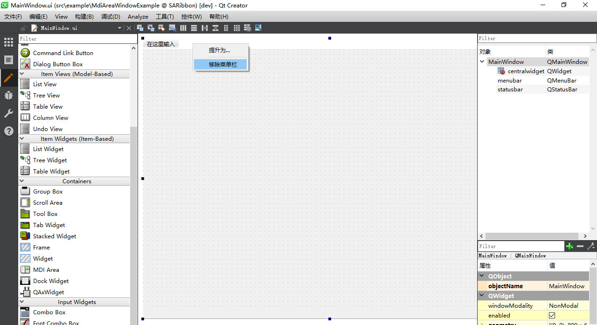
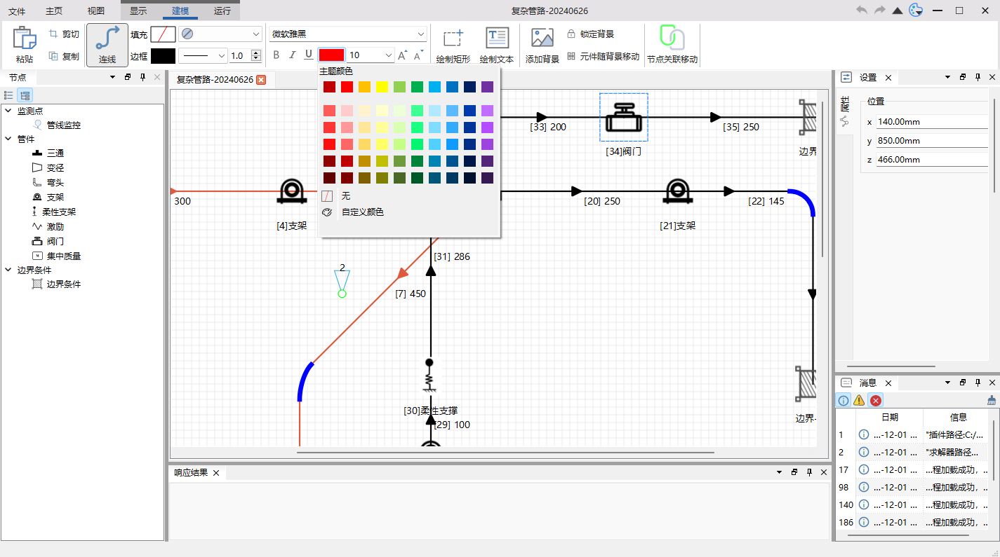

[中文文档点击这里,QQ群:434014314](./readme-cn.md)

<div align="center">
<p>


</p>
<p>


</p>
</div>


||Windows(latest)|Linux ubuntu(latest)|Mac(latest)|
|:-|:-|:-|:-|
|Qt5.12 LTS|[](https://github.com/czyt1988/SARibbon/actions/workflows/cmake-win-qt5.12.yml)|[](https://github.com/czyt1988/SARibbon/actions/workflows/cmake-linux-qt5.12.yml)|[](https://github.com/czyt1988/SARibbon/actions/workflows/cmake-mac-qt5.12.yml)|
|Qt5.14|[](https://github.com/czyt1988/SARibbon/actions/workflows/cmake-win-qt5.14.yml)|[](https://github.com/czyt1988/SARibbon/actions/workflows/cmake-linux-qt5.14.yml)|[](https://github.com/czyt1988/SARibbon/actions/workflows/cmake-mac-qt5.14.yml)|
|Qt5.15 LTS|[](https://github.com/czyt1988/SARibbon/actions/workflows/cmake-win-qt5.15.yml)|[](https://github.com/czyt1988/SARibbon/actions/workflows/cmake-linux-qt5.15.yml)|[](https://github.com/czyt1988/SARibbon/actions/workflows/cmake-mac-qt5.15.yml)|
|Qt6.2 LTS|[](https://github.com/czyt1988/SARibbon/actions/workflows/cmake-win-qt6.2.yml)|[](https://github.com/czyt1988/SARibbon/actions/workflows/cmake-linux-qt6.2.yml)|[](https://github.com/czyt1988/SARibbon/actions/workflows/cmake-mac-qt6.2.yml)|
|Qt6.5 LTS|[](https://github.com/czyt1988/SARibbon/actions/workflows/cmake-win-qt6.5.yml)|[](https://github.com/czyt1988/SARibbon/actions/workflows/cmake-linux-qt6.5.yml)|[](https://github.com/czyt1988/SARibbon/actions/workflows/cmake-mac-qt6.5.yml)|
|Qt6.8 LTS|[](https://github.com/czyt1988/SARibbon/actions/workflows/cmake-win-qt6.8.yml)|[](https://github.com/czyt1988/SARibbon/actions/workflows/cmake-linux-qt6.8.yml)|[](https://github.com/czyt1988/SARibbon/actions/workflows/cmake-mac-qt6.8.yml)|

# SARibbon Introduction

This is a `Qt`-based `Ribbon` interface widget that provides an operation interface similar to Microsoft Office software.

- `SARibbon` is suitable for the UI of large-scale software, industrial software, and complex software.
- `SARibbon` references the naming style of the MFC Ribbon interface in its design.
- `SARibbon` draws on the Ribbon interfaces of Microsoft Office and WPS software, combining the strengths of both.
- `SARibbon` is a Ribbon widget that can define multiple theme styles and quickly define desired themes through qss.

For the convenience of developing large-scale software, `SARibbon` encapsulates some commonly used functional widgets, such as [color selection buttons and color selection palettes](https://github.com/czyt1988/SAColorWidgets).

## Features

- Ribbon layout and display


- Support for minimized mode, where the Ribbon only displays tabs (double-clicking a tab will toggle by default), and support for context tab.


- Support for quickAccessBar (similar to Word's quick menu), which has different display effects under different layout modes.


- Support for 4 types of Ribbon buttons: regular buttons, delayed pop-up menu buttons, menu buttons, and action menu buttons (the action menu button is one of the main issues this Ribbon widget addresses).


- Support for 4 different styles of layout.


- Support for customizing the Ribbon using qss, with real-time theme switching and 5 built-in different styles.

Win7 theme:


Office2013 theme:


Office2016 theme:


Office2021 theme:


Dark theme:


- Provide Gallery widget.


- Support for long scrolling and Option Action.


- Provide center alignment mode.


- Support for 4K screens and multi-screen extension.
- Support for Linux and MacOS (the interface is not deeply customized).

Under the MIT license, everyone is welcome to use it and provide feedback.

[gitee (Code Cloud) - https://gitee.com/czyt1988/SARibbon](https://gitee.com/czyt1988/SARibbon)

[github - https://github.com/czyt1988/SARibbon](https://github.com/czyt1988/SARibbon)

# Building

It is recommended to use cmake for building. After completing the cmake build and installation, your project can integrate SARibbonBar using either cmake or qmake.

SARibbon offers both qmake and cmake build options. Additionally, it provides integrated SARibbon.h and SARibbon.cpp files for quick static embedding in projects.

> SARibbon supports the third-party frameless library [QWindowkit](https://github.com/stdware/qwindowkit). It also supports a simple frameless solution. If you need native window support from the operating system, such as edge snapping in Windows 7 and later, or the maximize button hover effect in Windows 11, it is recommended to enable the [QWindowkit](https://github.com/stdware/qwindowkit) library. The [QWindowkit](https://github.com/stdware/qwindowkit) library can also better solve multi-screen movement issues.

The effect after enabling `QWindowkit` is as follows:


If you want to depend on the [QWindowkit](https://github.com/stdware/qwindowkit) library, you need to compile the [QWindowkit](https://github.com/stdware/qwindowkit) library first. As a submodule of the SARibbon project, if the `--recursive` parameter was not included during `git clone`, you need to run the `submodule update` command:

```shell
git submodule update --init --recursive
```

> After the user specifies the use of [QWindowkit](https://github.com/stdware/qwindowkit), the minimum C++ standard required is C++17, otherwise the minimum requirement is C++14.

## Building as a Dynamic Library

For the specific build process, refer to the document: [SARibbon Build](./doc/how-to-build.md)

## Static Project Integration

You can integrate SARibbon without building it into a dynamic library by directly including the provided `SARibbon.h` and `SARibbon.cpp` files in your project. These files include all necessary resources. Refer to the StaticExample (located in `example/StaticExample`) for guidance.

### Using qmake

To use qmake, follow these steps:

1. Copy `SARibbon.h`, `SARibbon.cpp`, and `SARibbon.pri` (from the `./src` directory) to your project directory.
2. Include the `SARibbon.pri` file in your project's pro file, like: `include($$PWD/SARibbon.pri)`.

qmake can use the `SARibbon.pri` file to configure whether to enable the third-party frameless library.

### Using cmake

When using cmake, refer to the cmake writing style in the StaticExample (located in `example/StaticExample`). Simply include `SARibbon.h` and `SARibbon.cpp` in your project.

```cmake
set(SARIBBON_FILES
    SARibbon.h
    SARibbon.cpp
)
add_executable({your-target} 
            {your project's cpp and header files}
            ${SARIBBON_FILES}
)
```

If your project needs to use `QWindowkit`, you must integrate the `QWindowkit` library and add the pre-defined macro:

```cmake
find_package(QWindowKit)
target_link_libraries({your-target} PRIVATE QWindowKit::Widgets)
target_compile_definitions({your-target} PRIVATE SARIBBON_USE_3RDPARTY_FRAMELESSHELPER=1)
```

Otherwise, you need to set it to 0:

```cmake
target_compile_definitions({your-target} PRIVATE SARIBBON_USE_3RDPARTY_FRAMELESSHELPER=0)
```

# Usage

## Importing the Library

After compilation, integrate SARibbon into your project as follows:

### qmake

1. Copy `SARibbon.h`, `SARibbon.cpp`, and `SARibbon.pri` (from the `./src` directory) to your project directory.
2. Include `SARibbon.pri` in your project's .pro file: `include($$PWD/SARibbon.pri)`.

Refer to the comments in `SARibbon.pri` for configuration details.

### cmake

If you've built SARibbon dynamically, use it after installation via:

```cmake
set(SARibbonBar_DIR "[Your SARibbonBar install root]/lib/cmake")
find_package(SARibbonBar REQUIRED)
target_link_libraries({your_target_name} PUBLIC SARibbonBar::SARibbonBar)
```


## Quick Start

The Ribbon combines the menu bar and toolbar, displaying them through a tab widget. The Ribbon cannot be simply replaced by a Tab+Toolbar, as it involves many detailed issues. When designing `SARibbon`, the naming style of the MFC Ribbon interface was referenced. The tab page is called `Category` (kind), and each `Category` has multiple `pannel` (panels) under it, which manage toolbuttons. The `pannel` is somewhat similar to a traditional `Toolbar`. The hierarchy is shown in the figure below, and these names reference the Ribbon interface classes in MFC.


Some common terminology explanations are as follows:

- **Category**: Represents the content displayed by a tab, corresponding to `SARibbonCategory`.
- **Context Category**: This is a special kind of category that is not displayed normally and is shown based on context. The most common example is in Word, where a picture editing-related tab appears when an image is selected, and disappears when the image is deselected. This is a context category, corresponding to `SARibbonContextCategory`.
- **Pannel**: A collection of menus, similar to a Toolbar, corresponding to `SARibbonPannel`.
- **Application Button**: The button at the top-left corner of the tab bar (in Word, it corresponds to the File button). This button triggers special pages or menus, corresponding to `SARibbonApplicationButton`, which can be hidden.
- **Quick Access Bar**: A simple toolbar at the very top for placing frequently used actions, corresponding to `SARibbonQuickAccessBar`.
- **Gallery**: This is the most eye-catching widget of the Ribbon, displaying functions with intuitive images. Some even render in real-time based on context. A typical example is the style selection in the Home tab of Word, corresponding to `SARibbonGallery`.

The hierarchy of SARibbonBar is shown in the figure below:


> Note: Different layout schemes affect the placement of `Category` and `Quick Access Bar`. For more details, see [SARibbonBar Layout Schemes](#SARibbonBar Layout Schemes).

### Using Ribbon in MainWindow

To use SARibbon in MainWindow, you need to replace `QMainWindow` with `SARibbonMainWindow`. `SARibbonMainWindow` modifies the rendering of the menubar in `QMainWindow`.

> Note: If you are using a ui file, delete the original menu in the ui file to avoid potential exceptions, as shown in the figure below:
> 

Example code is as follows:

```cpp
#include "SARibbonMainWindow.h"
class MainWindow : public SARibbonMainWindow
{
    Q_OBJECT
public:
    MainWindow(QWidget* par = nullptr);
    ...
}
```

`SARibbonMainWindow` also supports rendering in normal mode. The second parameter of the SARibbonMainWindow constructor is used to set whether to use Ribbon mode:

```cpp
SARibbonMainWindow(QWidget *parent = nullptr, bool useRibbon = true);
```

If the second parameter is set to false, it will use the normal menu toolbar mode. This interface is reserved for projects that need to switch between Ribbon and classic menu toolbar modes. Ribbon state and classic state do not support hot switching. If switching is needed, users can set a configuration file or registry entry and pass false to the second parameter upon application restart to enter the classic menu toolbar mode.

### Using SARibbonBar in QWidget or QDialog

SARibbonBar supports use in QWidget or QDialog. For more details, see the example: `example/WidgetWithRibbon`.

The project provides the `SARibbonWidget` class. Inheriting `SARibbonWidget` in a widget window will achieve a Ribbon-effect window.

```cpp
#include "SARibbonWidget.h"

class RibbonWidget : public SARibbonWidget
{
 Q_OBJECT
public:
    RibbonWidget(QWidget* parent = nullptr);
};
```

The `SARibbonWidget` class provides the `setWidget` method, which can embed any widget.

```cpp
RibbonWidget::RibbonWidget(QWidget* parent) : SARibbonWidget(parent)
{
    // Get SARibbonBar
    SARibbonBar* ribbonbar = ribbonBar();
    // In QWidget mode, there is no need to display the title
    ribbonbar->setTitleVisible(false);
    // In QWidget mode, using compact mode is better
    ribbonbar->setRibbonStyle(SARibbonBar::RibbonStyleCompactThreeRow);
    // Cancel applicationbutton
    ribbonbar->setApplicationButton(nullptr);

    setWidget(new InnerWidget());
}
```

The effect is as follows:


### Creating Categories and Pannels

The order of creating a Ribbon is as follows: first create the category (
Category), then create the panel (Pannel), and finally create the corresponding toolbutton (action).

Use `SARibbonBar::addCategoryPage` to add the Category to SARibbonBar, use `SARibbonCategory::addPannel` to add the Pannel to the Category, and use `SARibbonPannel::addAction` to add actions to the Pannel.

The following code demonstrates an example of adding an action:

```cpp
// Add the main tab page - through the addCategoryPage factory function
SARibbonCategory* categoryMain = ribbon->addCategoryPage(tr("Main"));
 // Use the addPannel function to create a SARibbonPannel, which has the same effect as creating a new SARibbonPannel and then adding it
SARibbonPannel* pannel1 = categoryMain->addPannel("Panel 1");
QAction* actSave = new QAction(this);
actSave->setText("save");
actSave->setIcon(QIcon(":/icon/icon/save.svg"));
actSave->setObjectName("actSave");
actSave->setShortcut(QKeySequence(QLatin1String("Ctrl+S")));
pannel1->addLargeAction(actSave);
```

The above operation adds a button, and the effect is shown in the figure below:


Users can also directly create a SARibbonCategory and add it to the pannel. The following code has the same effect as the one above:

```cpp
SARibbonCategory* categoryMain = new SARibbonCategory(tr("Main"));
ribbon->addCategoryPage(categoryMain);
SARibbonPannel* pannel1 = new SARibbonPannel("Panel 1");
categoryMain->addPannel(pannel1);
QAction* actSave = new QAction(this);
...
pannel1->addLargeAction(actSave);
```

Ribbon icons come in different sizes. Using `addLargeAction`, `addMediumAction`, and `addSmallAction` can create different layout styles.

For more details, see [./example/MainWindowExample/mainwindow.cpp](./example/MainWindowExample/mainwindow.cpp).

### ContextCategory (Contextual Tabs)

Contextual tabs are special tabs or tab groups that only appear under certain conditions. For example, in Microsoft Office Word, when an image is selected, an image editing contextual tab appears. If no image is selected, the tab disappears. This is a contextual tab, corresponding to `SARibbonContextCategory`.

Contextual tabs are usually created during program initialization and hidden by default, waiting to be displayed when needed. Creating a contextual tab is as follows:

Since contextual tabs need to be invoked when needed, it is a good practice to save them as member variables. Of course, you can also search for them by iterating through the list (using `SARibbonBar::contextCategoryList` to enumerate all `SARibbonContextCategory` instances).

Header file:

```cpp
SARibbonContextCategory* m_contextCategory;
```

Cpp file:

```cpp
SARibbonBar* ribbon = ribbonBar();
// Create a contextCategory with a random color
m_contextCategory   = ribbon->addContextCategory(tr("context"), QColor());
SARibbonCategory* contextCategoryPage1 = m_contextCategory->addCategoryPage(tr("Page1"));
// Perform operations on contextCategoryPage1
......
SARibbonCategory* contextCategoryPage2 = m_contextCategory->addCategoryPage(tr("Page2"));
// Perform operations on contextCategoryPage2
......
```

`SARibbonCategory` instances created by `SARibbonContextCategory` are managed by `SARibbonContextCategory`. Only when `SARibbonContextCategory` is "displayed" will its managed `SARibbonCategory` instances be shown. **Note:** `SARibbonContextCategory` is not a window.

To display a contextual tab, simply call `SARibbonBar::showContextCategory` or `SARibbonBar::hideContextCategory`:

```cpp
void MainWindow::onShowContextCategory(bool on)
{
    if (on) {
        this->ribbonBar()->showContextCategory(m_contextCategory);
    } else {
        this->ribbonBar()->hideContextCategory(m_contextCategory);
    }
}
```

**Note:** If you need to delete a `contextCategory`, call `SARibbonBar::destroyContextCategory` instead of directly deleting it. After calling `SARibbonBar::destroyContextCategory`, there is no need to delete the pointer to `ContextCategory`.

Different styles of `contextCategory` have different appearances. For more details, see [SARibbon Styles](#SARibbon Styles) and [Comparison of Appearance Under Different Styles](#Comparison of Appearance Under Different Styles).

### ApplicationButton

There is a special and prominent button at the top-left corner of the Ribbon interface, known as the `applicationButton`. This button is generally used to invoke a menu. By default, `SARibbonBar` creates an `applicationButton` during construction, and you can set its text as follows:

```cpp
SARibbonBar* ribbon = ribbonBar();
ribbon->applicationButton()->setText(("File"));
```

The default `applicationButton` inherits from `SARibbonApplicationButton`, which in turn inherits from `QPushButton`. Therefore, you can perform all operations available for `QPushButton` on it. If you wish to set your own button as the `applicationButton`, you can do so by calling the `SARibbonBar::setApplicationButton` function.

### QuickAccessBar and rightButtonGroup

The QuickAccessBar is a simple toolbar located at the top-left corner, while the rightButtonGroup is a toolbar at the top-right corner. In Office mode, these toolbars are separated into left and right sides, whereas in WPS mode, they are combined and placed on the right side.

In `SARibbon`:

- QuickAccessBar corresponds to the `SARibbonQuickAccessBar` class.
- rightButtonGroup corresponds to the `SARibbonButtonGroupWidget` class.

`SARibbonBar` initializes by default with QuickAccessBar and RightButtonGroup. You can obtain pointers to these components and perform operations on them using `SARibbonBar::quickAccessBar` and `SARibbonBar::rightButtonGroup`, respectively. Here is an example:

```cpp
QAction* MainWindow::createAction(const QString& text, const QString& iconurl, const QString& objName)
{
    QAction* act = new QAction(this);
    act->setText(text);
    act->setIcon(QIcon(iconurl));
    act->setObjectName(objName);
    return act;
}

void MainWindow::initQuickAccessBar(){
    SARibbonBar* ribbon = ribbonBar();
    SARibbonQuickAccessBar* quickAccessBar = ribbon->quickAccessBar();
    quickAccessBar->addAction(createAction("save", ":/icon/icon/save.svg", "save-quickbar"));
    quickAccessBar->addSeparator();
    quickAccessBar->addAction(createAction("undo", ":/icon/icon/undo.svg"),"undo");
    quickAccessBar->addAction(createAction("redo", ":/icon/icon/redo.svg"),"redo");
    quickAccessBar->addSeparator();
}
void MainWindow::initRightButtonGroup(){
    SARibbonBar* ribbon = ribbonBar();
    SARibbonButtonGroupWidget* rightBar = ribbon->rightButtonGroup();
    QAction* actionHelp = createAction("help", ":/icon/icon/help.svg","help");
    connect(actionHelp, &QAction::triggered, this, &MainWindow::onActionHelpTriggered);
    rightBar->addAction(actionHelp);
}
```

### SARibbonBar Layout Schemes

`SARibbon` supports 4 Ribbon layout schemes, referencing the Ribbon styles of `Office` and `WPS`. The layout scheme can be switched using the `void SARibbonBar::setRibbonStyle(RibbonStyle v)` function.

The `Office` mode is the most common Ribbon mode, where the `tab` and title bar occupy more space. The `WPS` Ribbon mode has been improved to reduce the height of the Ribbon. It combines the tab and title bar to save one title bar height, effectively utilizing vertical space. Additionally, it changes the button layout in the pannel from a maximum of 3 buttons to 2 buttons per row, further compressing the vertical space.

Comparison of screenshots of the Office Word interface and the WPS Word interface:


Under normal screen conditions, the WPS style reduces the vertical height by at least 30 pixels compared to the Office style, which is equivalent to saving nearly 3% of the vertical space on a 1920*1080 screen.

In `SARibbon`, the layout with a title bar is referred to as a loose layout (Loose), and the arrangement of its various elements is shown in the figure below:


This layout is consistent with the default layout in Office.

The layout in `SARibbon` that combines the title bar and tab is called a compact layout (Compact), and the arrangement of its various elements is shown in the figure below:


The `SARibbonBar` provides the `setRibbonStyle` function to define the current layout scheme. The `SARibbonBar::RibbonStyle` enumeration defines four layout schemes:

- `
SARibbonBar::RibbonStyleLooseThreeRow`: Loose structure, 3-row mode (v0.x version was `SARibbonBar::OfficeStyle`)


- `SARibbonBar::RibbonStyleLooseTwoRow`: Loose structure, 2-row mode (v0.x version was `SARibbonBar::OfficeStyleTwoRow`)


- `SARibbonBar::RibbonStyleCompactThreeRow`: Compact structure, 3-row mode (v0.x version was `SARibbonBar::WpsLiteStyle`)


- `SARibbonBar::RibbonStyleCompactTwoRow`: Compact structure, 2-row mode (v0.x version was `SARibbonBar::WpsLiteStyleTwoRow`)


### SARibbonBar Text Wrapping and Icon Size

The `SARibbonBar::setEnableWordWrap` function controls whether the text in SARibbonBar wraps. The height of `SARibbonBar` is fixed, and text wrapping affects the size of the icons. Therefore, if you want the icons to appear larger, you can set text wrapping to off.

In the `SARibbonBar::RibbonStyleCompactTwoRow` layout mode, the display effect with text wrapping off is as follows:


Setting text wrapping off in SARibbonBar increases the display space for icons.

### Different Button Layout Styles

`SARibbonPannel` provides three methods to add actions:

- `addLargeAction`
- `addMediumAction`
- `addSmallAction`

In a standard pannel, a button (action) has three layouts. Taking Microsoft Office Word as an example, the three layouts of a pannel are actually the number of rows occupied:

- The first type occupies the entire pannel and is called `large`.
- The second type allows two buttons in one pannel and is called `medium`.
- The third type places three buttons in one pannel and is called `small`.


The `SARibbonPannelItem::RowProportion` enumeration represents the number of rows occupied by each widget in the pannel and is commonly used in pannel layouts. This enumeration is defined as follows:

```cpp
/**
  * @brief Defines the row proportion, with large, medium, and small proportions in the Ribbon
  */
enum RowProportion {
    None            ///< Undefined proportion; this will be determined based on expandingDirections. If Qt::Vertical is possible, it is equivalent to Large; otherwise, it is Small.
    , Large         ///< Large proportion, where a widget's height will fill the entire pannel
    , Medium        ///< Medium proportion, which only takes effect in @ref SARibbonPannel::pannelLayoutMode when it is @ref SARibbonPannel::ThreeRowMode. Both items in the same column must be Medium to occupy two rows out of three.
    , Small         ///< Small proportion, occupying one row of SARibbonPannel. Medium will also become Small if conditions are not met, but it will not become Large.
};
```

Each action managed by `SARibbonPannel` has a private attribute (`SARibbonPannelItem::RowProportion`), which determines the layout of the action within the pannel.

### SARibbonPannel Layout Modes

#### Three-Row Mode

The three-row mode is the traditional pannel layout, as shown in the figure below:


In the three-row mode, there are three types of proportions (`SARibbonPannelItem::RowProportion`): large, medium, and small.

The pannel in the three-row mode displays the pannel title in the `Pannel Title` area. There is also an `OptionAction` area, which is used for special triggering of the action. If no `OptionAction` is set, this area is hidden.

#### Two-Row Mode

The two-row mode is an improved layout method referenced from WPS (it is unclear whether WPS was the first to use this layout, but it was designed based on WPS's layout), as shown in the figure below:


In the two-row mode, the proportions of medium and small (`SARibbonPannelItem::RowProportion`) are the same and are not distinguished.

The pannel in the two-row mode does not display the title.

### Customization Features of SARibbon

Customization is a key feature of Ribbon. Referencing the customization interfaces of Office and WPS, users can define a wide range of content for their Ribbon, even creating a completely different interface from the original.

Below is the customization interface of Office:


`SARibbon` encapsulates a set of convenient-to-use `SARibbonCustomize**` classes, including the following 5 classes:

> - SARibbonCustomizeDialog
> - SARibbonCustomizeWidget
> - SARibbonCustomizeData
> - SARibbonActionsManager
> - SARibbonActionsManagerModel

In practice, users will only deal with `SARibbonActionsManager` and `SARibbonCustomizeDialog`/`SARibbonCustomizeWidget`. The other classes are typically not used by users.

`SARibbonActionsManager` is used to manage `QAction`. Add the `QAction` you want to customize to `SARibbonActionsManager` for management, and you can categorize `QAction` to display in `SARibbonCustomizeDialog`/`SARibbonCustomizeWidget`.

`SARibbonCustomizeDialog`/`SARibbonCustomizeWidget` are the actual display windows. `SARibbonCustomizeDialog` packages `SARibbonCustomizeWidget` into a dialog box. If you want to integrate it into a configuration dialog box like Office, you can use `SARibbonCustomizeWidget`. The effect of `SARibbonCustomizeDialog` is shown in the figure below:


#### Adding Customization Features to the Interface

Here is an example of how to add customization features.

First, define `SARibbonActionsManager` as a member variable of MainWindow:

```cpp
// In MainWindow.h, define the member variable
SARibbonActionsManager* m_ribbonActionMgr; ///< Used to manage all actions
```

During the initialization of MainWindow, a large number of `QAction` instances need to be created, with MainWindow as the parent object. Additionally, the Ribbon layout will be generated, such as adding categories and panels. After these operations are completed, add the following steps to automatically have `SARibbonActionsManager` manage all `QAction` instances:

```cpp
// Initialization of MainWindow, generating QAction
// Generating Ribbon layout
m_ribbonActionMgr = new SARibbonActionsManager(mainWinowPtr);
m_ribbonActionMgr->autoRegisteActions(mainWinowPtr);
```

The key function `autoRegisteActions` of `SARibbonActionsManager` can iterate through all child objects of `SARibbonMainWindow`, find actions, and register them. It will also iterate through all `SARibbonCategory` instances, categorizing the actions under `SARibbonCategory` by the title name of `SARibbonCategory`. This function will register actions under `SARibbonMainWindow` but not in any category as the `NotInRibbonCategoryTag` label. By default, the name will be assigned as `not in ribbon`.

Where you need to invoke `SARibbonCustomizeDialog`, perform the following operations:

```cpp
QString cfgpath = "customization.xml";
SARibbonCustomizeDialog dlg(this, this);

dlg.setupActionsManager(m_ribbonActionMgr);
dlg.fromXml(cfgpath); // This step is called to load existing customization steps, so that when saving, it can be based on the existing customization steps
if (QDialog::Accepted == dlg.exec()) {
    dlg.applys(); // Apply customization steps
    dlg.toXml(cfgpath); // Save customization steps to a file
}
```

Before constructing MainWindow, the customized content needs to be loaded. Therefore, add the following line at the end of the constructor:

```cpp
// At the end of the MainWindow constructor
sa_apply_customize_from_xml_file("customization.xml", this, m_ribbonActionMgr);
```

`sa_apply_customize_from_xml_file` is a function provided in `SARibbonCustomizeWidget.h`, which directly applies the customized content from the configuration file to MainWindow.

In this way, the software will load according to the configuration file each time it starts.

# More Screenshots

- This is a screenshot of software built using SARibbon:




[github - https://github.com/czyt1988/data-workbench](https://github.com/czyt1988/data-workbench)

[gitee - https://gitee.com/czyt1988/data-workbench](https://gitee.com/czyt1988/data-workbench)

For the specific Ribbon generation code, see:

[https://github.com/czyt1988/data-workbench/blob/master/src/APP/DAAppRibbonArea.cpp](https://github.com/czyt1988/data-workbench/blob/master/src/APP/DAAppRibbonArea.cpp)

# Documentation Generation

You can generate qch and html documentation using doxygen. The `doc/Doxyfile-qch-cn` file is used to generate `.qch` format Qt help documentation, which can be integrated into Qt Creator. The `doc/Doxyfile-wiki-cn` file is used to generate html documentation for easy viewing in a web browser.

# FAQs

## 1. High-DPI Display Issues

For high-DPI display, the following two aspects are prepared:

1 - Set the `Qt::AA_EnableHighDpiScaling` attribute for QApplication in the main function.

This attribute enables the application to automatically detect the pixel density of the display to achieve automatic scaling. The example code is as follows:

```cpp
int main(int argc, char* argv[])
{
#if (QT_VERSION >= QT_VERSION_CHECK(5, 6, 0))
    QApplication::setAttribute(Qt::AA_EnableHighDpiScaling);
    QApplication::setAttribute(Qt::AA_UseHighDpiPixmaps);
#endif
    QApplication a(argc, argv);
    ......
}
```

2 - Set the scaling policy for QApplication in the main function: `QApplication::setHighDpiScaleFactorRoundingPolicy`

Qt 5.6 introduced `Qt::AA_EnableHighDpiScaling`, but it does not completely solve the issue. Starting from Qt 5.14, the high-DPI scaling policy setting `QApplication::setHighDpiScaleFactorRoundingPolicy` is provided. Like `AA_EnableHighDpiScaling`, it needs to be set before the main function.

```cpp
int main(int argc, char* argv[])
{
#if (QT_VERSION >= QT_VERSION_CHECK(5, 6, 0))
    QApplication::setAttribute(Qt::AA_EnableHighDpiScaling);
    QApplication::setAttribute(Qt::AA_UseHighDpiPixmaps);
#endif
#if (QT_VERSION >= QT_VERSION_CHECK(5, 14, 0))
    QApplication::setHighDpiScaleFactorRoundingPolicy(Qt::HighDpiScaleFactorRoundingPolicy::PassThrough);
#endif
    QApplication a(argc, argv);
    ......
}
```

If you encounter strange issues with an OpenGL window, you can remove the above statements to see if it resolves the problem. The latest version of Qt no longer requires the above handling.

## 2. Shortcut Key Issues

Many users have reported that after using SARibbonBar, the shortcut keys of inactive tab pages do not respond, while only the shortcut keys of the active tab page are effective. In traditional toolbar mode, since the toolbar containing the action is always at the forefront, the shortcut keys are always effective. However, in SARibbonBar, the pannel containing the action can be hidden, and once hidden, the shortcut keys will not work. If you want the shortcut keys to be effective regardless of whether the Pannel is hidden, setting the `shortcutContext` attribute of the shortcut key to `Qt::ApplicationShortcut` is also无效. At this time, you can use the Qt `QWidget::addAction` function to add the action with the shortcut key to the MainWindow.

For example:

```cpp
void MainWindow::initRibbon(){
    SARibbonCategory* categoryMain = ribbon->addCategoryPage(tr("Main"));
    SARibbonPannel* pannel = categoryMain->addPannel(tr("io"));
    // Omitted action creation process
    QAction* actSave = new QAction(this);
    ...
    // Set shortcut for the action
    actSave->setShortcut(QKeySequence(QLatin1String("Ctrl+S")));
    // Add the action to the pannel
    pannel->addLargeAction(actSave);
    // Add the action to the MainWindow so that it can respond to shortcut keys even when switching to other tab pages
    addAction(actSave);
}
```

## 3. Theme Settings Not Taking Effect

In some versions of Qt, setting the theme in the constructor may not take full effect. You can use `QTimer` to schedule it to the end of the queue for execution, like this:

```cpp
QTimer::singleShot(0, this, [ this ]() { 
    this->setRibbonTheme(SARibbonMainWindow::RibbonThemeDark); 
    });
```

## 4. Macro Redefinition Issues

This error occurs when using SARibbon.h/cpp. This is because some debug macros written in cpp in early versions did not have `#ifdef` processing. When multiple cpp files are merged, problems will arise. This issue does not occur when using shared libraries. If you encounter this problem, update to version v2.2.8 or above.

## 5. Maximize/Minimize Icons in the Wrong Corner

If you encounter this issue, ensure that the library files and header files match. This problem usually occurs during partial updates, such as replacing only the dll without replacing the h file. Some projects, after pulling the latest version of SARibbon, directly replace the lib and dll files without updating the header files, which can cause this issue. To fix this problem, ensure the consistency of all file versions. If you installed using cmake, the following files/folders will be involved:

```txt
bin/SARibbonBar.dll
include/SARibbonBar[folder]
lib/SARibbonBar.lib
lib/qmake/SARibbonBar[folder]
lib/cmake/SARibbonBar[folder]
SARibbonBar_amalgamate
```

## 6. Icons Not Displaying

If you encounter issues with icons not displaying, such as maximize/minimize buttons showing the button but not the icon, it indicates that your runtime environment cannot find the Qt svg plugin. Your program directory should contain the `imageformats/qsvg.dll` plugin. You can run `windeployqt` to fetch the dependencies for your program, or ensure that the `plugins/imageformats` folder is accessible in your PATH environment variable configuration.

> This article was translated by [kimi](kimi.moonshot.cn), a large language model from China. [kimi](kimi.moonshot.cn) is known for its strong capabilities in natural language understanding and generation, making it highly effective for tasks like translation and content creation.
