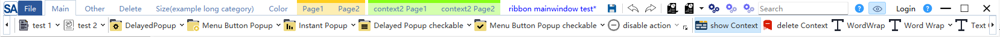

# SARibbon Introduction

[中文文档点击这里](./readme-cn.md)

<div align="center">
<p>


</p>
<p>


</p>
</div>

📚 **Project Documentation**: [https://czyt1988.github.io/SARibbon/en](https://czyt1988.github.io/SARibbon/en)  
Detailed User Guide: [SARibbon User Guide](./docs/en/use-guide/SARibbon-user-guide.md)

||Windows (latest)|Linux Ubuntu (latest)|Mac (latest)|
|:-|:-|:-|:-|
|Qt 5.12 LTS|[](https://github.com/czyt1988/SARibbon/actions/workflows/cmake-win-qt5.12.yml)|[](https://github.com/czyt1988/SARibbon/actions/workflows/cmake-linux-qt5.12.yml)|[](https://github.com/czyt1988/SARibbon/actions/workflows/cmake-mac-qt5.12.yml)|
|Qt 5.14|[](https://github.com/czyt1988/SARibbon/actions/workflows/cmake-win-qt5.14.yml)|[](https://github.com/czyt1988/SARibbon/actions/workflows/cmake-linux-qt5.14.yml)|[](https://github.com/czyt1988/SARibbon/actions/workflows/cmake-mac-qt5.14.yml)|
|Qt 5.15 LTS|[](https://github.com/czyt1988/SARibbon/actions/workflows/cmake-win-qt5.15.yml)|[](https://github.com/czyt1988/SARibbon/actions/workflows/cmake-linux-qt5.15.yml)|[](https://github.com/czyt1988/SARibbon/actions/workflows/cmake-mac-qt5.15.yml)|
|Qt 6.2 LTS|[](https://github.com/czyt1988/SARibbon/actions/workflows/cmake-win-qt6.2.yml)|[](https://github.com/czyt1988/SARibbon/actions/workflows/cmake-linux-qt6.2.yml)|[](https://github.com/czyt1988/SARibbon/actions/workflows/cmake-mac-qt6.2.yml)|
|Qt 6.5 LTS|[](https://github.com/czyt1988/SARibbon/actions/workflows/cmake-win-qt6.5.yml)|[](https://github.com/czyt1988/SARibbon/actions/workflows/cmake-linux-qt6.5.yml)|[](https://github.com/czyt1988/SARibbon/actions/workflows/cmake-mac-qt6.5.yml)|
|Qt 6.8 LTS|[](https://github.com/czyt1988/SARibbon/actions/workflows/cmake-win-qt6.8.yml)|[](https://github.com/czyt1988/SARibbon/actions/workflows/cmake-linux-qt6.8.yml)|[](https://github.com/czyt1988/SARibbon/actions/workflows/cmake-mac-qt6.8.yml)|

---

## Project Overview

**SARibbon** is a **Ribbon UI control library** for **Qt**, designed to provide desktop applications with a modern interface similar to Microsoft Office applications.

### Use Cases

- Large-scale software
- Industrial software
- Complex desktop applications

### Design Philosophy

- Interface naming inspired by **MFC Ribbon**
- Visual style blends the best of **Microsoft Office** and **WPS Office** Ribbon interfaces
- Supports rapid theme customization via **QSS (Qt Style Sheets)**
- Includes encapsulated common functional widgets, such as [color picker buttons and color panels](https://github.com/czyt1988/SAColorWidgets)

---

## Features

### Ribbon Layout and Display


- Supports **minimized mode**, where only tabs are shown (double-clicking a tab toggles minimization by default). Contextual tabs are also supported.  
  

- Supports **Quick Access Bar** (like Word's quick menu) and **Right Button Group**, with adaptive layout behavior in different modes.

- Supports **four types of Ribbon buttons**: standard push button, delayed popup menu button, menu button, and action menu button. *(The action menu button addresses one of the core challenges this Ribbon control aims to solve.)*  
    
  See: [Ribbon Button Layout Guide](./docs/en/use-guide/layout-of-ribbonbutton.md)

- Offers **six distinct layout styles** — Loose 3-row, Loose 2-row, Compact 3-row, Compact 2-row, Loose Single-row, Compact Single-row — with Single-row mode ideal for space-constrained scenarios.  
  Layout styles:  
    
  Single-row layout:  
    
  See: [SARibbon Layout Guide](./docs/en/use-guide/layout-of-SARibbon.md)

- Fully customizable via **QSS**, with **real-time theme switching** support. Includes **6 built-in themes**:
  - Windows 7  
    
  - Office 2013  
    
  - Office 2016  
    
  - Office 2021  
    
  - Dark  
    
  - Dark 2  
    
  
  You can design any theme via QSS. See: [Design Your Theme](./docs/en/use-guide/design-your-theme.md)

- Provides a **Gallery widget**.  
  

- Supports **horizontal scrolling** and **Option Actions**.  
  

- Offers **center-aligned mode**.  
  

- Fully compatible with **4K displays** and **multi-monitor setups**.

- Supports **Linux** and **macOS** (*UI not deeply optimized for these platforms*).

- Provides **RTL mode** with automatic system detection.

**License**: MIT (free to use, modify, and distribute)  
**Contributions welcome**: feel free to submit Issues, PRs, or join discussions!

### Repositories

- [Gitee (Chinese Git hosting)](https://gitee.com/czyt1988/SARibbon)  
- [GitHub](https://github.com/czyt1988/SARibbon)

---

## Building and Usage

`SARibbon` provides amalgamated integration files (`SARibbon.h` and `SARibbon.cpp`) in the `src/` directory — just include them in your project to get started.

To build as a dynamic library, see: [SARibbon Build Instructions](./docs/en/build-guide/build-instructions.md)

Quick start guides:

- [Create a Ribbon-Style Window](./docs/en/use-guide/create-ribbon-style-window.md)
- [Create a Ribbon Interface](./docs/en/use-guide/create-ribbon-ui.md)

**We recommend starting with the `example/MainWindowExample` project to learn SARibbon usage. You can run it directly to explore all features interactively.**

Project documentation is in the `docs/en/` folder:  
[https://czyt1988.github.io/SARibbon/en](https://czyt1988.github.io/SARibbon/en)

Doxygen-generated API documentation is deployed at:
[https://czyt1988.github.io/SARibbon/doxygen/index.html](https://czyt1988.github.io/SARibbon/doxygen/index.html)

---

## Python Bindings

SARibbon provides Python bindings for three frameworks, allowing you to use SARibbon in Python applications:

| Binding | Framework | Build Tool |
|---------|-----------|------------|
| PyQtSARibbon | PyQt5 | SIP |
| PyQtSARibbon6 | PyQt6 | SIP |
| PySideSARibbon | PySide6 | Shiboken6 |

Install via pip:

```bash
pip install PyQtSARibbon    # PyQt5
pip install PyQtSARibbon6   # PyQt6
pip install PySideSARibbon  # PySide6
```

For building from source and detailed usage, see:
- [Build Python Bindings](./docs/en/python-guide/build-python-bindings.md)
- [Use Python Bindings](./docs/en/python-guide/use-python-bindings.md)
- [Build PySide6 Bindings](./docs/en/python-guide/build-pyside6-bindings.md)
- [Publish to PyPI](./docs/en/python-guide/publish-to-pypi.md)

Python demo examples are in the `pyexamples/` directory.

---

## More Screenshots

Screenshots of real applications built with SARibbon:

  
  


- [GitHub - data-workbench](https://github.com/czyt1988/data-workbench)  
- [Gitee - data-workbench](https://gitee.com/czyt1988/data-workbench)

For actual Ribbon implementation code, see:  
[https://github.com/czyt1988/data-workbench/blob/master/src/APP/DAAppRibbonArea.cpp](https://github.com/czyt1988/data-workbench/blob/master/src/APP/DAAppRibbonArea.cpp)

---

## Documentation Generation

Project documentation is built with **MkDocs** and deployed to GitHub Pages:  
[https://czyt1988.github.io/SARibbon/en](https://czyt1988.github.io/SARibbon/en)

You can also generate documentation using **Doxygen**:

- `docs/doxygen-doc-file/Doxyfile-qch-en`: generates `.qch` files for integration into **Qt Creator** as Qt Help documentation. *(Note: the `-en` variant does not yet exist — use `Doxyfile-qch-cn` as a reference, or create the `-en` version from it.)*
- `docs/doxygen-doc-file/Doxyfile-wiki-en`: generates HTML documentation for browser viewing. *(Note: the `-en` variant does not yet exist — use `Doxyfile-wiki-cn` as a reference, or create the `-en` version from it.)*
