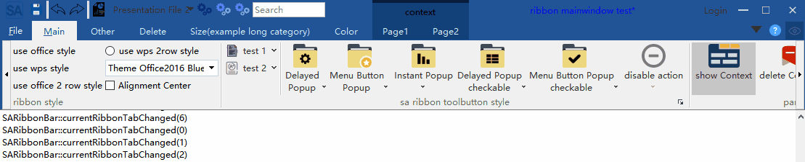
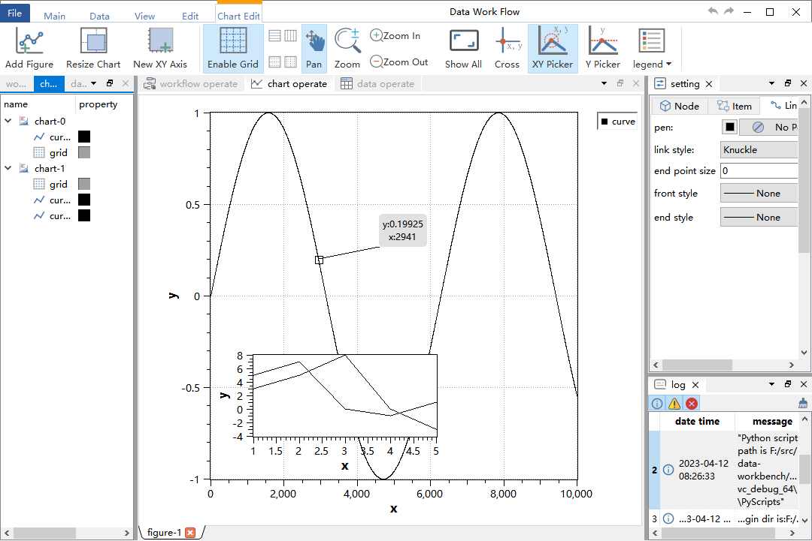

# SARibbon Introduction
[中文文档点击这里](./readme-cn.md)

Project Documentation: [https://czyt1988.github.io/SARibbon/en](https://czyt1988.github.io/SARibbon/en)  
Detailed User Guide: [SARibbon User Guide](./docs/SARibbon-User-Guide(en).md)

||Windows (latest)|Linux Ubuntu (latest)|Mac (latest)|
|:-|:-|:-|:-|
|Qt 5.12 LTS||||
|Qt 5.14||||
|Qt 5.15 LTS||||
|Qt 6.2 LTS||||
|Qt 6.5 LTS||||
|Qt 6.8 LTS||||

This is a **Ribbon UI control** for **Qt**, providing an interface similar to Microsoft Office applications.

- `SARibbon` is suitable for large-scale software, industrial applications, and complex UIs.
- It adopts naming conventions inspired by **MFC Ribbon** interfaces.
- The visual style draws from both **Microsoft Office** and **WPS Office** Ribbon interfaces, combining the best features of both.
- `SARibbon` supports multiple customizable themes and allows rapid styling via **Qt Style Sheets (QSS)**.
- To facilitate development of large applications, `SARibbon` includes encapsulated common functional widgets, such as [color picker buttons and color panels](https://github.com/czyt1988/SAColorWidgets).

## Features

### Ribbon Layout and Display

- Supports **minimized mode**, where only tabs are shown (double-clicking a tab toggles minimization by default). Contextual tabs are also supported.  
  

- Supports **Quick Access Bar** (like Word’s quick menu) and **Right Button Group**, with adaptive layout behavior in different modes.

- Supports **four types of Ribbon buttons**:
  - Standard push button
  - Delayed popup menu button
  - Menu button
  - Action menu button  
  *(The action menu button addresses one of the core challenges this Ribbon control aims to solve.)*  
  

- Offers **four distinct layout styles**.  
  

- Fully customizable via **QSS**, with **real-time theme switching** support. Includes **6 built-in themes**:
  - Windows 7  
    
  - Office 2013  
    
  - Office 2016  
    
  - Office 2021  
    
  - Dark  
    
  - Dark 2  
    

- Provides a **Gallery widget**.  
  

- Supports **horizontal scrolling** and **Option Actions**.  
  

- Offers **center-aligned mode**.  
  

- Fully compatible with **4K displays** and **multi-monitor setups**.

- Supports **Linux** and **macOS** (*UI not deeply optimized for these platforms*).

- Licensed under the **MIT License** — contributions and feedback are welcome!

### Repositories

- [Gitee (Chinese Git hosting)](https://gitee.com/czyt1988/SARibbon)  
- [GitHub](https://github.com/czyt1988/SARibbon)

---

## Building and Usage

- Project documentation is located in the `docs/en/` folder. You can access it directly here:  
  [https://czyt1988.github.io/SARibbon/en](https://czyt1988.github.io/SARibbon/en)

- Doxygen-generated API documentation is deployed at:  
  [https://czyt1988.github.io/SARibbon/doxygen/index.html](https://czyt1988.github.io/SARibbon/doxygen/index.html)

- Learn how to use `SARibbon` by exploring the example project:  
  `example/MainWindowExample`. You can run it to experience the Ribbon’s features interactively.

---

## More Screenshots

Screenshots of real applications built with SARibbon:

  
  

- [GitHub - data-workbench](https://github.com/czyt1988/data-workbench)  
- [Gitee - data-workbench](https://gitee.com/czyt1988/data-workbench)

For actual Ribbon implementation code, see:  
[https://github.com/czyt1988/data-workbench/blob/master/src/APP/DAAppRibbonArea.cpp](https://github.com/czyt1988/data-workbench/blob/master/src/APP/DAAppRibbonArea.cpp)

---

## Documentation Generation

You can generate documentation using **Doxygen**:

- `docs/Doxyfile-qch-en`: generates `.qch` files for integration into **Qt Creator** as Qt Help documentation.
- `docs/Doxyfile-wiki-en`: generates HTML documentation for browser viewing.

This project’s documentation is built with **MkDocs** and deployed to GitHub Pages:  
[https://czyt1988.github.io/SARibbon/en](https://czyt1988.github.io/SARibbon/en)

