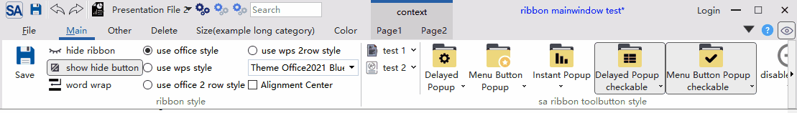
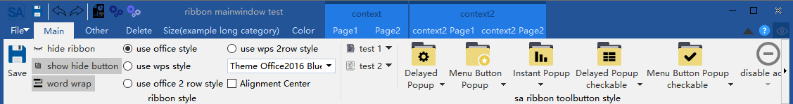
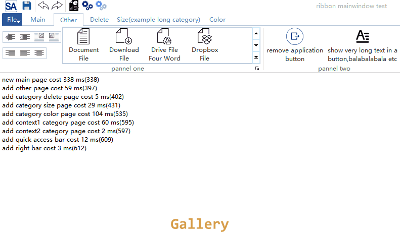
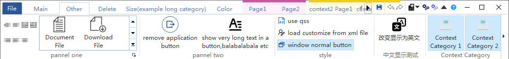
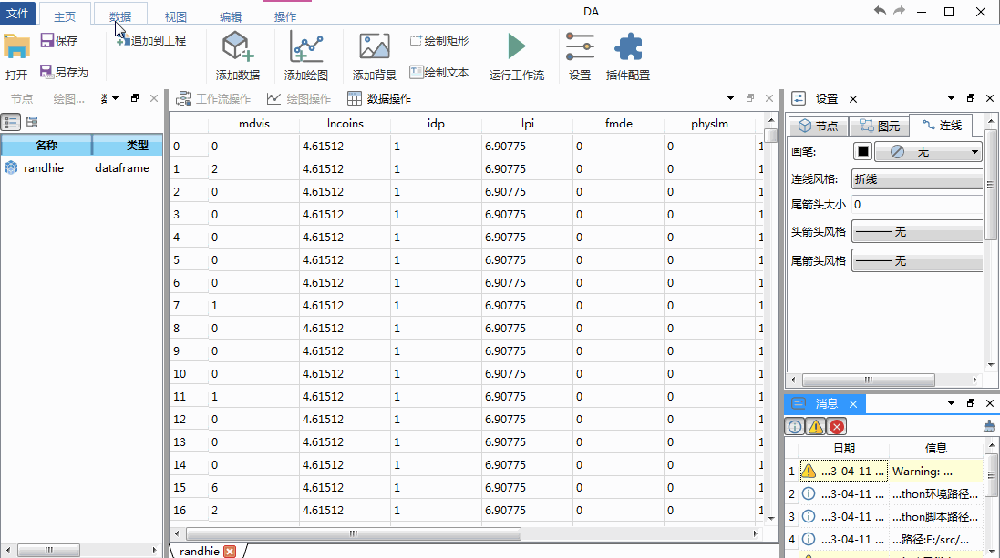

[中文文档点击这里,QQ群:434014314](./readme-cn.md)

<div align="center">
<p>


</p>
<p>


</p>
</div>


||Windows(2019, latest)|Linux ubuntu(20.04, latest)|Mac(11-latest)|
|:-|:-|:-|:-|
|Qt5.12|[](https://github.com/czyt1988/SARibbon/actions/workflows/cmake-win-qt5.12.yml)|[](https://github.com/czyt1988/SARibbon/actions/workflows/cmake-linux-qt5.12.yml)|[](https://github.com/czyt1988/SARibbon/actions/workflows/cmake-mac-qt5.12.yml)|
|Qt5.13|[](https://github.com/czyt1988/SARibbon/actions/workflows/cmake-win-qt5.13.yml)|[](https://github.com/czyt1988/SARibbon/actions/workflows/cmake-linux-qt5.13.yml)|[](https://github.com/czyt1988/SARibbon/actions/workflows/cmake-mac-qt5.13.yml)|
|Qt5.14|[](https://github.com/czyt1988/SARibbon/actions/workflows/cmake-win-qt5.14.yml)|[](https://github.com/czyt1988/SARibbon/actions/workflows/cmake-linux-qt5.14.yml)|[](https://github.com/czyt1988/SARibbon/actions/workflows/cmake-mac-qt5.14.yml)|
|Qt5.15|[](https://github.com/czyt1988/SARibbon/actions/workflows/cmake-win-qt5.15.yml)|[](https://github.com/czyt1988/SARibbon/actions/workflows/cmake-linux-qt5.15.yml)|[](https://github.com/czyt1988/SARibbon/actions/workflows/cmake-mac-qt5.15.yml)|
|Qt6.0|[](https://github.com/czyt1988/SARibbon/actions/workflows/cmake-win-qt6.0.yml)|[](https://github.com/czyt1988/SARibbon/actions/workflows/cmake-linux-qt6.0.yml)|[](https://github.com/czyt1988/SARibbon/actions/workflows/cmake-mac-qt6.0.yml)|
|Qt6.1|[](https://github.com/czyt1988/SARibbon/actions/workflows/cmake-win-qt6.1.yml)|[](https://github.com/czyt1988/SARibbon/actions/workflows/cmake-linux-qt6.1.yml)|[](https://github.com/czyt1988/SARibbon/actions/workflows/cmake-mac-qt6.1.yml)|
|Qt6.2|[](https://github.com/czyt1988/SARibbon/actions/workflows/cmake-win-qt6.2.yml)|[](https://github.com/czyt1988/SARibbon/actions/workflows/cmake-linux-qt6.2.yml)|[](https://github.com/czyt1988/SARibbon/actions/workflows/cmake-mac-qt6.2.yml)|
|Qt6.3|[](https://github.com/czyt1988/SARibbon/actions/workflows/cmake-win-qt6.3.yml)|[](https://github.com/czyt1988/SARibbon/actions/workflows/cmake-linux-qt6.3.yml)|[](https://github.com/czyt1988/SARibbon/actions/workflows/cmake-mac-qt6.3.yml)|
|Qt6.4|[](https://github.com/czyt1988/SARibbon/actions/workflows/cmake-win-qt6.4.yml)|[](https://github.com/czyt1988/SARibbon/actions/workflows/cmake-linux-qt6.4.yml)|[](https://github.com/czyt1988/SARibbon/actions/workflows/cmake-mac-qt6.4.yml)|
|Qt6.5|[](https://github.com/czyt1988/SARibbon/actions/workflows/cmake-win-qt6.5.yml)|[](https://github.com/czyt1988/SARibbon/actions/workflows/cmake-linux-qt6.5.yml)|[](https://github.com/czyt1988/SARibbon/actions/workflows/cmake-mac-qt6.5.yml)|
|Qt6.6|[](https://github.com/czyt1988/SARibbon/actions/workflows/cmake-win-qt6.6.yml)|[](https://github.com/czyt1988/SARibbon/actions/workflows/cmake-linux-qt6.6.yml)|[](https://github.com/czyt1988/SARibbon/actions/workflows/cmake-mac-qt6.6.yml)|

# Introduction to SARibbon

This is a `Ribbon control` under `Qt` framework, which provides an interface similar to that of Microsoft Office software. `SARibbon` is suitable for large software, industrial software, and complex software UI. `SARibbon` is designed with reference to the naming style of the MFC Ribbon interface, and the interface style of `SARibbon` refers to the Ribbon interface of Microsoft Office series software and WPS software, and combines the advantages of both. `SARibbon` is a ribbon widget that can define a variety of theme styles, and it can quickly define your desired theme style through qss.In order to facilitate the development of large software, `SARibbon` encapsulates some commonly used functional controls,such as [Color Widgets](https://github.com/czyt1988/SAColorWidgets)


## Features

- Layout and display for Ribbon


- Support minimization mode, ribbon only shows tabs (default double-click on the tab will switch)


- Supports quickAccessBar (word quick menu), which will have different display effects in different layout modes


- Support 4 different ribbon buttons: normal buttons, delay pop-up menu buttons, menu buttons, action menu buttons


- There are 4 different styles of ribbon layouts available



- Support QSS to customize the ribbon, you can switch themes in real time, and there are 5 different styles of themes built-in

win7 theme:

office2013 theme:

office2016 theme:

office2021 theme:

dark theme:


- Provides a Gallery control



- Supports long scrolling and Option Action


- Provides a centered alignment mode


- Support 4K screen and multi-screen
- Support linux and MacOS


MIT protocol，welcome for everyone to use and give comments

[gitee - https://gitee.com/czyt1988/SARibbon](https://gitee.com/czyt1988/SARibbon)

[github - https://github.com/czyt1988/SARibbon](https://github.com/czyt1988/SARibbon)


# Build

`SARibbon` provides both qmake and cmake build methods, and provides an amalgamate `SARibbon.h` and `SARibbon.cpp` file for static embedding into a single project

> `SARibbon` supports third-party library [QWindowKit](https://github.com/stdware/qwindowkit) At the same time, it also supports simple frameless solutions. If you need native window support for the operating system, such as edge trimming after Windows 7 and maximizing the hovering effect of buttons in Windows 11, it is recommended to enable [QWindowKit](https://github.com/stdware/qwindowkit) Library, [QWindowKit](https://github.com/stdware/qwindowkit) Library can better solve the problem of multi screen movement

If you want to rely on [QWindowKit](https://github.com/stdware/qwindowkit) Library, needs to be compiled first [QWindowKit](https://github.com/stdware/qwindowkit) Library, [QWindowKit](https://github.com/stdware/qwindowkit) As the submodules of the SARibbon project, if the '-- recursive' parameter is not included in the 'git clone', the 'submodules update' command needs to be executed:

```shell
git submodule update --init --recursive
```

## Compile to dynamic libraries

### qmake

Use Qt Creator to open `SARibbon.pro` directly, compile it, and the SARibbonBar library and examples will be compiled, and the lib and example directories are located in the `bin_qt{Qt version}_{MSVC/GNU}_x{32/64}` directory

> Libraries compiled in debug mode are distinguished by a 'd' after the end

### cmake

Use Qt Creator or visual studio to open `src/CMakeLists.txt` compilation

```cmake
mkdir build
cd build
cmake -DCMAKE_PREFIX_PATH={YOUR_QT_SDK_DIR_PATH} -DCMAKE_INSTALL_PREFIX={WHERE_YOU_WANT_TO_INSTALL} -DCMAKE_BUILD_TYPE=Release
cmake --build . --config Release --target all --parallel
cmake --install . --config Release --strip 
```

{YOUR_QT_SDK_DIR_PATH} is the directory of your qtsdk, something like `D:Qt5.14.2msvc2017_64`

{WHERE_YOU_WANT_TO_INSTALL} is your installation directory


## Embedding SARibbon directly into the project

SARibbon provides amalgamate `SARibbon.h` file and `SARibbon.cpp` file, you only need to import these two files in your own project, and at the same time import resource files and third-party library files to use, no need to compile into dynamic libraries or static libraries, you can refer to the StaticExample example (located in `src/example/StaticExample`), static embedding will be used to` SARibbon.h`, `SARibbon.cpp`, `SARibbon.pri`, `SARibbonBar/resource.qrc`, and `SARibbonBar/3rdparty`, `SARibbonBar/resource` two folders:

Your project directory will look like this:

```
|-you-project-dir
|  |-you-project.pro
|  |-SARibbon.h
|  |-SARibbon.cpp
|  |-SARibbon.pri
|  |-SARibbonBar
|     |-resource.qrc
|     |-resource(Directly copy the resource under SARibbonBar in its entirety)
|        |-resource files
```

To compile with qmake, you can follow the steps below:

- 1. Copy `SARibbon.h`, `SARibbon.cpp`, `SARibbon.pri` to your project directory
- 2. Create a `SARibbonBar` folder in your project directory
- 3. Copy the `src/SARibbonBar/resource.qrc` file in the source code to the `SARibbonBar` folder in your project directory
- 4. Copy the `resource` folder under `src/SARibbonBar` to the `SARibbonBar` folder in your project directory
- 5. Import the `SARibbon.pri` file into the pro file of your project, e.g. `include($$PWD/SARibbon.pri)`

If you use cmake, refer to the cmake writing method of the StaticExample example(located in `src/example/StaticExample`)

# How to use:

## Import the library

After the compilation is complete, import SARibbon as follows:

### qmake

If you use qmake, you can simply copy the following files into your project in a directory structure after the compilation is complete

Create a 3rdparty folder in your project first, and then copy the entire SARibbon folder, there are already several pri files inside SARibbon that can easily allow you to import the project into your own directory, and the `./importSARibbonBarLib.pri` file is used to import the SARibbon library

After completing the appeal process, you can add the following statement to your Qt project pro file

```shell
include($$PWD/3rdparty/SARibbon/importSARibbonBarLib.pri)
```

The compilation process of qmake will generate bin_qtx.x_xx folder under SARibbon, and the library files and dll files are in this folder, and `importSARibbonBarLib.pri` will automatically reference the libraries in this folder

At this point, your project directory looks like this:

```
|-[you-project-dir]
|  |-you-project.pro
|  |-[3rdparty]
|     |-[SARibbon](Copy SARibbon in its entirety)
|        |-importSARibbonBarLib.pri
|        |-SARibbonBar.pri
|        |-common.pri
|        |-[bin_qtx.x.x_{MSVC/GNU}_x{32/64}]
|        |-[src]
|        |   |-[SARibbonBar]
```


### cmake

After cmake executes install, it will copy the necessary files to the installation directory, which can be used as a reference when writing cmake files`src/example/MainWindowExample/CMakeLists.txt`

## Get started quickly

Ribbon is a combination of the menu bar and the toolbar, and displayed through a tab control, Ribbon can not be simply replaced by Tab+Toolbar, involving a lot of details, `SARibbon` refers to the naming style of the MFC Ribbon interface in the design, the tab page is called `Category`, and there are multiple `pannel` under each `Category`, below which manages the toolbutton, `pannel` is a bit like the traditional `Toolbar`, with a hierarchy as shown in the image below, and these names are referencing the MFC ribbon interface class


Some common nouns are explained below

- **Category**, representing what a label presents, corresponding to `SARibbonCategory`.

- **Context Category**, this is a special category. It is not displayed normally. You need to judge whether it should be displayed based on the context. The most common way is that after inserting a picture in word, a label related to picture modification will appear. If no picture is selected, the label will disappear. This is the context category, corresponding to `SARibbonContextCategory`.

- **Pannel**, This is a collection of menus, like a Toolbar, corresponding to `SARibbonPannel`

- **Application Button**, this is the leftmost button in the tab bar (word is the corresponding file button). This button will trigger some special pages or menus, corresponding to `SARibbonApplicationButton`, which can be hidden.

- **Quick Access Bar**, a simple toolbar at the top for placing common actions corresponding to `SARibbonQuickAccessBar`.

- **Gallery Control**, this is the most eye-catching control of ribbon. It displays the functions with intuitive images, and even some renders are done in real time according to the context. Typical example is the style selection in the office word. corresponding to `SARibbonGallery`.

The layout of SARibbonBar is shown in the figure below


> Note: Different layout schemes affect the placement of the `Category` and `Quick Access Bar`

### Use Ribbon in the MainWindow

To use SARibbon in MainWindow, you need to replace `QMainWindow` with `SARibbonMainWindow`, which modifies the way `QMainWindow` renders menubar

> Note that if you use a UI file, you should delete the menu of the UI file, otherwise it may cause some exceptions

The sample code is as follows:

```cpp
#include "SARibbonMainWindow.h"
class MainWindow : public SARibbonMainWindow
{
    Q_OBJECT
public:
    MainWindow(QWidget* par = nullptr);
    ...
}
```

`SARibbonMainWindow` also supports normal mode rendering with the following constructor:

```cpp
SARibbonMainWindow(QWidget *parent = nullptr, bool useRibbon = true);
```

If the second parameter is set to false, it will use the normal menu toolbar mode, this interface is reserved for some projects that need to be able to switch between ribbon and classic menu toolbar scenes, ribbon state and classic state do not support hot switching, if you need to switch, you can set a configuration file or registry, pass false to the second parameter when the application is restarted to enter the classic menu toolbar mode

### Use SARibbonBar in QWidget or QDialog

`SARibbonBar` can be used on `QWidget` or `QDialog`, see the example：`src/example/WidgetWithRibbon`

All you need to do is use `SARibbonBar` as a normal widget

First, declare the pointer of `SARibbonBar` in the header file

```cpp
private:
    Ui::Widget* ui;
    SARibbonBar* mRibbonBar { nullptr };
```

Create a `SARibbonBar` in the Widget's constructor, there is a `QVBoxLayout` layout in the widget's ui file, place the `SARibbonBar` at the very top, and at the same time, since the QWidget mode, there is no need to display the title, you can call the `SARibbonBar::setTitleVisible` method to hide the title. applicationbutton can also be canceled in QWidget via `SARibbonBar::setApplicationButton` if it is not necessary, and finally since the theme of SARibbonBar is set in the `SARibbonMainWindow` method, the theme can be set in QWidget via the global function `sa_set_ribbon_ theme`


```cpp
#include "SARibbonBar.h"
#include "SARibbonCategory.h"
#include "SARibbonPannel.h"
#include "SARibbonMainWindow.h"
Widget::Widget(QWidget* parent) : QWidget(parent), ui(new Ui::Widget)
{
    // Note: There is a QVBoxLayout layout in the ui file
    ui->setupUi(this);
    // Create SARibbonBar
    mRibbonBar = new SARibbonBar(this);
    // there is no need to display the title anymore on QWidget
    mRibbonBar->setTitleVisible(false);
    // it is better to use compact mode directly on QWidget
    mRibbonBar->setRibbonStyle(SARibbonBar::RibbonStyleCompactThreeRow);
    // cancel applicationbutton
    mRibbonBar->setApplicationButton(nullptr);
    // Set the theme, although SARibbonMainWindow is not used here, 
    // but the theme of the Ribbon is defined in SARibbonMainWindow, so SARibbonMainWindow.h should be introduced
    sa_set_ribbon_theme(mRibbonBar, SARibbonMainWindow::RibbonThemeOffice2013);

    // QWidgets sets a QVBoxLayout and puts the window in the second layout of the QVBoxLayout, 
    // and the first layout is given to SARibbonBar, so that SARibbonBar will be on top
    ui->verticalLayout->insertWidget(0, mRibbonBar);

    buildRibbon(mRibbonBar);
}
```

Here's what it looks like:


### Create Category and Pannel

The order of creating a ribbon is to create a Category, then a Pannel, and finally a toolbutton (action)

Use `SARibbonBar::addCategoryPage` to add a Category to SARibbonBar, `SARibbonCategory::addPannel` to add a Category, and `SARibbonPannel::addAction` to add an action to Pannel

The following code demonstrates an example of adding an action:

```cpp
//Add main tab - The main tab is added through the addcategorypage factory function.
SARibbonCategory* categoryMain = ribbon->addCategoryPage(tr("Main"));
 //Using the addpannel function to create saribponpannel. The effect is the same as that of new saribponpannel, and then call SARibbonCategory:: addpannel.
SARibbonPannel* pannel1 = categoryMain->addPannel(("Panel 1"));
QAction* actSave = new QAction(this);
actSave->setText("save");
actSave->setIcon(QIcon(":/icon/icon/save.svg"));
actSave->setObjectName("actSave");
actSave->setShortcut(QKeySequence(QLatin1String("Ctrl+S")));
pannel1->addLargeAction(actSave);
```

The above operation adds a button, and the effect is shown in the following figure:


You can also directly new out of `SARibbonCategory` and add it to pannel, and the following code will look the same as the one above:

```cpp
SARibbonCategory* categoryMain = new SARibbonCategory(tr("Main"));
ribbon->addCategoryPage(categoryMain);
SARibbonPannel* pannel1 = new SARibbonPannel("Panel 1");
categoryMain->addPannel(pannel1);
QAction* actSave = new QAction(this);
...
pannel1->addLargeAction(actSave);
```

Different layout styles can be combined through`addLargeAction`,`addMediumAction`,`addSmallAction`. For details, see :

[./src/example/MainWindowExample/mainwindow.cpp](./src/example/MainWindowExample/mainwindow.cpp)

### Context Category

The so-called Context Category refers to the label / label group that appears only under special circumstances. For example, when office word selects a picture, the Context Category of picture editing will appear, as shown in the following figure:


The class corresponding to the Context Category in SARibbon is `SARibbonContextCategory`

The Context Category is usually created when the program is initialized. It is usually hidden and displayed when it needs to be displayed. The Context Category is created as follows:

Since the Context Category needs to be invoked when used, it is a good choice to save it with a member variable. Of course, you can also traverse the search (`SARibbonBar::contextCategoryList`can enumerate all `SARibbonContextCategory`).

header file:

```cpp
SARibbonContextCategory* m_contextCategory;
```

cpp file:
```cpp
SARibbonBar* ribbon = ribbonBar();
//Create a contextCategory with random colors
m_contextCategory   = ribbon->addContextCategory(tr("context"), QColor());
SARibbonCategory* contextCategoryPage1 = m_contextCategory->addCategoryPage(tr("Page1"));
//Operate on contextCategoryPage1
......
SARibbonCategory* contextCategoryPage2 = m_contextCategory->addCategoryPage(tr("Page2"));
//Operate on contextCategoryPage2
......
```

The `SARibbonCategory` created by `SARibbonContextCategory` is managed by `SARibbonContextCategory`. Only when `SARibbonContextCategory` is displayed, the managed `SARibbonCategory` is displayed

Note: **`SARibbonContextCategory`** is not a widget.

To display a contex use

`SARibbonBar::showContextCategory`/`SARibbonBar::hideContextCategory`:

```cpp
void MainWindow::onShowContextCategory(bool on)
{
    if (on) {
        this->ribbonBar()->showContextCategory(m_contextCategory);
    } else {
        this->ribbonBar()->hideContextCategory(m_contextCategory);
    }
}
```

**Note: ** if you want to delete `contextCategory`, you need to call `SARibbonBar::destroyContextCategory` instead of delete  directly. After calling `SARibbonBar::destroyContextCategory`, you do not need to delete the pointer of ContextCategory.

Different contextCategory has different style. For details,see: [SARibbon style](#SARibbon style) and [Display comparison under different styles](#Display comparison under different styles).

### ApplicationButton

There is a special and obvious button called `ApplicationButton` in the upper left corner of the ribbon interface. This button is generally used to call up menus. SARibbonBar creates `ApplicationButton` by default during construction. Its text can be set in the following ways:

```cpp
SARibbonBar* ribbon = ribbonBar();
ribbon->applicationButton()->setText(("File"));
```

The default applicationButton inherits from `SARibbonApplicationButton`, and `SARibbonApplicationButton` inherits from `QPushButton`, so you can perform all operations on `QPushButton`. Of course, if you want to set your own Button as an applicationButton, you can just call the `SARibbonBar::setApplicationButton` function.

### QuickAccessBar and RightButtonGroup

QuickAccessBar is the quick toolbar in the upper left corner and rightButtonGroup is the quick toolbar in the upper right corner. In office mode, it is divided into left and right sides. In WPS mode, the left and right sides will be combined and placed on the right.


In `SARibbon`:

- QuickAccessBar corresponds to the `SARibbonQuickAccessBar` class.
- rightButtonGroup corresponds to the `SARibbonQuickAccessBar` class.

During initialization, `SARibbonBar` will create QuickAccessBar and RightButtonGroup by default. Its pointers can be obtained through `SARibbonBar::quickAccessBar` and `SARibbonBar::rightButtonGroup`. Examples are as follows:

```cpp
QAction* MainWindow::createAction(const QString& text, const QString& iconurl, const QString& objName)
{
    QAction* act = new QAction(this);
    act->setText(text);
    act->setIcon(QIcon(iconurl));
    act->setObjectName(objName);
    return act;
}

void MainWindow::initQuickAccessBar(){
    SARibbonBar* ribbon = ribbonBar();
    SARibbonQuickAccessBar* quickAccessBar = ribbon->quickAccessBar();
    quickAccessBar->addAction(createAction("save", ":/icon/icon/save.svg", "save-quickbar"));
    quickAccessBar->addSeparator();
    quickAccessBar->addAction(createAction("undo", ":/icon/icon/undo.svg"),"undo");
    quickAccessBar->addAction(createAction("redo", ":/icon/icon/redo.svg"),"redo");
    quickAccessBar->addSeparator();
}
void MainWindow::initRightButtonGroup(){
    SARibbonBar* ribbon = ribbonBar();
    SARibbonButtonGroupWidget* rightBar = ribbon->rightButtonGroup();
    QAction* actionHelp = createAction("help", ":/icon/icon/help.svg","help");
    connect(actionHelp, &QAction::triggered, this, &MainWindow::onActionHelpTriggered);
    rightBar->addAction(actionHelp);
}
```

### SARibbonBar layout style

 `SARibbon` supports switching between four ribbon styles. Here, the ribbon style of `office` and `WPS` is referred.
Online style switching can be realized through`void SARibbonBar::setRibbonStyle(RibbonStyle v)`.

The `office` mode is the most common ribbon mode, the `tab` and title bar occupy more space, the ribbon mode designed by `WPS` has been improved, it reduces the height of the ribbon, the label and the title bar are set together, so as to reduce the height of a title bar, effectively use the vertical space, and at the same time, the button layout of the pannel is changed from a maximum of 3 to 2, further compressing the vertical space

Screenshot comparison between the word interface of office and the word interface of WPS


Under the normal screen, the WPS style will reduce the vertical height by at least 30 pixels compared with the Office style, which is equivalent to saving nearly 3% of the vertical space compared with the 1920*1080 screen.

In SARibbon, the one with the title bar is called Loose, and the elements of the loose layout are arranged as shown below：


This layout is consistent with the default layout of Office

In SARibbon, the layout with a title bar and tab is called a compact layout, and the elements of the compact layout are arranged as follows:


SARibbonBar provides a `setRibbonStyle` function that defines the current layout style, and enumerating `SARibbonBar::RibbonStyle` defines four layout schemes:

- `SARibbonBar::RibbonStyleLooseThreeRow`Loose With Three Row(The v0.x version is `SARibbonBar::OfficeStyle`)


- `SARibbonBar::RibbonStyleLooseTwoRow`Loose With Two Row(The v0.x version is `SARibbonBar::OfficeStyleTwoRow`)


- `SARibbonBar::RibbonStyleCompactThreeRow`Compact With Three Row(The v0.x version is `SARibbonBar::WpsLiteStyle`)



- `SARibbonBar::RibbonStyleCompactTwoRow`Compact With Two Row(The v0.x version is `SARibbonBar::WpsLiteStyleTwoRow`)


### Text wrapping, and icon size

The `SARibbonBar::setEnableWordWrap` function allows you to control whether the text of the SARibbonBar wraps or not, the height of the `SARibbonBar` is fixed, and whether the text wraps or not will affect the size of the icon display, so if you want the icon to look bigger, you can set the text to not wrap

In `SARibbonBar::RibbonStyleCompactTwoRow` layout style, the text without wrapping is displayed as follows:

`SARibbonBar::RibbonStyleCompactTwoRow`紧凑结构，2行模式把文字设置为不换行后(`SARibbonBar::setEnableWordWrap(false)`)的效果如下


When the SARibbonBar text is set to non-wrapping, the display space of the icon becomes larger

### Tool Button layouts of SARibbonBar

`SARibbonPannel` provides three methods to add action:

- `addLargeAction`
- `addMediumAction`
- `addSmallAction`

In the standard pannel, an action (button) has three layouts mode. Taking office word as an example, the three layouts of pannel are actually the number of lines occupied:

- The first, which occupies the entire pannel, is called 'Large'
- Second, 2 buttons can be placed under one pannel, which is called 'medium'
- The third type, a pannel with 3 buttons, is called 'samll'


`SARibbonPannelItem::RowProportion` is used to represent the number of rows each form occupies in the pannel. It is commonly used in the pannel layout. This enumeration is defined as follows:

```cpp
/**
 * @brief defines the proportion of rows. The ribbon has  three proportions: large, media and small.
 */
enum RowProportion {
    None            ///< to define the proportion, it will be judged according to expandingDirections. If Qt::Vertical is available, it is equal to Large, otherwise it is Small
    , Large         ///< Large proportion, the height of a widget will fill the whole pannel.
    , Medium        ///< Medium proportion will only work when @ref SARibbonPannel::pannelLayoutMode is @ref SARibbonPannel::ThreeRowMode, and will occupy two of the three rows if both of them in the same column are Medium.
    , Small         ///< Small proportion, in the line of SARibbonPannel, Medium will become Small if it does not meet the conditions, but will not become Large.
};
```

Each action managed in `SARibbonPannel` will have a private property (`SARibbonPannelItem::RowProportion`). This property determines the layout of this action in the pannel.

### `SARibbonPannel` layout mode

#### 3-line mode

The three line mode is the traditional pannel layout, as shown in the following figure:


In the 3-line mode, there are three kinds of placeholders, which are large, medium and small

The pannel in the 3-line mode will display the title of the pannel in the Pannel Title area, and there is another OptionAction area. This area is used to add a special trigger to this action. If OptionAction is not set, this area is hidden.

#### 2-line mode

The two-line mode is the WPS improved layout method , as shown in the following figure:


In the 2-line mode, the medium and small placeholders (SARibbonPannelItem::RowProportion) are the same, and no distinction is made.

In 2-line mode, pannel does not display the title.

### SARibbon Customization

Ribbon customization is a feature of ribbon. With reference to the custom interface of office and WPS, users can define a lot of content for their own ribbon, or even define an interface completely different from the original one.

The following is the custom interface of office.


SARibbon refers to the interface of office and WPS, and encapsulates the easy-to-use `SARibbonCustomize**` class, including the following five classes:

> - `SARibbonCustomizeDialog`
> - `SARibbonCustomizeWidget`
> - `SARibbonCustomizeData`
> - `SARibbonActionsManager`
> - `SARibbonActionsManagerModel`

Actual users can only use `SARibbonActionsManager` and `SARibbonCustomizeDialog`/`SARibbonCustomizeWidget`, and other users will not use them normally.

`SARibbonActionsManager` is used to manage `QAction`, add the `QAction` that is wanted to customize to `SARibbonActionsManager` for management, and classify `QAction` so that they can be displayed in `SARibbonCustomizeDialog`/`SARibbonCustomizeWidget`.

`SARibbonCustomizeDialog`/`SARibbonCustomizeWidget` is a specific display window. The `SARibbonCustomizeDialog` encapsulates the `SARibbonCustomizeWidget` as a dialog box. If you want to integrate it into the configuration dialog box like office, you can use the `SARibbonCustomizeWidget`. The effect of the `SARibbonCustomizeDialog` is shown in the following figure:


#### Add custom functions to an interface

Here's how to add custom features.

First, define `SARibbonActionsManager` as the member variable of `MainWindow`.

```cpp
//Define member variables in the MainWindow.h. 
SARibbonActionsManager* m_ribbonActionMgr;///< Manage all actions
```

During the initialization of `MainWindow`, a large number of `QAction` need to be created. The parent object of `QAction` is designated as `MainWindow`. In addition, ribbon layout will be generated, such as adding category, adding panel and other operations. After the above operations are completed, add the following steps to automatically let `SARibbonActionsManager` manage all `QAction`.

```cpp
//Initialization of MainWindow and generation of QAction.
//Generate ribbon layout.
m_ribbonActionMgr = new SARibbonActionsManager(mainWinowPtr);
m_ribbonActionMgr->autoRegisteActions(mainWinowPtr);
```

The key function `autoRegisteActions` of `SARibbonActionsManager` can traverse all subobjects under `SARibbonMainWindow`, find and register action, and traverse all `SARibbonCategory`. The actions under `SARibbonCategory` are classified according to the title name of `SARibbonCategory`. This function also registers the actions under `SARibbonMainWindow`, but not under any category, as 'NotInRibbonCategoryTag' tags, The default name is 'not in ribbon'.

To call SARibbonCustomizeDialog as follows:

```cpp
QString cfgpath = "customization.xml";
SARibbonCustomizeDialog dlg(this, this);

dlg.setupActionsManager(m_ribbonActionMgr);
dlg.fromXml(cfgpath);//This step is called to load the existing custom steps, which can be added based on the original custom steps when saving.
if (QDialog::Accepted == dlg.exec()) {
    dlg.applys();//Apply custom steps
    dlg.toXml(cfgpath);//Save custom steps to a file
}
```

Before the MainWindow is generated, the customized content needs to be loaded. Therefore, the following statement should be added to the constructor:

```cpp
//Constructor of MainWindow
sa_apply_customize_from_xml_file("customization.xml", this, m_ribbonActionMgr);
```

`sa_apply_customize_from_xml_file` is the function provided in `SARibbonCustomizeWidget.h`. The customized contents in the configuration file are directly applyed in the MainWindow.

In this way, the software will be loaded according to the configuration file every time it is started.


# More screenshots

- Here is a screenshot of the software built with SARibbon




[github - https://github.com/czyt1988/data-workbench](https://github.com/czyt1988/data-workbench)

[gitee - https://gitee.com/czyt1988/data-workbench](https://gitee.com/czyt1988/data-workbench)

The specific ribbon generation code can be seen:

[https://github.com/czyt1988/data-workbench/blob/master/src/APP/DAAppRibbonArea.cpp](https://github.com/czyt1988/data-workbench/blob/master/src/APP/DAAppRibbonArea.cpp)

# FAQ

## High-DPI screen display issues

There are two ways to prepare for the issue of high-DPI screen display:

- 1 Set `Qt::AA_EnableHighDpiScaling` for `QApplication` in the main function

This attribute enables the application to automatically detect the pixel density of the display to achieve automatic scaling, such as:

```cpp
int main(int argc, char* argv[])
{
#if (QT_VERSION >= QT_VERSION_CHECK(5, 6, 0))
    QApplication::setAttribute(Qt::AA_EnableHighDpiScaling);
    QApplication::setAttribute(Qt::AA_UseHighDpiPixmaps);
#endif
    QApplication a(argc, argv);
    ......
}
```

- 2 Set the scaling policy for `QApplication` in the main function: `QApplication::setHighDpiScaleFactorRoundingPolicy`

Qt5.6 provides `Qt::AA_EnableHighDpiScaling`, but it cannot completely solve the problem of high-DPI screens. Qt5.14 has provided a high-dpi screen scaling policy setting called `QApplication::setHighDpiScaleFactorRoundingPolicy`, also needs to be set in the main function, for example:

```cpp
int main(int argc, char* argv[])
{
#if (QT_VERSION >= QT_VERSION_CHECK(5, 6, 0))
    QApplication::setAttribute(Qt::AA_EnableHighDpiScaling);
    QApplication::setAttribute(Qt::AA_UseHighDpiPixmaps);
#endif
#if (QT_VERSION >= QT_VERSION_CHECK(5, 14, 0))
    QApplication::setHighDpiScaleFactorRoundingPolicy(Qt::HighDpiScaleFactorRoundingPolicy::PassThrough);
#endif
    QApplication a(argc, argv);
    ......
}
```

## Shortcut key problem

People often give feedback that after using SARibbonBar, the shortcut keys of inactive tab pages do not respond, and only the shortcut keys of activated tab pages respond. If it is in traditional toolbar mode, the shortcut key will remain in effect because the toolbar where the action is located is always at the forefront. However, if it is SARibbonBar, the shortcut key in the action panel will be hidden, and it will not take effect after hiding, If you want the shortcut key to take effect regardless of whether Pannel is hidden or not, setting the shortcut key's' shortcutContext 'property to `Qt::ApplicationShortcut` is also invalid. In this case, you can manually create the shortcut key in the place where you created the Category

example:

```cpp
    ribbon build
    ...
    QShortcut* shortCut = new QShortcut(QKeySequence(QLatin1String("Ctrl+S")), this);
    connect(shortCut, &QShortcut::activated, this, [ actSave ]() {
        actSave->trigger();
    });
```

# Gallery

> [FastCAE](http://www.fastcae.com/product.html) CAE software integrated development platform. 
homepage:[www.fastcae.com](www.fastcae.com)


> [shonDy](https://shoncloud.com) MPS(Moving particle simulation method) Fluid simulation software.
homepage:[https://shoncloud.com](https://shoncloud.com)

