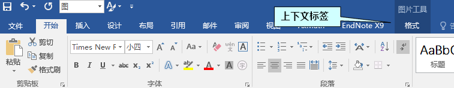
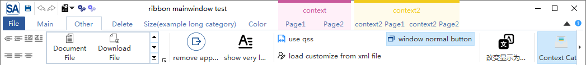
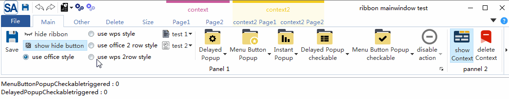

[中文文档点击这里](./readme-cn.md)

This is a lightweight Ribbon control (Officestyle UI) based on Qt (minimum Qt5, compiler supporting C++ 11). Screenshot of the interface:


MIT protocol, welcome to use and make comments

[gitee]- https://gitee.com/czyt1988/SARibbon ] ( https://gitee.com/czyt1988/SARibbon )

[github - https://github.com/czyt1988/SARibbon ] ( https://github.com/czyt1988/SARibbon )

# Compile

Open `SARibbon.pro` directly using Qt Creator, and compile it.  The SARibbonBar library and an example (there is only one example at present) will be compiled.  The directories of lib and examples are located in bin_ Qt{Qt version}_ {debug/release}_ {32/64}` under directory.

> 'd' will be added after the library compiled in debug mode for distinction

# Usage

You can move the entire compiled directory to the desired project directory, and in the project's profile, `include SARibbonBar.pri`, for example:

```shell
Include ($$PWD/SARibbonBar/SARibbon/SARibbonBar.pri)
```

## Quick Start

To use SARibbon, you need to replace `QMainWindow` with `SARibbonMainWindow. `The rendering method of `QMainWindow` for menubar is modified by `SARibbonMainWindow`.

The sample code is as follows:

```cpp
#include "SARibbonMainWindow.h"
class MainWindow : public SARibbonMainWindow
{
    Q_OBJECT
public:
    MainWindow(QWidget* par = nullptr);
    ...
}
```

`SARibbonMainWindow` also supports normal mode rendering with the constructor:

```cpp
SARibbonMainWindow(QWidget *parent = nullptr, bool useRibbon = true);
```

If the second parameter is set to be false, the normal menu toolbar mode will be used. This interface is reserved for some projects that need to be able to switch between the ribbon and the classic menu toolbar. The `SARibbon` does not support hot switching. If switching is needed, the user can set a configuration file or registry, and pass false to the second parameter when restarting next time to enter the classic menu toolbar mode.

Simply understand, Ribbon combines menu bars and toolbars and displays them through a tab control,`SARibbon` refers to the naming style of MFC ribbon interface in design. The tab is called `Category`. There are multiple `pannel` under each `Category`, and the specific toolbutton is below the panel. Its hierarchy is shown in the figure below. These naming refer to the ribbon interface class of MFC.


- **Category**, representing what a label presents, corresponding to `SARibbonCategory`.

- **Context Category**, this is a special category. It is not displayed normally. You need to judge whether it should be displayed based on the context. The most common way is that after inserting a picture in word, a label related to picture modification will appear. If no picture is selected, the label will disappear. This is the context category, corresponding to `SARibbonContextCategory`.

- **Pannel**, this is a collection of menus, the inner panel of office will have a panel title, displayed at the bottom of the panel, followed by the toolbar buttons (Action).

- **Application Button**，this is the leftmost button in the tab bar (word is the corresponding file button). This button will trigger some special pages or menus, corresponding to `SARibbonApplicationButton`, which can be hidden.

- **Quick Access Bar**, a simple toolbar at the top for placing common actions corresponding to `SARibbonQuickAccessBar`.

- **Gallery Control**, this is the most eye-catching control of ribbon. It displays the functions with intuitive images, and even some renders are done in real time according to the context. Typical example is the style selection in the office word. corresponding to `SARibbonGallery`.

A simple hierarchical diagram is shown below:


### 创建Category和Pannel

Create ribbons in the following order:  first create categories, then create panels, and finally create corresponding toolbuttons (actions).

```cpp
//Add main tab - The main tab is added through the addcategorypage factory function.
SARibbonCategory* categoryMain = ribbon->addCategoryPage(tr("Main"));
 //Using the addpannel function to create saribponpannel. The effect is the same as that of new saribponpannel, and then call SARibbonCategory:: addpannel.
SARibbonPannel* pannel1 = categoryMain->addPannel(("Panel 1"));
QAction* actSave = new QAction(this);
actSave->setText("save");
actSave->setIcon(QIcon(":/icon/icon/save.svg"));
actSave->setObjectName("actSave");
actSave->setShortcut(QKeySequence(QLatin1String("Ctrl+S")));
pannel1->addLargeAction(actSave);
```

The above operation adds a button, and the effect is shown in the following figure:


Different layout styles can be combined through`addLargeAction`、`addMediumAction`、`addSmallAction`. For details, see :

[./src/example/MainWindowExample/mainwindow.cpp](./src/example/MainWindowExample/mainwindow.cpp)

For more specific and complex examples, see the chapter [SARibbon Layout](#SARibbon Layout).

### Different 'button' layouts

`SARibbonPannel`provides three methods to add action：

- `addLargeAction`
- `addMediumAction`
- `addSmallAction`

Action added by different methods will be shown in different way in pannel. See [Pannel Layout](#Pannel Layout)  for details.

### Context Category

The so-called Context Category refers to the label / label group that appears only under special circumstances. For example, when office word selects a picture, the Context Category of picture editing will appear, as shown in the following figure:



The class corresponding to the Context Category in SARibbon is `SARibbonContextCategory`

The Context Category is usually created when the program is initialized. It is usually hidden and displayed when it needs to be displayed. The Context Category is created as follows:

Since the Context Category needs to be invoked when used, it is a good choice to save it with a member variable. Of course, you can also traverse the search (`SARibbonBar::contextCategoryList`can enumerate all `SARibbonContextCategory`).

header file:

```cpp
SARibbonContextCategory* m_contextCategory;
```

cpp file:
```cpp
SARibbonBar* ribbon = ribbonBar();
//Create a contextCategory with random colors
m_contextCategory   = ribbon->addContextCategory(tr("context"), QColor());
SARibbonCategory* contextCategoryPage1 = m_contextCategory->addCategoryPage(tr("Page1"));
//Operate on contextCategoryPage1
......
SARibbonCategory* contextCategoryPage2 = m_contextCategory->addCategoryPage(tr("Page2"));
//Operate on contextCategoryPage2
......
```

The `SARibbonCategory` created by `SARibbonContextCategory` is managed by `SARibbonContextCategory`. Only when `SARibbonContextCategory` is displayed, the managed `SARibbonCategory` is displayed

Note: **`SARibbonContextCategory`** is not a widget.

To display a contex use

`SARibbonBar::showContextCategory`/`SARibbonBar::hideContextCategory`:

```cpp
void MainWindow::onShowContextCategory(bool on)
{
    if (on) {
        this->ribbonBar()->showContextCategory(m_contextCategory);
    } else {
        this->ribbonBar()->hideContextCategory(m_contextCategory);
    }
}
```

**Note: ** if you want to delete `contextCategory`, you need to call `SARibbonBar::destroyContextCategory` instead of delete  directly. After calling `SARibbonBar::destroyContextCategory`, you do not need to delete the pointer of ContextCategory.

Different contextCategory has different style. For details，see: [SARibbon style](#SARibbon style) and [Display comparison under different styles](#Display comparison under different styles).

### ApplicationButton

There is a special and obvious button called `ApplicationButton` in the upper left corner of the ribbon interface. This button is generally used to call up menus. SARibbonBar creates `ApplicationButton` by default during construction. Its text can be set in the following ways:

```cpp
SARibbonBar* ribbon = ribbonBar();
ribbon->applicationButton()->setText(("File"));
```

The default applicationButton inherits from `SARibbonApplicationButton`, and `SARibbonApplicationButton` inherits from `QPushButton`, so you can perform all operations on `QPushButton`. Of course, if you want to set your own Button as an applicationButton, you can just call the `SARibbonBar::setApplicationButton` function.

### QuickAccessBar和rightButtonGroup

QuickAccessBar is the quick toolbar in the upper left corner and rightButtonGroup is the quick toolbar in the upper right corner. In office mode, it is divided into left and right sides. In WPS mode, the left and right sides will be combined and placed on the right.


In `SARibbon`：

- QuickAccessBar corresponds to the `SARibbonQuickAccessBar` class.
- rightButtonGroup corresponds to the `SARibbonQuickAccessBar` class.

During initialization, `SARibbonBar` will create QuickAccessBar and RightButtonGroup by default. Its pointers can be obtained through `SARibbonBar::quickAccessBar` and `SARibbonBar::rightButtonGroup`. Examples are as follows:

```cpp
QAction* MainWindow::createAction(const QString& text, const QString& iconurl, const QString& objName)
{
    QAction* act = new QAction(this);
    act->setText(text);
    act->setIcon(QIcon(iconurl));
    act->setObjectName(objName);
    return act;
}

void MainWindow::initQuickAccessBar(){
    SARibbonBar* ribbon = ribbonBar();
    SARibbonQuickAccessBar* quickAccessBar = ribbon->quickAccessBar();
    quickAccessBar->addAction(createAction("save", ":/icon/icon/save.svg", "save-quickbar"));
    quickAccessBar->addSeparator();
    quickAccessBar->addAction(createAction("undo", ":/icon/icon/undo.svg"),"undo");
    quickAccessBar->addAction(createAction("redo", ":/icon/icon/redo.svg"),"redo");
    quickAccessBar->addSeparator();
}
void MainWindow::initRightButtonGroup(){
    SARibbonBar* ribbon = ribbonBar();
    SARibbonButtonGroupWidget* rightBar = ribbon->rightButtonGroup();
    QAction* actionHelp = createAction("help", ":/icon/icon/help.svg","help");
    connect(actionHelp, &QAction::triggered, this, &MainWindow::onActionHelpTriggered);
    rightBar->addAction(actionHelp);
}
```

# SARibbon style

 `SARibbon` supports switching between four ribbon styles. Here, the ribbon style of 'office' and 'WPS' is referred.
Online style switching can be realized through`void SARibbonBar::setRibbonStyle(RibbonStyle v)`.

## Office Ribbon style

Office mode is the most common ribbon mode. The tab and title bars occupy a lot of space.

This mode is consistent with the Ribbon style of Office. The screenshot of the word interface of office is as follows:


`SARibbonBar::OfficeStyle` style for SARibbon


For the layout of the above style, see [SARibbon layout] (#SARibbon layout).

## WPS Ribbon Style

The ribbon mode designed by WPS has been improved. In order to reduce the height of the ribbon, it sets the label and title bar together, so as to reduce the height of a title bar and effectively use the vertical space. This is the first change to the ribbon by WPS.


`SARibbonBar::WpsLiteStyle` style for SARibbon


For the layout of the above style, see [SARibbon layout] (#SARibbon layout).

Under the normal screen, the WPS style will reduce the vertical height by at least 30 pixels compared with the Office style, which is equivalent to saving nearly 3% of the vertical space compared with the 1920*1080 screen.

## Display comparison under different styles

`SARibbonBar::OfficeStyle`


`SARibbonBar::OfficeStyleTwoRow`


`SARibbonBar::WpsLiteStyle`


`SARibbonBar::WpsLiteStyleTwoRow`


In addition, if you change whether the font wraps in the 2-line mode, two styles can appear, which can be set through the static function `SARibbonToolButton::setLiteStyleEnableWordWrap`.

The display effect of the 2-line mode without text wrapping is as follows:

`SARibbonBar::OfficeStyleTwoRow and SARibbonToolButton::setLiteStyleEnableWordWrap(false)`


`SARibbonBar::WpsLiteStyleTwoRow and SARibbonToolButton::setLiteStyleEnableWordWrap(false)`


If the toolbar text does not wrap, the icon will be larger and the display effect will be better. This depends on the specific needs. Using `SARibontoolbutton:: setlitestyleenablewordwrap (false) `will not change the height of the ribbon bar, but the icon will change a little larger.


## Smaller vertical space

In order to make better use of the vertical space, WPS has changed the original 3 rows into 2 rows, which can free up more vertical space. This is the second layout change of the ribbon by WPS. The screenshot of the new version of WPS is as follows:


`SARibbon`also uses this design method for reference, and implements a 2-line scheme for both the Ribbon style of office and the Ribbon style of WPS. The effects are as follows:

The 2-line display effect of office ribbon style:


The 2 lines of wps ribbon style display effect:


The vertical height of different styles under the normal screen is shown in the following table:

|Style|vertical height (px)|corresponding style enumeration name|
|:-|:-|:-|
|Office Ribbon style|160|SARibbonBar::OfficeStyle|
|WPS Ribbon style|130|SARibbonBar::WpsLiteStyle|
|Office Ribbon 2line style|134|SARibbonBar::OfficeStyleTwoRow|
|WPS Ribbon 2line style|104|SARibbonBar::WpsLiteStyleTwoRow|

It can be seen from the above table that the vertical height of WPS Ribbon 2line style is 65% of that of ordinary Office Ribbon style, which is equivalent to saving nearly 5% of the vertical space compared with 1920*1080 screen.

Visually, the WPS Ribbon 2line style still has a lot more space than the traditional office layout.

# SARibbon Layout

Different styles have different layout methods.

## Office Layout Mode——SARibbonBar::OfficeStyle

The layout of `SARibbon OfficeStyle` is shown in the following figure:


This layout is consistent with the default layout of office.

## WPS Layout Mode——SARibbonBar::WpsLiteStyle

This mode is different from the Ribbon style of Office. By referring to the ribbon interface practice of WPS, the title bar that takes up more space in the office ribbon is used to maximize the use of the interface. In this mode, the height of one title bar can be reduced.


## Pannel Layout

In the standard pannel, an action (button) has three layouts. Taking office word as an example, the three layouts of pannel are actually the number of lines occupied:

- The first type, which occupies the entire pannel and has only one line, is called `Large`.
- Second, two rows are placed under a pannel, which is called `Medium`.
- Third, a pannel places three lines of content, which is called `Samll`.


Therefore, the layout of the pannel is actually the number of rows in the final analysis. It can be understood that the `QGridLayout` is used to layout the pannel. The grid is divided into six rows, which occupy all six rows in the `Large` mode, three rows in the `Medium` mode, and two rows in the `Small` mode (in fact, it is not arranged in the GridLayout).

`SARibbonPannelItem::RowProportion` is used to represent the number of rows each form occupies in the pannel. It is commonly used in the pannel layout. This enumeration is defined as follows:

```cpp
/**
 * @brief defines the proportion of rows. The ribbon has  three proportions: large, media and small.
 */
enum RowProportion {
    None            ///< to define the proportion, it will be judged according to expandingDirections. If Qt::Vertical is available, it is equal to Large, otherwise it is Small
    , Large         ///< Large proportion, the height of a widget will fill the whole pannel.
    , Medium        ///< Medium proportion will only work when @ref SARibbonPannel::pannelLayoutMode is @ref SARibbonPannel::ThreeRowMode, and will occupy two of the three rows if both of them in the same column are Medium.
    , Small         ///< Small proportion, in the line of SARibbonPannel, Medium will become Small if it does not meet the conditions, but will not become Large.
};
```

Each action managed in saribonpanel will have a placeholder attribute (`SARibbonPannelItem::RowProportion`). This placeholder attribute determines the layout of this action in the pannel.

The layout of pannel has been mentioned above. A key point of pannel layout is the concept of "row". Different definitions of "row" will affect the whole display effect. In the higher version of WPS, in order to further reduce the height of the ribbon bar, the three row buttons of the ribbon bar are changed to two, so that the ribbon bar is further reduced, and the category with few corresponding actions will appear fuller, which is equivalent to only medium without small mode. `SARibbon`supports these kinds of ribbon styles, and introduces the concept of row number. In the enumeration of`SARibbonBar::RibbonStyle`, all the items with the end of`TwoRow`refer to the two row mode. For details, see  [Smaller vertical space](# Smaller vertical space).


The following describes the number of rows in detail.

### 3-line mode

The three line mode is the traditional pannel layout, as shown in the following figure:


In the 3-line mode, there are three kinds of placeholders (`SARibbonPannelItem::RowProportion`), which are large, medium and small

- The proportion of large. The height of a widget will fill the whole pannel
- The proportion of medium in the panel. Two forms are placed in one column, provided that both of these two columns are medium, otherwise an exception will be displayed (the degradation of the medium condition to small has not yet been processed, and will be implemented later)
- Small accounts for a small proportion. Three forms are placed in a column in the pannel.

The pannel in the 3-line mode will display the title of the pannel in the `Pannel Title` area, and there is another `OptionAction` area. This area is used to add a special trigger to this action. If `OptionAction` is not set, this area is hidden.

### 2-line mode

The two-line mode is the traditional WPS improved layout method , as shown in the following figure:


In the 2-line mode, the medium and small placeholders (`SARibbonPannelItem::RowProportion`) are the same, and no distinction is made.

In the other two line mode, pannel does not display the title.

The 2-line mode is compiled according to WPS 2020. The screenshot of WPS2020 is as follows:


> Note: The title of the category in the two-line mode is not displayed.

# SARibbon Customization

Ribbon customization is a feature of ribbon. With reference to the custom interface of office and WPS, users can define a lot of content for their own ribbon, or even define an interface completely different from the original one.

The following is the custom interface of office.


The following is the custom interface of WPS.


SARibbon refers to the interface of office and WPS, and encapsulates the easy-to-use `SARibbonCustomize**` class, including the following five classes:

> - SARibbonCustomizeDialog
> - SARibbonCustomizeWidget
> - SARibbonCustomizeData
> - SARibbonActionsManager
> - SARibbonActionsManagerModel

Actual users can only use `SARibbonActionsManager` and `SARibbonCustomizeDialog`/`SARibbonCustomizeWidget`, and other users will not use them normally.

`SARibbonActionsManager` is used to manage `QAction`, add the `QAction` that is wanted to customize to `SARibbonActionsManager` for management, and classify `QAction` so that they can be displayed in `SARibbonCustomizeDialog`/`SARibbonCustomizeWidget`.

`SARibbonCustomizeDialog`/`SARibbonCustomizeWidget` is a specific display window. The `SARibbonCustomizeDialog` encapsulates the `SARibbonCustomizeWidget` as a dialog box. If you want to integrate it into the configuration dialog box like office, you can use the `SARibbonCustomizeWidget`. The effect of the `SARibbonCustomizeDialog` is shown in the following figure:


# How to add custom functions to an interface

Here's how to add custom features.

First, define `SARibbonActionsManager` as the member variable of MainWindow.

```cpp
//Define member variables in the MainWindow.h. 
SARibbonActionsManager* m_ribbonActionMgr;///< Manage all actions
```
During the initialization of MainWindow, a large number of `QAction` need to be created. The parent object of `QAction` is designated as MainWindow. In addition, ribbon layout will be generated, such as adding category, adding panel and other operations. After the above operations are completed, add the following steps to automatically let `SARibbonActionsManager` manage all `QAction`.

```cpp
//Initialization of MainWindow and generation of QAction.
//Generate ribbon layout.
m_ribbonActionMgr = new SARibbonActionsManager(mainWinowPtr);
m_ribbonActionMgr->autoRegisteActions(mainWinowPtr);
```

The key function `autoRegisteActions` of `SARibbonActionsManager` can traverse all subobjects under `SARibbonMainWindow`, find and register action, and traverse all `SARibbonCategory`. The actions under `SARibbonCategory` are classified according to the title name of `SARibbonCategory`. This function also registers the actions under' saribonmainwindow ', but not under any category, as notinribboncategorytag tags, The default name is assigned not in ribbon.

To call `SARibbonCustomizeDialog` as follows:

```cpp
QString cfgpath = "customization.xml";
SARibbonCustomizeDialog dlg(this, this);

dlg.setupActionsManager(m_ribbonActionMgr);
dlg.fromXml(cfgpath);//This step is called to load the existing custom steps, which can be added based on the original custom steps when saving.
if (QDialog::Accepted == dlg.exec()) {
    dlg.applys();//Apply custom steps
    dlg.toXml(cfgpath);//Save custom steps to a file
}
```

Before the MainWindow is generated, the customized content needs to be loaded. Therefore, the following statement should be added to the constructor:

```cpp
//Constructor of MainWindow
sa_apply_customize_from_xml_file("customization.xml", this, m_ribbonActionMgr);
```

`sa_apply_customize_from_xml_file` is the function provided in `SARibbonCustomizeWidget.h`. The customized contents in the configuration file are directly applyed in the MainWindow.

In this way, the software will be loaded according to the configuration file every time it is started.

SARibbon customization can be realized in the above steps.

# More screenshots


- Supports the minimize mode. The ribbon only displays the label (by default, double clicking the label will switch)


- quickAccessBar (word quick menu) is supported, which has different display effects in WPS mode and office mode



- Support 4 different ribbon buttons, common button, delayed pop-up menu button, menu button, and action menu button (action menu button is one of the main problems to be solved by this ribbon control)


- Support qss to set ribbon


- This is a screenshot of another open source software that uses this control.


[github - https://github.com/czyt1988/sa](https://github.com/czyt1988/sa)

[gitee - https://gitee.com/czyt1988/SA](https://gitee.com/czyt1988/SA)

# Off topic

This ribbon is mainly implemented by 'QSS' instead of `QStyle`. The main reason is that the workload of rewriting styles is huge. Some `QSS` cannot be implemented, and the interface is rewritten, such as the RibbonToolButton.

At present, the basic layout and ToolButton functions have been completed, and the simple RibbonGallery control has also been preliminarily implemented. The Gallery needs to be improved in the future.

More screenshots:

[github - https://github.com/czyt1988/sa](https://github.com/czyt1988/sa)

[gitee - https://gitee.com/czyt1988/SA](https://gitee.com/czyt1988/SA)

SARibbon project is a sub item of SA project.

The specific ribbon generation code can be seen:

[https://github.com/czyt1988/sa/blob/master/src/signA/MainWindowPrivate.cpp](https://github.com/czyt1988/sa/blob/master/src/signA/MainWindowPrivate.cpp)

This ribbon is mainly implemented through QTabbar and QStackWidget. It is written according to the interface naming method of Microsoft MFCRibbbon. It is mainly controlled through qss. By default, qss is in the resource file. Theoretically, it can meet various styles and realize style switching (skin changing).


# other

> Thank [FastCAE](http://www.fastcae.com/product.html) for using this control and finding many bugs and suggestions [（github）:https://github.com/DISOGitHub/FastCAE](https://github.com/DISOGitHub/FastCAE)，[gitee:https://gitee.com/DISOGitee/FastCAE](https://gitee.com/DISOGitee/FastCAE)，[Official website:http://www.fastcae.com/product.html](http://www.fastcae.com/product.html).

