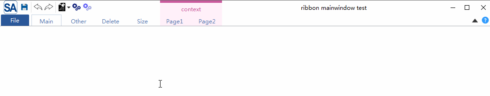

# 简介

 这是Qt（最低要求Qt5，支持C++11的编译器）下一个轻量级的Ribbon控件(Office样式UI),界面截图：


MIT协议，欢迎大家使用并提出意见

[gitee(码云) - https://gitee.com/czyt1988/SARibbon](https://gitee.com/czyt1988/SARibbon)

[github - https://github.com/czyt1988/SARibbon](https://github.com/czyt1988/SARibbon)

 它支持4种目前常见的ribbon样式在线切换

 包括2种office模式，office模式是最常见的ribbon模式了，就是我们经常看到的word模式，office模式的tab和标题栏占用位置较多。


 另两种参考wps设计的wps模式，wps模式是office模式的改良版，它为了减小ribbon的高度，把标签和标题栏设置在一起
 


 office模式和wps模式都支持两行和3行设计，满足不同界面需求。

# 编译方法

 使用Qt Creator直接打开SARibbonBar.pro，并编译即可，会编译出SARibbonBar库和一个（目前只有一个例子）例子，lib和例子的目录位于bin目录下

# 使用方法

## 方法1（适合动态库）：

可以把编译好的整个目录移动到需要的工程目录下，然后在项目的pro文件中,`include SARibbonBar.pri`即可(**注意是SARibbon/SARibbonBar.pri**)，示例如下：

```shell
# 假如在你把SARibbon拷贝到你的工程目录下：你的工程目录/SARibbon
include($$PWD/SARibbon/SARibbonBar.pri)
```

## 方法2（适合静态）： 

`SARibbon/src/SARibbonBar/`目录下面也有个`SARibbonBar.pri`,如果直接：

```shell
include($$PWD/SARibbon/src/SARibbonBar/SARibbonBar.pri)
```

那么就是静态编译了

## qmake过程变量

`SARibbon`提供了`common.pri`文件，这里把`SARibbon`的一些主要目录做了描述：

`SARIBBON_SRC_DIR`是源码路径,`SARIBBON_LIB_NAME`是库名称，会根据编译模式决定后面是否带d


# 更多截图



- 支持最小化模式，ribbon只显示标签（默认双击标签会进行切换）


- 支持quickAccessBar（word快速菜单），在wps模式和office模式下会有不同的显示效果


- 支持4种不同的ribbon button，普通按钮，延迟弹出菜单按钮，菜单按钮，action菜单按钮（action菜单按钮是此ribbon控件最主要解决的问题之一）


- 支持qss对ribbon进行设置


- 这是使用此控件的本人另外一个开源软件的截图


[github - https://github.com/czyt1988/sa](https://github.com/czyt1988/sa)

[gitee - https://gitee.com/czyt1988/SA](https://gitee.com/czyt1988/SA)

# 使用教程

- [SARibbon介绍](./doc/saribbon-guide.md)
- [SARibbon自定义介绍](./doc/saribbon-customize.md)

# 题外

这个Ribbon主要靠`QSS`实现而不是重写样式(`QStyle`)，主要是重写样式工作量巨大，一些`QSS`无法实现的，重写了界面，如RibbonToolButton，

目前基本的布局和ToolButton功能以及完成，简单的RibbonGallery控件也有初步实现，后续还需对Gallery进行完善

更多界面截图可看：

[github - https://github.com/czyt1988/sa](https://github.com/czyt1988/sa)

[gitee - https://gitee.com/czyt1988/SA](https://gitee.com/czyt1988/SA)

SARibbon项目是SA项目的子项

具体Ribbon的生成代码可见：
[https://github.com/czyt1988/sa/blob/master/src/signA/MainWindowPrivate.cpp](https://github.com/czyt1988/sa/blob/master/src/signA/MainWindowPrivate.cpp)

这个ribbon主要通过QTabbar和QStackWidget实现，按照微软MFCRibbbon的接口命名方式来写，主要通过qss来控制，默认qss在资源文件中，理论上能满足各种样式，可以实现样式的切换(换肤)

若有空会把这个`SARibbon`和`SA`一起打包讲讲如何开发，其中遇到的一些坑啊和注意的问题。

