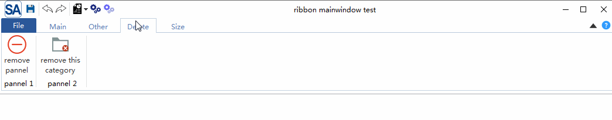
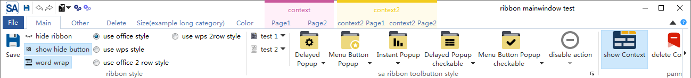
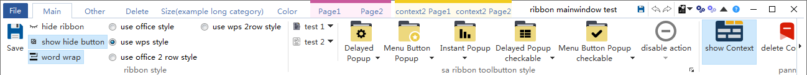
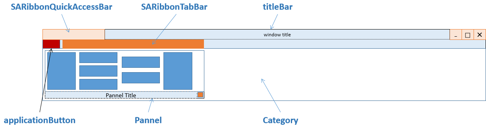

# 简介

 这是Qt（最低要求Qt5，支持C++11的编译器）下一个轻量级的Ribbon控件(Office样式UI),界面截图：



MIT协议，欢迎大家使用并提出意见

[gitee(码云) - https://gitee.com/czyt1988/SARibbon](https://gitee.com/czyt1988/SARibbon)

[github - https://github.com/czyt1988/SARibbon](https://github.com/czyt1988/SARibbon)

# 编译方法

 使用Qt Creator直接打开`SARibbon.pro`，并编译即可，会编译出SARibbonBar库和一个（目前只有一个例子）例子，lib和例子的目录位于`bin_qt{Qt版本}_{debug/release}_{32/64}`目录下

> 在debug模式编译的库后面会加上d以作区别


# 使用方法

可以把编译好的整个目录移动到需要的工程目录下，然后在项目的pro文件中,`include SARibbonBar.pri`即可，示例如下：

```shell
include($$PWD/SARibbonBar/SARibbon/SARibbonBar.pri)
```

## 快速开始

要使用SARibbon，需要对`QMainWindow`替换为`SARibbonMainWindow`，`SARibbonMainWindow`修改了`QMainWindow`对menubar的渲染方式

示例代码如下:

```cpp
#include "SARibbonMainWindow.h"
class MainWindow : public SARibbonMainWindow
{
    Q_OBJECT
public:
    MainWindow(QWidget* par = nullptr);
    ...
}
```

当然`SARibbonMainWindow`也支持普通模式的渲染，其构造函数为：

```cpp
SARibbonMainWindow(QWidget *parent = nullptr, bool useRibbon = true);
```

第二个参数如果设置为false，将会使用普通的菜单工具栏模式，预留这个接口是为了一些项目需要能在ribbon和经典菜单工具栏切换的场景设计的，`SARibbon`不支持热切换，如果需要切换，用户可以设置一个配置文件或者注册表，在下次重启时给第二个参数传入false即可进入到经典菜单工具栏模式

简单的理解，Ribbon是把菜单栏和工具栏合并了，并通过一个tab控件进行展示，`SARibbon`在设计时参考了MFC Ribbon接口的命名风格，标签页称之为`Category`(种类)，每个`Category`下面有多个`pannel`（面板），面板下面才是具体的toolbutton，其层次结构如下图所示，这些命名参考了MFC的ribbon界面类


- **Category 类别**，代表一个标签所呈现的内容，对应`SARibbonCategory`
- **Context Category 上下文类别**，这个是一种特殊的类别，它正常不显示，需要基于上下文判断是否应该显示，最常用的就是word中插入图片后，会有图片修改相关的标签出现，如果没选中图片，这个标签就消失，这个就是上下文类别，对应`SARibbonContextCategory`
- **Pannel 面板**，这个是一组菜单的集合，office里面板都会有个面板标题，显示在面板最下方，面板之后就是工具栏按钮（Action）
- **Application Button 应用按钮**，标签栏最左边的按钮（word就是对应文件按钮），这个按钮会触发一些特殊的页面或菜单，对应`SARibbonApplicationButton`,可以隐藏
- **Quick Access Bar 快速响应栏**，位于最顶部的一个简单工具栏，用于放置一些常用的action，对应`SARibbonQuickAccessBar`
- **Gallery 预览控件**,这是Ribbon最吸引眼球的控件，用直观的图像把功能显示出来，甚至有些会根据上下文进行实时渲染，典型的就是word开始标签下的样式选择，对应`SARibbonGallery`

简单的层次示意如下图所示：


因此创建ribbon过程先创建类别，再创建面板，最后创建对应的toolbutton（action）

```cpp
//添加主标签页 - 通过addCategoryPage工厂函数添加
SARibbonCategory* categoryMain = ribbon->addCategoryPage(tr("Main"));
 //使用addPannel函数来创建SARibbonPannel，效果和new SARibbonPannel再addPannel一样
SARibbonPannel* pannel1 = categoryMain->addPannel(("Panel 1"));
QAction* actSave = new QAction(this);
actSave->setText("save");
actSave->setIcon(QIcon(":/icon/icon/save.svg"));
actSave->setObjectName("actSave");
actSave->setShortcut(QKeySequence(QLatin1String("Ctrl+S")));
pannel1->addLargeAction(actSave);
```

上面的操作添加了一个按钮，效果如下图所示：


通过`addLargeAction`、`addMediumAction`、`addSmallAction`可以组合出不同的布局样式。具体可见[./src/example/MainWindowExample/mainwindow.cpp](./src/example/MainWindowExample/mainwindow.cpp)

更加具体复杂的例子可见[SARibbon的布局](#SARibbon的布局)章节

# SARibbon样式

 `SARibbon`支持4种ribbon样式进行切换，这里参考了`office`的ribbon风格和`wps`的ribbon风格
通过`void SARibbonBar::setRibbonStyle(RibbonStyle v)`可实现在线的样式切换

## Office Ribbon 样式

office模式是最常见的ribbon模式，tab和标题栏占用位置较多。

此模式和Office的Ribbon样式一致，office的word界面截图如下


SARibbon的`SARibbonBar::OfficeStyle`样式



针对上面样式的布局，见[SARibbon的布局](#SARibbon的布局)

## WPS Ribbon 样式

wps设计的ribbon模式进行了改良，它为了减小ribbon的高度，把标签和标题栏设置在一起，这样减少了一个标题栏高度，有效利用了垂直空间，这是WPS对ribbon的第一次改动


 
SARibbon的`SARibbonBar::WpsLiteStyle`样式



针对上面样式的布局，见[SARibbon的布局](#SARibbon的布局)

在正常屏幕下，WPS 样式会比 Office 样式减少至少30像素左右的垂直高度，相比1920*1080的屏幕来说，相当于节约了接近3%的垂直空间

## 更小的垂直空间

为了更好的利用垂直空间，WPS把原来的3行变为了2行，这样可以释放更多的垂直空间，这是WPS对ribbon的第二次布局更改，新版WPS的截图如下：


`SARibbon`也借鉴了此设计方法，并针对office的Ribbon样式和wps的Ribbon样式都实现了2行方案，效果如下：

office ribbon样式的2行显示效果：


wps ribbon样式的2行显示效果：


正常屏幕下不同样式的垂直高度如下表所示：

|样式|垂直高度(px)|对应样式枚举名称|
|:-|:-|:-|
|Office Ribbon 样式|160|SARibbonBar::OfficeStyle|
|WPS Ribbon 样式|130|SARibbonBar::WpsLiteStyle|
|Office Ribbon 2line 样式|134|SARibbonBar::OfficeStyleTwoRow|
|WPS Ribbon 2line 样式|104|SARibbonBar::WpsLiteStyleTwoRow|

由上表可见WPS Ribbon 2line样式的垂直高度为普通Office Ribbon 样式的65%，相比1920*1080的屏幕来说，相当于节约了接近5%的垂直空间

在感观上，WPS Ribbon 2line 样式的显示效果还是比传统的office布局多出很多空间

# SARibbon的布局

不同样式有不同的布局方法

## Office布局模式——SARibbonBar::OfficeStyle

`SARibbon OfficeStyle`的布局如下图所示：



这个布局和office的默认布局是一致的

## WPS布局模式——SARibbonBar::WpsLiteStyle

此模式和Office的Ribbon样式有区别，参考了WPS的ribbon界面做法，把office ribbon较占空间的标题栏进行利用，实现了界面的最大利用，这个模式下可以减少一个标题栏的高度


## pannel的布局

在标准的pannel中，一个action（按钮）有3种布局，以office word为例，pannel的三种布局其实是所占行数:

- 第一种，占满整个pannel，只有一行，称之为`large`
- 第二种，一个pannel下放置两行，称之为`medium`
- 第三种，一个pannel放置3行内容，称之为`samll`


因此，pannel的布局其实归根结底就是行数，可以理解为`QGridLayout`来对pannel进行布局的，把grid分割为6行，`large`模式下占全部6行，`medium`模式下占据3行，`small`模式下占据2行（实际并不是用GridLayout布置的）。

枚举`SARibbonPannelItem::RowProportion`是为了表征每个窗体在pannel所占行数的情况，在pannel布局中会常用到，这个枚举定义如下：

```cpp
/**
    * @brief 定义了行的占比，ribbon中有large，media和small三种占比
    */
enum RowProportion {
    None            ///< 为定义占比，这时候将会依据expandingDirections来判断，如果能有Qt::Vertical，就等同于Large，否则就是Small
    , Large         ///< 大占比，一个widget的高度会充满整个pannel
    , Medium        ///< 中占比，在@ref SARibbonPannel::pannelLayoutMode 为 @ref SARibbonPannel::ThreeRowMode 时才会起作用，且要同一列里两个都是Medium时，会在三行中占据两行
    , Small         ///< 小占比，占SARibbonPannel的一行，Medium在不满足条件时也会变为Small，但不会变为Large
};
```

SARibbonPannel里管理的每个action都会带有一个占位的属性（`SARibbonPannelItem::RowProportion`），这个占位属性决定了这个action在pannel里的布局。


上面讲到了pannel的布局，pannel布局一个很关键的点就是`行`的概念，`行`的不同定义，会影响整个显示效果。在高版本的wps中，为了进一步缩减ribbon bar的高度，把ribbon的3行按钮改为了2个，这样使得ribbon bar进一步缩减，对应action不多的category显得会更饱满，相当于只有medium，没有small模式，`SARibbon`支持这几种ribbon样式，引入了行数的概念，在`SARibbonBar::RibbonStyle`的枚举中带`TwoRow`结尾的都是指代2行模式，具体介绍见[SARibbon样式:更小的垂直空间](#更小的垂直空间)


下面针对不同行数进行详细介绍。

### 3行模式

三行模式是传统的pannel布局方式，如下图所示：


3行模式下有三种占位(`SARibbonPannelItem::RowProportion`)，分别为large、medium和small

- large大占比，一个widget的高度会充满整个pannel
- medium中占比，pannel里一列放置2个窗体，前提是这一列2个都是medium，否则会显示异常（暂时还未做medium条件降级到small的处理，后续会实现）
- small小占比，pannel里一列放置3个窗体

3行模式下的pannel会显示pannel的标题在`Pannel Title`区域，另外还有一个`OptionAction`的区域，这个是给这个action添加特殊触发使用的，如果没有设置`OptionAction`，这个区域是隐藏。

### 2行模式

两行模式是传统的WPS的改进布局法（具体是否是WPS首先这样做的不清楚，我是按照WPS的布局进行参考的），如下图所示：


2行模式下medium和small占位(`SARibbonPannelItem::RowProportion`)是一样的，不做区分。

另外两行模式下pannel是不显示标题的。

2行模式是按照WPS的2020进行参考编写的，WPS2020的截图如下：


> 注意：两行模式的category的title是不显示的

# 更多例子

TODO

# 更多截图


- 支持最小化模式，ribbon只显示标签（默认双击标签会进行切换）


- 支持quickAccessBar（word快速菜单），在wps模式和office模式下会有不同的显示效果


- 支持4种不同的ribbon button，普通按钮，延迟弹出菜单按钮，菜单按钮，action菜单按钮（action菜单按钮是此ribbon控件最主要解决的问题之一）


- 支持qss对ribbon进行设置


- 这是使用此控件的本人另外一个开源软件的截图


[github - https://github.com/czyt1988/sa](https://github.com/czyt1988/sa)

[gitee - https://gitee.com/czyt1988/SA](https://gitee.com/czyt1988/SA)

# 题外

这个Ribbon主要靠`QSS`实现而不是重写样式(`QStyle`)，主要是重写样式工作量巨大，一些`QSS`无法实现的，重写了界面，如RibbonToolButton，

目前基本的布局和ToolButton功能以及完成，简单的RibbonGallery控件也有初步实现，后续还需对Gallery进行完善

更多界面截图可看：

[github - https://github.com/czyt1988/sa](https://github.com/czyt1988/sa)

[gitee - https://gitee.com/czyt1988/SA](https://gitee.com/czyt1988/SA)

SARibbon项目是SA项目的子项

具体Ribbon的生成代码可见：
[https://github.com/czyt1988/sa/blob/master/src/signA/MainWindowPrivate.cpp](https://github.com/czyt1988/sa/blob/master/src/signA/MainWindowPrivate.cpp)

这个ribbon主要通过QTabbar和QStackWidget实现，按照微软MFCRibbbon的接口命名方式来写，主要通过qss来控制，默认qss在资源文件中，理论上能满足各种样式，可以实现样式的切换(换肤)

若有空会把这个`SARibbon`和`SA`一起打包讲讲如何开发，其中遇到的一些坑啊和注意的问题。

# 计划及进度

## 计划

- 正在实现designer plugin

## 已知bug

- 在ubuntu下会有文字换行显示不全问题

# 其他

> 感谢[FastCAE](http://www.fastcae.com/product.html)项目使用了本控件，并找到了许多bug和建议，FastCAE国产CAE软件集成开发平台，免费开源，是面向求解器开发者提供CAE软件界面与通用功能模块快速研发集成框架，[其开源仓库（github）:https://github.com/DISOGitHub/FastCAE](https://github.com/DISOGitHub/FastCAE)，[gitee:https://gitee.com/DISOGitee/FastCAE](https://gitee.com/DISOGitee/FastCAE)，[官网见:http://www.fastcae.com/product.html](http://www.fastcae.com/product.html)