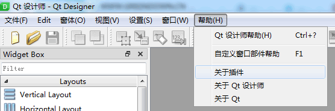
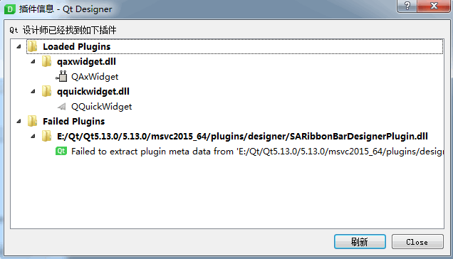

# 简介

这里将介绍SARibbon的`Qt Designer`插件是如何实现的

和一般的插件不同，一般插件只需要把窗口生成就完事了，但SARibbon是一个组合插件，需要实现类似`QTabbar`的插入标签页功能，需要实现类似`QToolBar`的添加`QAction`功能，还要支持redo/undo等等，这就需要涉及对`Qt Designer`的深度操作了。

qt 帮助文档中有个较为详细的例子：Container Extension Example介绍了此类插件的编写。但很多内容讲的非常粗，导致许多细节无法了解，都是通过看源码慢慢摸索，这篇主要记录SARibbon的`Qt Designer`插件编写过程遇到的一些问题，以及看`Qt Designer`源码了解到的一些细节。

Qt帮助文档搜：`Creating Custom Widgets for Qt Designer`能获得官方文档对插件的介绍，对于写一般插件，完全足够，但要实现`SARibbon`的功能，还远远不够。

插件相关的几个类主要如下：

插件基本类有两个：

- **`QDesignerCustomWidgetInterface`**
- `QDesignerCustomWidgetCollectionInterface`

扩展相关类有6个：

- `QExtensionManager`
- `QExtensionFactory`
- `QDesignerContainerExtension`
- `QDesignerPropertySheetExtension`
- `QDesignerMemberSheetExtension`
- `QDesignerTaskMenuExtension`

操作Qt Desginer的接口,大概有9个，通过下面这9个接口可以操作`Qt Designer`的许多窗体

- **`QDesignerFormEditorInterface`**
- **`QDesignerFormWindowInterface`**
- `QDesignerPropertyEditorInterface`
- `QDesignerFormWindowManagerInterface`
- `QDesignerWidgetFactoryInterface`
- `QDesignerActionEditorInterface`
- `QDesignerIntegrationInterface`
- `QDesignerObjectInspectorInterface`
- `QDesignerMetaDataBaseInterface`


上面加粗的是需要比较关注的类

如果仅仅是单一的窗体控件，实际用到的不多，也就`QDesignerCustomWidgetInterface`或者`QDesignerFormEditorInterface`,但要是复杂的控件，如`SARibbon`又要支持redo/undo，就要面对更多的接口，而Qt在一些不常用的接口说明极少，只能看源码来摸索。

# 一些问题

如果没有成功加载插件，可以通过`Qt Designer`的“帮助”->“关于插件”中查看错误信息



# 编写插件注意事项

注意插件类要导出信息，通过`Q_PLUGIN_METADATA`宏，如果没有使用这个宏，在designer里将不会显示，且会提示错误：



这时只需加入`Q_PLUGIN_METADATA`宏即可

```cpp
class SARibbonMainWindowDesignerPlugin : public QObject,
                     public QDesignerCustomWidgetInterface
{
    Q_OBJECT
    Q_PLUGIN_METADATA(IID "SA.SARibbon.SARibbonMainWindow")
    Q_INTERFACES(QDesignerCustomWidgetInterface)
```

这是因为作为一个lib，自定义的plugin没有任何导出的描述符，只能通过某些操作通知qt哪些类需要导出。

当然，如果定义了`QDesignerCustomWidgetCollectionInterface`插件集合，只需在继承`QDesignerCustomWidgetCollectionInterface`的类中申明一次`Q_PLUGIN_METADATA`即可，这里会通过customWidgets告诉`Qt Designer`有哪些plugin要导出，这样就不需要每个plugin类都定义一下`Q_PLUGIN_METADATA`,如果要导出多个控件，建议使用这种方法，可见`QDesignerCustomWidgetCollectionInterface`类的介绍。

# 插件相关的几个类

## QDesignerCustomWidgetInterface

这个类是自定义窗口的接口，每个`QDesignerCustomWidgetInterface`对应了一个自定义窗口，会在designer的左侧边的窗口中显示出来。

这个类定义了一个控件的关键描述，例如一些描述性：

- `QString QDesignerCustomWidgetInterface::group() const`自定义控件的分组
- `QIcon QDesignerCustomWidgetInterface::icon() const` 自定义控件的图标

**有个关键函数`QString QDesignerCustomWidgetInterface::name() const`，这个函数非常关键，并不是指控件的名字，而是指控件类名字，因此必须返回此控件对应的类名（大小写敏感）**

另外有三个函数用于插件的生成，
- `QWidget *QDesignerCustomWidgetInterface::createWidget(QWidget - *parent)`
- `QString QDesignerCustomWidgetInterface::domXml() const`
- `void QDesignerCustomWidgetInterface::initialize(QDesignerFormEditorInterface *formEditor)`

###  createWidget

这三个函数对控件的生成非常重要，`createWidget`决定了在`Qt Designer`里的显示，`Qt Designer`里会调用这个函数获得这个控件，并显示的designer里，因此，这个函数只是提供给`Qt Designer`生成控件显示用的，并不会体现在你实际设计好的代码中，因此，有时候为了给`Qt Designer`的控件提供一些额外的操作，可以在`createWidget`函数中创建出来的窗体再设置一个事件过滤器，提供一些为`Qt Designer`额外赋予的操作，最典型的就是在设计QMainWindow时，能动态操作工具栏和菜单栏dockwidget，查看`Qt Designer`的源码，大部分的常用控件在`createWidget`都返回一个特定的窗体，处理一些拖曳事件修改事件。

###  domXml

`domXml`函数是真正关系到设计好的窗体和我们最后显示的效果，因为它是决定了*.ui文件是如何生成的，官方对这个函数说明比较少，需要看源码慢慢摸索，如果仅仅只是普通的单一窗口，不涉及嵌套窗体，这个函数还是比较套路化的，但是如果是类似于`QTabBar`、`QStackedWidget`这种，在`Qt Designer`中还可以添加子窗口，就比较复杂了属于`Container`类型。

最简单的套路化的domXml返回如下：
``` xml
<widget class="{className}" name="{objectName}">
</widget>
```
其中`{className}`为这个窗口的类名,`{objectName}`是在ui文件里的默认的object name

`<widget></widget>`标签之间可以附加属性标签<property>，如：

``` xml
<widget class="{className}" name="{objectName}">
 <property name="geometry">
  <rect>
   <x>0</x>
   <y>0</y>
   <width>400</width>
   <height>200</height>
  </rect>
 </property>
</widget>
```

上面这个都是普通窗口的`domXml`配置方法，但是如果涉及复杂的窗口，这个`domXml`就需要有另外的形式了。

例如`SARibbonBar`是有3个层级，最顶层是`SARibbonBar`，下面`SARibbonCategory`，再下层是`SARibbonPannel`,层级关系如下所：


那么，对于这样的层级关系，`domXml`应该如下设置：

```xml
<ui language="c++" displayname="{displayname}">
      <widget class="{className}" name="{objectName}"/>
      <!-- customwidgets是对一些特殊的窗口设置，例如对容器类窗口，需要指定添加子页面的方法 -->
      <customwidgets>
          <customwidget>
              <class>{className}</class>
              <addpagemethod>{添加页面的方法}</addpagemethod>
              <!-- 下面这个propertyspecifications是特殊属性列表的设置，无需求可不用管 -->
              <propertyspecifications>
                  <stringpropertyspecification name="fileName" notr="true" type="singleline"/>
                  <stringpropertyspecification name="text" type="richtext"/>
                  <tooltip name="text">Explanatory text to be shown in Property Editor</tooltip>
            </propertyspecifications>
        </customwidget>
    </customwidgets>
</ui>
```

`<customwidgets>`是对一些特殊的窗口设置标签，例如对容器类窗口，需要指定添加子页面的方法`<addpagemethod>`，那么对于

> `<ui>`标签下的`displayname`属性是`Qt Designer`中的显示名字，`<widget>`标签的`name`属性是对象的object name

### initialize

这是一个非常关键的函数之一，控件在初始化的时候会调用，为什么会放到最后讲这个函数呢，主要是这个函数是给予控件附加的高级功能，普通的控件不需要对此函数做特殊处理，按固定模式走就行

**要确保的是调用`initialize`函数之前`isInitialized`返回`false`，调用`initialize`函数之后`isInitialized`返回`true`**

要实现上述效果，其实只要一个bool成员变量记录一下就行，因此，无特殊需求的控件，`initialize`函数和`isInitialized`的写法如下：

头文件通过成员变量`bool m_initialized;`记录状态
```cpp
class XXXPlugin : public QDesignerCustomWidgetInterface
{
    ......
private:
    bool m_initialized;///< 用来记录控件是否完成初始化的
}
```

cpp文件

```cpp
void XXXPlugin::initialize(QDesignerFormEditorInterface *  core )
{
    //保证只初始化一遍
    if (m_initialized)
        return;
    m_initialized = true;
}
```

这是简单控件的做法，那`initialize`有什么用呢，这里的主要作用是告诉`Qt Designer`是否需要一些特殊的操作，如控件的右键菜单涉及到`QDesignerTaskMenuExtension`,是否能添加子窗体，涉及到`QDesignerContainerExtension`等等`Extension`的操作都需要在这里执行，因此，对于一些复杂控件，这里一般是这样写的：

```cpp
void XXXPlugin::initialize(QDesignerFormEditorInterface *core)
{
    if (m_isInitialized) {
        return;
    }
    QExtensionManager *mgr = core->extensionManager();

    if (mgr) {
        //添加附加功能
        mgr->registerExtensions(new XXXContainerFactory(mgr)
            , Q_TYPEID(QDesignerContainerExtension));
        mgr->registerExtensions(new XXXTaskMenuFactory(mgr)
            , Q_TYPEID(QDesignerTaskMenuExtension));
    }
    m_isInitialized = true;
}
```

## QDesignerCustomWidgetCollectionInterface

这个类比较简单，所有放到前面先讲，这是一个管理类，看名字就知道，目的是管理一堆`QDesignerCustomWidgetInterface`,如果你的控件有很多，要按照一组暴露给`Qt Designer`，那么最好就用这个类。

这个类写法比较固定，以SARibbon为例，PluginCollection写法如下：

头文件基本不用改，除了IID
```cpp
#include <QDesignerCustomWidgetInterface>
class SARibbonPluginCollection : public QObject, public QDesignerCustomWidgetCollectionInterface
{
    Q_OBJECT
    Q_PLUGIN_METADATA(IID "SA.SARibbon.SARibbonPluginCollection")//给一个iid
    Q_INTERFACES(QDesignerCustomWidgetCollectionInterface)
public:
    SARibbonPluginCollection(QObject *p = nullptr);
    QList<QDesignerCustomWidgetInterface *> customWidgets() const Q_DECL_OVERRIDE;

private:
    QList<QDesignerCustomWidgetInterface *> m_widgets;
};

```

cpp文件就是用于注册插件

```cpp
#include "SARibbonPluginCollection.h"
//以下是自己插件的头文件
#include "SARibbonMainWindowDesignerPlugin.h"
#include "SARibbonBarDesignerPlugin.h"
#include "SARibbonCategoryDesignerPlugin.h"
#include "SARibbonPannelDesignerPlugin.h"

SARibbonPluginCollection::SARibbonPluginCollection(QObject *p) : QObject(p)
{
    m_widgets.append(new SARibbonMainWindowDesignerPlugin(this));
    m_widgets.append(new SARibbonBarDesignerPlugin(this));
    m_widgets.append(new SARibbonCategoryDesignerPlugin(this));
    m_widgets.append(new SARibbonPannelDesignerPlugin(this));
}


QList<QDesignerCustomWidgetInterface *> SARibbonPluginCollection::customWidgets() const
{
    return (m_widgets);
}
```

你有多少个插件，就在构造函数里构造多少个，通过此类就可以导出所有插件。

# 插件扩展相关的几个类

## QExtensionManager 和 QExtensionFactory

扩展都是使用抽象工厂设计模式实现的，所有的扩展（`Extension`）都是由扩展工厂(`ExtensionFactory`)生成，所有的工厂由`QExtensionManager`进行管理，因此，要给控件提供扩展，需要实现一个扩展工厂和一个扩展类，扩展工厂负责生成扩展类，然后把扩展工厂注册到扩展管理器中。

扩展工厂注册到扩展管理器是在`QDesignerCustomWidgetInterface`类的`initialize`方法中进行。

在会触发到扩展的场景就会调用工厂的工厂函数：

```cpp
 QObject *QExtensionFactory::createExtension(QObject *object, const QString &iid, QObject *parent) const
```

这个函数用于判断是否需要生成扩展，函数的第二个参数iid用于判断当前是什么情况触发的扩展，可以通过`Q_TYPEID`宏来判断，例如：

```cpp
if (iid == Q_TYPEID(QDesignerTaskMenuExtension)){
    //说明这个是在请求右键菜单扩展
}
```

目前`Qt Designer`提供了4种默认扩展: `QDesignerContainerExtension` , `QDesignerMemberSheetExtension`, `QDesignerPropertySheetExtension` 和 `QDesignerTaskMenuExtension`。

## QDesignerTaskMenuExtension

这个扩展最好理解，就是为插件提供右键扩展的，当在自己的插件上点右键时就会调用这个扩展

我们要把自己想要的菜单（`QAction`）添加到这个类里，这个抽象类的关键接口函数是：

```cpp
virtual QList<QAction *> taskActions() const = 0
```

在这个函数里生成想要的菜单即可，常规套路如下：

头文件

```cpp
class SARibbonMainWindowTaskMenuExtension : public QObject, public QDesignerTaskMenuExtension
{
    Q_OBJECT
    Q_INTERFACES(QDesignerTaskMenuExtension)
public:
    SARibbonMainWindowTaskMenuExtension(QWidget *w, QObject *p = nullptr);
    QList<QAction *> taskActions() const;
private:
    void initActions();
    QDesignerFormWindowInterface *formWindowInterface() const;
    QDesignerFormEditorInterface *core() const;
private:
    void initActions();
private:
    QList<QAction *> m_actions;
    QWidget *m_widget;///< 一般会传入一个控件的指针保存
};
```

cpp文件：

```cpp
SARibbonMainWindowTaskMenuExtension::SARibbonMainWindowTaskMenuExtension(QWidget *w, QObject *p)
    : QObject(p)
    , m_widget(w)
{
    initActions();
}


QList<QAction *> SARibbonMainWindowTaskMenuExtension::taskActions() const
{
    return (m_actions);
}

void SARibbonMainWindowTaskMenuExtension::initActions()
{
    m_useRibbon = new QAction(tr("use ribbon"), this);

    m_useRibbon->setObjectName(QStringLiteral("use_ribbon"));
    connect(m_useRibbon, &QAction::triggered, this, &SARibbonMainWindowTaskMenuExtension::onUseRibbon);

    m_actions.append(m_useRibbon);
}
```

## QDesignerContainerExtension

这个是针对“容器”类窗体的扩展，容器类窗体就是有一些特殊的方法，可以添加“页面”，典型的如`QTabbar`和`QStackedWidget`，他们是可以添加widget作为其子页面，例如：`QStackedWidget::addWidget(QWidget *widget)`，在designer里，这种窗体在ui文件里会调用他们他有的添加窗体函数进行窗体的添加，这个扩展有如下几个接口需要实现：

```cpp
virtual int count() const = 0;
virtual QWidget *widget(int index) const = 0;
virtual int currentIndex() const = 0;
virtual void setCurrentIndex(int index) = 0;
virtual void addWidget(QWidget *widget) = 0;
virtual void insertWidget(int index, QWidget *widget) = 0;
virtual void remove(int index) = 0;
```

看这几个函数感觉就是`QStackedWidget`的翻版~~。

要支持`QDesignerContainerExtension`，`QDesignerCustomWidgetInterface`的`bool isContainer() const`接口必须返回true，同时`QDesignerCustomWidgetInterface`的`domXml`生成的ui描述文件要指定`<addpagemethod>`标签，声明添加页面的函数名是啥，通过这个标签，qmake过程中生成的ui_xx.h文件会形成:`窗体指针->addpagemethod(widget);`这样的代码。

这里以一个例子介绍`QDesignerContainerExtension`的使用方法，SARibbon中的层级关系非常明显，最顶层是`SARibbonBar`，下面`SARibbonCategory`，再下层是`SARibbonPannel`，他们就是典型的“容器”，以`SARibbonCategory`为例子，更好理解，`SARibbonCategory`相当于一个tab标签页，标签页下要添加一个或多个`SARibbonPannel`，因此`SARibbonCategory`对应的`QDesignerCustomWidgetInterface`的`bool isContainer() const`接口返回true

```cpp
bool SARibbonCategoryDesignerPlugin::isContainer() const
{
    return (false);
}

QString SARibbonCategoryDesignerPlugin::domXml() const
{
    return ("<ui language=\"c++\" displayname=\"Ribbon Category Page\">\n"
           " <widget class=\"SARibbonCategory\" name=\"ribbonCategoryPage\"/>\n"
           " <customwidgets>\n"
           "   <customwidget>\n"
           "       <class>SARibbonCategory</class>\n"
           "       <extends>QWidget</extends>\n"
           "       <addpagemethod>addPannel</addpagemethod>\n"
           "   </customwidget>\n"
           " </customwidgets>\n"
           "</ui>\n");
}
```

其`domXml`函数指定`<addpagemethod>`标签的方法名为`addPannel`

```cpp
    //添加pannel
    SARibbonPannel *addPannel(const QString& title);

    //添加pannel
    void addPannel(SARibbonPannel *pannel);

    //qt designer专用
    void addPannel(QWidget *pannel);
```

`SARibbonCategory`的`addPannel`函数专门提供了通用版的`void addPannel(QWidget *pannel);`，以便`Qt Designer`使用

在`SARibbonCategoryDesignerPlugin`的initialize函数中，注册插件工厂`SARibbonCategoryContainerFactory`：

```cpp
void SARibbonCategoryDesignerPlugin::initialize(QDesignerFormEditorInterface *core)
{
    if (m_isInitialized) {
        return;
    }
    QExtensionManager *mgr = core->extensionManager();

    if (mgr) {
        mgr->registerExtensions(new SARibbonCategoryContainerFactory(mgr)
            , Q_TYPEID(QDesignerContainerExtension));
        mgr->registerExtensions(new SARibbonBarTaskMenuFactory(mgr)
            , Q_TYPEID(QDesignerTaskMenuExtension));
    }

    m_isInitialized = true;
}
```

基本上`SARibbonCategoryDesignerPlugin`的工作就完成，剩下的是`SARibbonCategoryContainerExtension`的工作

关键函数`addWidget(QWidget *widget)`，这个函数是在此窗体体检子窗体时调用

```cpp
void SARibbonCategoryContainerExtension::addWidget(QWidget *widget)
{
    if (SARibbonPannel *pannel = qobject_cast<SARibbonPannel *>(widget)) {
        if (pannel->pannelName().isEmpty()) {
            QString title = QObject::tr("pannel %1").arg(count());
            pannel->setPannelName(title);
        }
        m_category->addPannel(pannel);
        pannel->show();
        QDesignerFormWindowInterface::findFormWindow(m_category)->manageWidget(pannel);
    }
}
```

这里要做的是判断窗口能否添加，由于`SARibbonCategory`只允许添加`SARibbonPannel`,因此需要做一层判断，如果判断成功，可以添加，需要通知`QDesignerFormWindowInterface`把这个窗口管理起来：`QDesignerFormWindowInterface::findFormWindow(m_category)->manageWidget(pannel);`

另外的几个函数只需窗体实现对应功能即可，不需要操作`Qt Designer`的接口，直接对应的窗体也实现对应的功能即可。

`void insertWidget(int index, QWidget *widget) Q_DECL_OVERRIDE;`这个接口如果有些不支持的话，直接继承不处理即可
